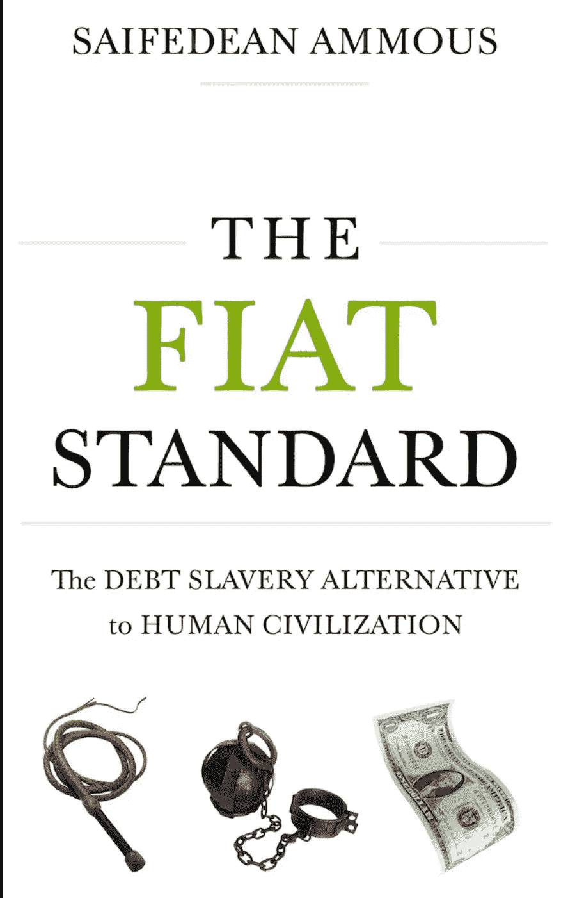

# TBH:书评——菲亚特标准

> 原文：<https://medium.com/coinmonks/tbh-book-review-the-fiat-standard-8738c166e767?source=collection_archive---------20----------------------->

[Source](https://www.google.com/imgres?imgurl=https%3A%2F%2Fcloudfront-us-east-1.images.arcpublishing.com%2Fcoindesk%2FGTC3FGVUAFCLBDJ2KBXEADSR2M.jpg&imgrefurl=https%3A%2F%2Fwww.coindesk.com%2Fpolicy%2F2020%2F12%2F06%2Fthe-fiat-standard-and-debt-slavery%2F&tbnid=KjH3ycmOBbkQzM&vet=12ahUKEwidyY7MkMn4AhWkEGIAHY1hDHkQMygDegUIARCvAg..i&docid=SJTdBOpnTvcwAM&w=703&h=1081&q=the%20fiat%20standard%20cover%20&hl=en-us&client=safari&ved=2ahUKEwidyY7MkMn4AhWkEGIAHY1hDHkQMygDegUIARCvAg)

这位业余爱好者带着另一篇书评回来了。这一次，我正在回顾 Ammous 先生关于比特币标准的续篇，名为 Fiat Standard。

## 我是如何发现这本书的？

由于他在比特币标准方面的出色工作，Saifedean Ammous 在比特币领域非常有名。作为一名比特币创造者和整个比特币社区的一员，Ammous 先生在这本书发行前很长一段时间都在谈论写这本书。我相信在 2021 年末。所有的播客(包括我的主要去地下室的故事(TFTC)都谈到了这本书。我确信《比特币》杂志尽了最大努力来推销这本书。总的来说，这本书被寄予厚望，比特大陆人迫不及待地想要得到它。由于我的书籍积压和繁忙的生活，我花了一些时间来完成它。

## 图书详细信息

页数:358 商店:[Amazon.com](https://www.amazon.com/Fiat-Standard-Slavery-Alternative-Civilization/dp/B09VVFCQ63/ref=sr_1_1?crid=278LS9BW2QI49&keywords=fiat+standard&qid=1656179211&sprefix=fiat+s%2Caps%2C52&sr=8-1)费用:30.00 美元。中等大小的字体，句子之间留有适当的空间。

## 摘要

罗斯·史蒂文斯的前锋非常合适。这本书很好地满足了读者的期望。它并没有过度传递，也没有用对整本书没有价值的戏谑让你厌烦。不像比特币是威尼斯([点击这里](/coinmonks/tbh-book-review-bitcoin-is-venice-5293301ea8ea)阅读我对那本书的评论)，亚历克斯·格拉德斯坦让我为一本伟大的书大肆宣传，结果却对最后一页感到失望。

总体赛弗(是的，这是我给他的昵称。如果 Ammous 先生读到这没有不尊重先生)带你在平坦的土地上旅行。这本书很好地解释了法定货币的起源，以及它是如何完全感染了人类的生活方式、思维和文化。Saife 经常提到这是一本真正建立在比特币标准基础上的比特币书籍，这是他对整个菲亚特系统进行分析的尝试。虽然赛义夫确实给出了一些证据，证明菲亚特如何解决了金本位货币体系的问题，并给人类带来了一些好处，但这本书的大部分内容都是负面的，只是给出了一个又一个例子，说明无限制的货币如何让人类机构陷入毁灭。

赛义夫解释说，法定货币不是由美联储创造的，而是由商业银行贷款给银行的。例如，如果你想贷款 100 万美元买一栋房子，银行分类账产生的新钱。这不是从银行客户那里收集资金。此外，这笔贷款被视为银行的资产。

这本书的最后几章将它带回比特币，以及为什么它比当前的系统好得多。赛弗看好比特币的理由是，它超越了世界债券(债务！)市场。随着价值超过 100 多万亿美元的主权(政府)债务产生负收益率，赛义夫认为，世界将从一个基于债务的系统转变为一个基于股权/储蓄的系统，在这个系统中，资产是其他人支付的承诺，在这个系统中，你可以抵押比特币，比特币是一种空头资产(意味着没有人必须偿还你才能获得它的基本价值)，你可以肯定你的购买力在任何时候都受到保护。

## TBH:主要外卖

赛义夫的文字很容易消化。单词很容易地从页面上流出并进入我的大脑，从而使信息记忆变得容易。由于我对比特币有偏见，赛义夫的观点我同意他们中 90%的人的观点。现在，赛义夫不像一些比特币狂热分子那样“有毒”，但他非常坚持自己的观点，不在乎他的话是否伤害了你的感情。我想到的 4 个话题如下:

1.  Saife 很好地解释了什么是畅销。

在我的比特币之旅中，我多次看到这个词，但我从来不知道它有多重要，也不知道比特币如何解决跨空间销售的问题。Saife 给出了一个跨越大西洋运送黄金的很好的例子。我的理解是，如果你有 100 美元的黄金，你花了 10 美元把它从伦敦运到亚特兰大，亚特兰大的接收者会因为运费而损失 10%的价值。而使用比特币，无论价值多少，你支付的费用都会让你进入 1MB 的区块，这与发送的比特币的价值无关。因此，如果黄金有 10%的运费，而且运费只随着距离和黄金价值的增加而增加，那么黄金的可销售性就没有比特币那么强。为此，我更好地理解了为什么适销性如此重要，这也是菲亚特诞生并致力于解决这个问题的部分原因。

2.我真的很喜欢 Saife 分解菲亚特对食品和教育的影响。

很明显，随着时间的推移，我们的食物变得越来越差。我在推特上看到了 20 世纪 70 年代人们在海滩上的照片，当时钱是一些什么声音。赛义夫很好地解释了推动谷物、糖和玉米的原因，这些都是基于短期利润动机，带有一些宗教色彩，以帮助大众远离动物蛋白。他忽略的一件事是肉类生产的开发。鸡肉、牛肉和猪肉是如何被注入水和激素以使它们成为最胖的以获得最大的利润，以及鱼类是如何由于缺乏对环境的关注而变得如此有毒，你必须监控你的食量以避免汞中毒。

谈到高等教育，赛义夫说得很对。由于政府贷款和印刷机追求他们想要的任何科学，大学不关心学生，一切都是为了研究，获得拨款，让学生为毫无价值的学位申请巨额贷款。作为受过大学教育的人，我亲眼目睹了这一切。教授们不会在乎你是否学会了，这只是为了发表论文，为学校争取更多的资助。对于学生来说，大学会竭尽全力让你改变专业，只是为了保持你的资格和获得学费。

3.Saife 提到为什么飞行速度没有进步。

这张真的引起了我的注意。作为一个经常乘坐飞机的人，我经常想知道为什么自 20 世纪 70 年代以来，飞机基本上看起来都一样，而在推动速度障碍和整个领域的创新方面没有任何改进。与 1970 年相比，现在的飞机非常复杂，有了无线网络和其他使飞行更加舒适的设施，但从形式和速度因素来看，基本上没有什么。赛义夫在 191 页提到

从 1903 年莱特兄弟的首次飞行开始，飞行的世界速度记录一直在不断增加，直到 1976 年 7 月 28 日，美国空军的 SR-71 黑鸟创下了吸气式飞机的最快速度:3，529.6 公里小时，即 3.3 马赫。同一天，另一架 SR-71 飞机创下了 25929 米的最高飞行高度纪录。45 年后，这两项记录仍然存在。"

赛义夫的这种推理是有道理的。1971 年黄金窗口关闭导致的通货膨胀导致耐用品和燃料价格上涨。然后，人类消耗肮脏的能源就变得邪恶，推动创新的可能性就不存在了。这是一个耻辱

4.面向大众的比特币将不同于马克西人的偏好

当人们控制自己的比特币私钥时，赛义夫给出的例子很美。赛义夫将此与其他我们认为理所当然的、没有人尝试自己去做的任务联系起来。例如，期望每个人都屠宰自己的肉或者挤奶是不现实的。人们总是想要一个最适合他们的解决方案。一些人可能想把他们的比特币留给比特币银行，另一些人可能更极端，使用带有备份光盘的旧笔记本电脑。一旦网络全面发展，将会出现满足客户需求的公司，我相信我们将会有一个托管解决方案的混合体，满足更广泛的消费者需求。

菲亚特的辩护者提到人类在现状中已经走了多远。所有人都摆脱了贫困，科学、技术和医疗保健的进步都是在一个法定标准下发生的。拍连比特币都是在这个黑暗的金钱时代创立的。我不指望 Saife 会对当前的系统给予任何信任，但我们必须承认，当基于债务的庞氏骗局以美元为首前进时，人类能够做什么，每年都在泄漏价值，导致未来更加不确定。我肯定赛义夫提到的其他话题我不同意，但总的来说，这是我的主要批评。

## 排名和推荐

⭐️⭐️⭐️⭐️⭐️

这是一本很棒的书。我强烈推荐它给任何比特币制造者或任何想从工程师/奥地利经济学家的角度了解菲亚特标准如何工作的人。你不需要读赛义夫的第一本书来理解这本书。如果你确实先读了这本书，那就回头读一下比特币标准，进一步了解 Saife 的立场。这本书很容易准备，并试图使一个没有任何意义的世界。

我离开的时候感觉到，如果钱是健全的，人们没有去玩股市赌场，贪婪的银行摧毁了系统，并因为他们的贪婪而得到救助，我们今天会在哪里？

感谢你花时间阅读这篇文章！使用 lightning 钱包扫描下面的二维码可获得 500 次免费 sat 考试(仅提供一次扫描)。

业余爱好者出局！

> 加入 Coinmonks [电报频道](https://t.me/coincodecap)和 [Youtube 频道](https://www.youtube.com/c/coinmonks/videos)了解加密交易和投资

# 另外，阅读

*   [如何在 Uniswap 上交换加密？](https://coincodecap.com/swap-crypto-on-uniswap) | [A-Ads 审核](https://coincodecap.com/a-ads-review)
*   [WazirX vs coin dcx vs bit bns](/coinmonks/wazirx-vs-coindcx-vs-bitbns-149f4f19a2f1)|[block fi vs coin loan vs Nexo](/coinmonks/blockfi-vs-coinloan-vs-nexo-cb624635230d)
*   [本地比特币审核](/coinmonks/localbitcoins-review-6cc001c6ed56) | [加密货币储蓄账户](https://coincodecap.com/cryptocurrency-savings-accounts)
*   [什么是保证金交易](https://coincodecap.com/margin-trading) | [美元成本平均法](https://coincodecap.com/dca)
*   [维护卡审核](https://coincodecap.com/uphold-card-review) | [信任钱包 vs MetaMask](https://coincodecap.com/trust-wallet-vs-metamask)