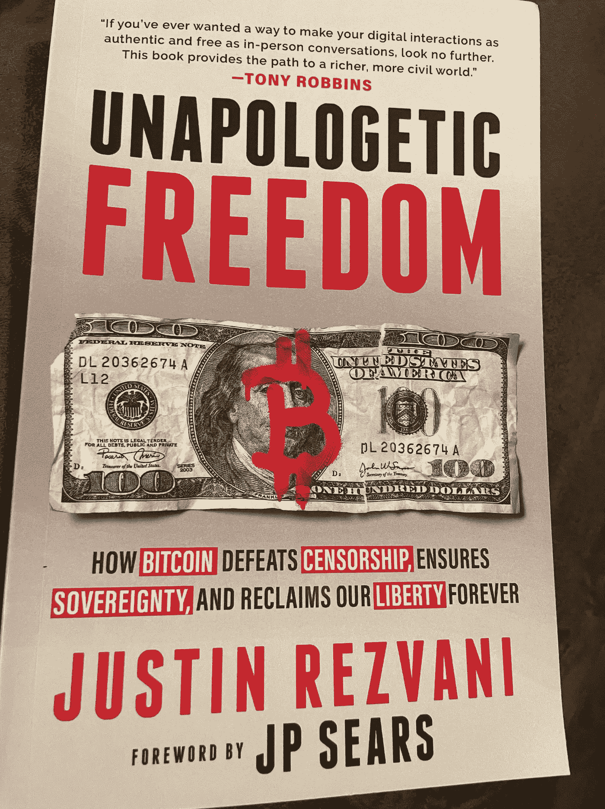
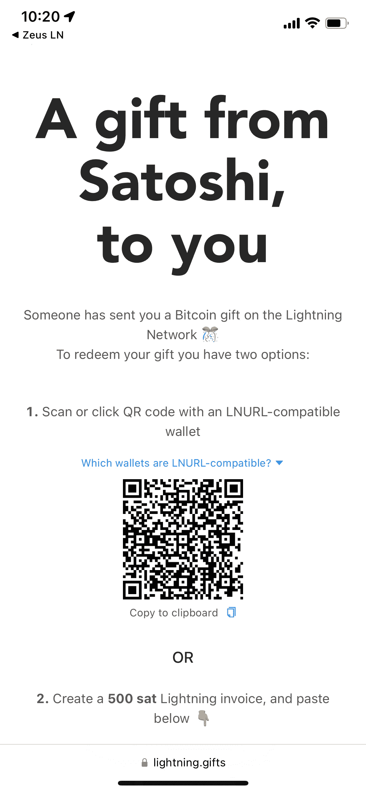

# TBH:书评——毫无歉意的自由

> 原文：<https://medium.com/coinmonks/tbh-book-review-unapologetic-freedom-bba2d65a5455?source=collection_archive---------69----------------------->

Source: Photo by Author

比特币爱好者(TBH)在这里，我正在用我的媒体博客开始一个新的书评系列。这些评论会很快且切中要点。我已经读了几本比特币领域的书，也许有一天我会回去重温这些书。但是现在我会把注意力集中在我从 2022 年开始读的书上。欢迎我对第一本书进行评论！

## 我是如何发现这本书的？

我从我的播客《来自地穴的故事》( TFTC)第 321 期《不道歉的自由》中听说了这本书。这本书的作者贾斯汀·雷兹瓦尼和喜剧演员 JP·西尔斯。贾斯汀之前在 TFTC 播客上，并与播客主持人马蒂·本特进行了很好的对话。在那个豆荚里，他正在推广他的新公司 Zion。也就是使用闪电网络的社交媒体。Justin 因为通过分叉 Sphinx 聊天代码创建了 Zion 而受到了很多批评，但是他很好地为自己辩护，并且几乎强迫我下载了 Zion。在这一集贾斯汀带来了良好的能量，并再次发言。这让我买下了他的书并读了一遍。

## 图书详细信息

页数:127；商店:[亚马逊](https://www.amazon.com/dp/B09WXG2V24/ref=cm_sw_r_cp_api_i_S3HXSH7V4D70J2FKQ07J?_encoding=UTF8&psc=1)费用:10.99 美元；大字体，易于阅读，图形最少。播客中提到的有声书。

## **总结**

贾斯汀开始写这本书，讲述他在矫形椅上的濒死体验。在那里，他对我们的货币体系做了一个快速而肮脏的解释，然后讲述了今天的社交媒体公司如何完全拥有所有的权力，以及如何使用一个新的系统来保护我们的自由，并允许互联网成为人们在没有技术霸主操纵的情况下自由交流思想的媒介。比特币是一种可以在数字时代开创我们互动新方式的技术。

## 比特币爱好者的主要收获

互联网现在就是这么烂。金钱也很糟糕。使用我新推出的名为 Zion 的服务(在本书中，我对贾斯汀没有投资他的创业公司表示支持)，在比特币这个有史以来最棒的货币上建立一个更美好的未来。如果你生活在唐纳德·特朗普被赶出 Tinder 的时代，这本书总结了为什么会发生这种情况，以及我们如何没有采取任何措施来解决审查问题。

## 排名和推荐

⭐️⭐️和 1/2 颗星(满分 5 分)

如果你是一个经验丰富的比特币玩家，我会跳过这本书。虽然贾斯汀很好地解释了发生了什么，但我觉得大多数比特币创造者已经知道了这一点。写作是非常基本的，简单的英语。我认为对于一个对比特币和唐纳德·特朗普为何被踢出 Twitter 一无所知的高三学生来说，这是一本好书。但如果你在比特币 Twitter 上玩游戏，听播客，并且已经阅读了比特币标准，这本书就很难通过了。虽然这本书可以在几个小时内读完，但我并没有感到我学到了一些新东西，或者被一些我完全不知道的事实所震惊。贾斯汀:你在豆荚上很棒，但是你写这本书的时候错过了目标。

感谢你花时间阅读这篇文章！使用 lightning 钱包扫描下面的二维码可获得 500 次免费 sat 考试(仅提供一次扫描)。如果你有任何问题，请发表评论或在 Twitter 上给我发短信，我愿意尽我所能提供帮助。

[https://lightning.gifts/redeem/f9879b6698b820c9a4f42b81bae235646a6cb958f56818e6](https://lightning.gifts/redeem/f9879b6698b820c9a4f42b81bae235646a6cb958f56818e6)

业余爱好者出局！

> 加入 Coinmonks [电报频道](https://t.me/coincodecap)和 [Youtube 频道](https://www.youtube.com/c/coinmonks/videos)了解加密交易和投资

# 另外，阅读

*   [8 大加密联盟项目](https://coincodecap.com/crypto-affiliate-programs) | [eToro vs 比特币基地](https://coincodecap.com/etoro-vs-coinbase)
*   [最佳以太坊钱包](https://coincodecap.com/best-ethereum-wallets) | [电报上的加密货币机器人](https://coincodecap.com/telegram-crypto-bots)
*   [交易杠杆代币的最佳交易所](https://coincodecap.com/leveraged-token-exchanges) | [购买 Floki](https://coincodecap.com/buy-floki-inu-token)
*   [3Commas 诉 Pionex 诉 crypto hopper](https://coincodecap.com/3commas-vs-pionex-vs-cryptohopper)|[Bingbon Review](https://coincodecap.com/bingbon-review)
*   [加密复制交易平台](/coinmonks/top-10-crypto-copy-trading-platforms-for-beginners-d0c37c7d698c) | [如何在 WazirX 上购买比特币](/coinmonks/buy-bitcoin-on-wazirx-2d12b7989af1)