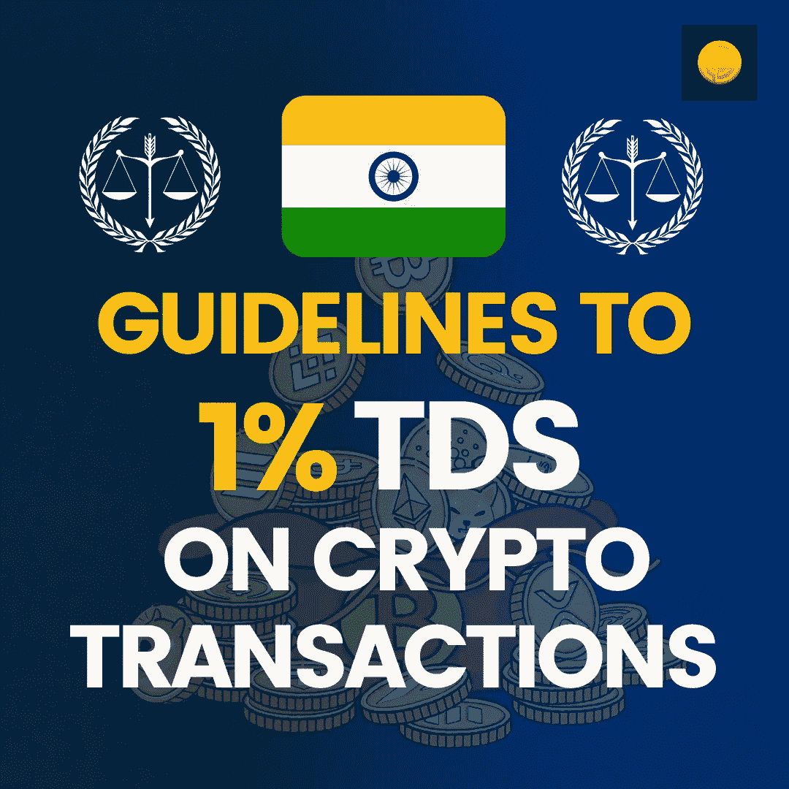

# 为初学者讲解虚拟数字资产的 TDS

> 原文：<https://medium.com/coinmonks/tds-on-virtual-digital-assets-explained-for-beginners-dcf4147d2cdc?source=collection_archive---------46----------------------->

印度财政部长 Nirmala Sitharaman 女士提交的加密法案提议对所有属于 VDA 或虚拟数字资产范围的加密交易征收 1%的 TDS。政府提议对所有加密收益征税，但他们不允许用其他收益抵消加密损失。在这一篇文章中，我们会研究政府建议的 1%全港发展策略。

# 什么是加密的 1% TDS 征税方案？

根据 1%的 TDS 征税模式，任何虚拟资产(无论是 NFTs、ERC 20 标准代币还是 BTC)如果在撰写本文时价值超过 10，000 印度卢比或 126 美元，将按 1%征税。

# 政府是如何定义虚拟资产征税的？

根据《所得税法》第 47A 条，任何以加密方式生成的具有内在价值的数据都将被纳入征税范围，并得到相应的处理。但是，该定义并不仅限于此，因为任何具有继承财产并在不久的将来产生收入的价值投资工具的存储也将属于 TDS 的范围，并且必须相应处理。

# 税收将如何进行？

对 T2 的税收将不同于对千禧一代的传统税收。在加密交易中，无论收入多少，用户都必须为获得的任何收益纳税。然而，这些损失不能用其他收入项目来抵消。最重要的是，也没有规定你可以结转损失，并用你自己的加密交易抵消它们。

客观地说，如果你的损失延续到下一个财政年度，你就不能用任何东西来抵消它。然而，任何秘密交易都必须向政府缴纳 1%的税。通过任何加密交易，这意味着无论您是通过加密付款，通过加密收款，还是将加密作为投资组合持有，都必须提供详细信息并按 1%的税率纳税。这在所有 vda 中都是一致的。

即使在进行 p2p 交易时，也必须遵循这一惯例。举个例子，如果拉姆和拉胡尔在做加密交易。拉姆想在 USDT 卖给拉胡尔 10，000 英镑。在发送密码时，Ram 必须给政府 9900 USDT，并在 USDT 存放 100 RS 作为 TDS。同样，拉胡尔必须给拉姆 9900 卢比，才能换来 10000 卢比的 USDT。差额将被视为 TDS，必须存入政府或交易所。如果是 p2p，存放 TDS 金额是一方的责任；但是，如果您是在柜台上向交易所出售，则交易所有责任根据交易切割和存放 TDS。

> 加入 Coinmonks [电报频道](https://t.me/coincodecap)和 [Youtube 频道](https://www.youtube.com/c/coinmonks/videos)了解加密交易和投资

# 另外，阅读

*   [OKEx vs KuCoin](https://coincodecap.com/okex-kucoin) | [摄氏替代品](https://coincodecap.com/celsius-alternatives) | [如何购买 VeChain](https://coincodecap.com/buy-vechain)
*   [ProfitFarmers 回顾](https://coincodecap.com/profitfarmers-review) | [如何使用 Cornix Trading Bot](https://coincodecap.com/cornix-trading-bot)
*   [如何匿名购买比特币](https://coincodecap.com/buy-bitcoin-anonymously) | [比特币现金钱包](https://coincodecap.com/bitcoin-cash-wallets)
*   [瓦济里克斯 NFT 评论](https://coincodecap.com/wazirx-nft-review) | [比茨盖普 vs 皮奥克斯](https://coincodecap.com/bitsgap-vs-pionex) | [坦吉姆评论](https://coincodecap.com/tangem-wallet-review)
*   [如何使用 Solidity 在以太坊上创建 DApp？](https://coincodecap.com/create-a-dapp-on-ethereum-using-solidity)