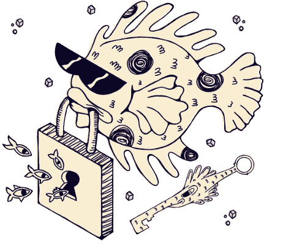

# 团队铁鱼

> 原文：<https://medium.com/coinmonks/team-iron-fish-f2fd0ee02de6?source=collection_archive---------44----------------------->

正如我们所知，铁鱼项目非常有前途，涉及隐私和 web-3 技术。我想和你一起回顾一下这个团队，看看谁是所有主要尖端技术的掌舵人。

**CEO**
所以，这个项目的 CEO 是埃琳娜·纳多林斯基。

Elena Nadolinski 在微软开始了她的职业生涯。2012 年和 2013 年夏天，她作为学生开始在那里实习。她最终成为了一名全职软件工程师，为微软在 Windows 10 中的虚拟助手 Cortana 开发一项功能。该功能根据人们与同龄人的互动以及他们共享的文件来收集有关他们的信息。【2016 年 7 月，她搬到旧金山，在硅谷一家名为 Tilt 的初创公司工作。她在该公司的 API 上工作，直到 2017 年该公司倒闭。【2017 年 2 月，Nadolinski 开始在 Airbnb 从事自动完成搜索的工作。
在 Airbnb 工作期间，Elena 注意到硅谷越来越关注加密货币和加密货币，尤其是以太坊。她开始探索这个领域，并参加了几次黑客马拉松。在赢得几次黑客马拉松后，她开始在这个领域获得认可。她现在在会议上谈论加密货币。
**学历:**
Nadolinski 毕业于弗吉尼亚理工大学，获得计算机科学学士学位。

**高级软件工程师。**
杰森·斯帕福德(Jason Spafford)也在铁鱼队担任重要职务。他在团队中担任高级软件工程师。因此，他在公司扮演着非常重要的角色:软件开发，检查软件工程师的工作，制定方向，分析完成的工作，纠正错误，估计和协调不同任务的条款。
**HR +招聘。Jenah C Bielza 负责招聘和部分公司内部环境。根据我的经验，我知道在团队的心理状态方面，很多都取决于一个好的、有经验的招聘人员。一个人应该有一种一眼就能看出性格的品质，此外，还需要在应聘者的知识和技能方面进行很好的分析。因此，招聘人员在团队中的作用非常重要。
**产品设计师。负责整个项目外部组件的人是 Skylar Richard。正是这个原始的标志，以及博客、测试网上的各种文章，让这个项目变得更加明亮和丰富多彩，这要感谢这个人。这个人做得很好，为我们建立了不同的布局、图片和一切，使这个项目看起来有吸引力和美丽。谢谢你！****

感谢大家的关注，很高兴向大家介绍铁鱼团队的一小部分。各位，头顶上是宁静的天空！

[铁鱼—$铁—私有、匿名、易于使用的加密货币](https://ironfish.network/)

[不和](https://discord.gg/ceDW8GjJ)

[电报](https://t.me/ironfishcryptochat)

[电报 RU](https://t.me/ironfishru)

> 加入 Coinmonks [电报频道](https://t.me/coincodecap)和 [Youtube 频道](https://www.youtube.com/c/coinmonks/videos)了解加密交易和投资

# 另外，阅读

*   [3 商业评论](/coinmonks/3commas-review-an-excellent-crypto-trading-bot-2020-1313a58bec92) | [Pionex 评论](https://coincodecap.com/pionex-review-exchange-with-crypto-trading-bot) | [Coinrule 评论](/coinmonks/coinrule-review-2021-a-beginner-friendly-crypto-trading-bot-daf0504848ba)
*   [莱杰 vs Ngrave](/coinmonks/ledger-vs-ngrave-zero-7e40f0c1d694) | [莱杰 nano s vs x](/coinmonks/ledger-nano-s-vs-x-battery-hardware-price-storage-59a6663fe3b0) | [币安评论](/coinmonks/binance-review-ee10d3bf3b6e)
*   [Bybit Exchange 审查](/coinmonks/bybit-exchange-review-dbd570019b71) | [Bityard 审查](https://coincodecap.com/bityard-reivew) | [Jet-Bot 审查](https://coincodecap.com/jet-bot-review)
*   [3 commas vs crypto hopper](/coinmonks/3commas-vs-pionex-vs-cryptohopper-best-crypto-bot-6a98d2baa203)|[赚取加密利息](/coinmonks/earn-crypto-interest-b10b810fdda3)
*   最好的比特币[硬件钱包](/coinmonks/hardware-wallets-dfa1211730c6) | [BitBox02 回顾](/coinmonks/bitbox02-review-your-swiss-bitcoin-hardware-wallet-c36c88fff29)