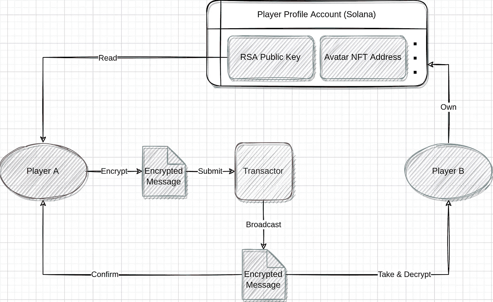

# RACE Poker Tech Reveal —加密通信

> 原文：<https://medium.com/coinmonks/tech-reveal-encrypted-communication-89619433f1d5?source=collection_archive---------31----------------------->

A message from Player A to Player B

洗牌一完成，游戏就开始了。在游戏过程中，卡片会显示出客户提供的钥匙。根据卡的类型，密钥将被相应地共享。例如，玩家的底牌正在被点对点共享。

交易者用于将数据从一个客户端转发到另一个客户端(如 WebRTC 中常见的那样)，但这并不意味着这些数据对交易者是可见的，因为数据在发送到交易者之前已经被加密了。

RACE Poker 有三种加密方式:
1。索拉纳使用的氯化钠。用户可以生成一对密钥:私钥和公钥。公钥将用于验证签名。在 RACE Poker 中，NaCL 将验证某个客户端是否发送了特定的消息。
2。AES-CTR，用于洗牌。这种加密的可交换性使得加密和解密的顺序变得无关紧要，这意味着数据可以以任意顺序加密或解密。
3。RSA，用于客户端之间的通信。这些消息用客户机的私钥加密，用公钥解密。

对于客户端之间的通信，玩家将生成自己的 RSA 密钥对。公钥将存储在用户在 Solana 上的个人资料帐户中。客户端可以通过区块链上的数据发现其他人，并获得他们相应的公钥。私钥将本地存储在浏览器的数据库中。只要玩家不在游戏中，他们总是可以更新他们的密钥对。

在发牌完成后，在公布公共牌之前，游戏中的玩家需要共享他们的公钥才能看到分配给他们的牌。当游戏中的每个玩家看到在任何给定时刻发生的事情时，他们中的任何人都应该能够知道谁需要谁的钥匙。此时，将会出现一个需要共享的密钥列表。密钥的密钥标识可以表示如下:

> [发送者、密钥身份、接收者]

所有客户端根据该列表共享它们的公钥。发送客户端使用接收客户端的 RSA 公钥对每条消息进行加密，然后通过交易器发送到目标客户端。

例如，当客户端 A 想要与客户端 B 通信时，它将从区块链上的 B 的配置文件帐户中读取 RSA 公钥，并在发送消息之前用该密钥对消息进行加密。

然后，客户端 A 将消息传递给交易者，交易者又将消息传递给客户端 B。注意，由于交易者没有客户端 B 的 RSA 私钥，所以它根本看不到消息内容。

当客户端 B 收到消息时，它可以使用自己的私钥解密消息体。

这基本上就是在游戏过程中，必要的信息是如何一条一条地被揭示出来的。在下一篇文章中，我们将讨论密钥共享和解密。