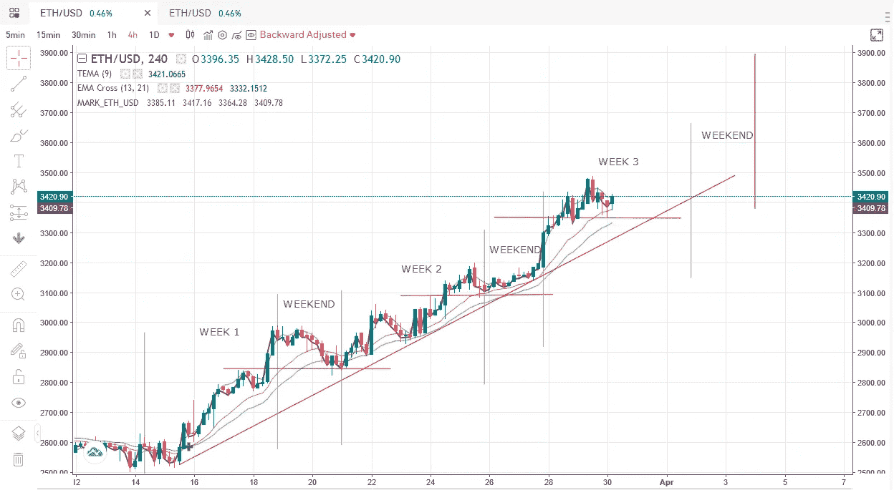
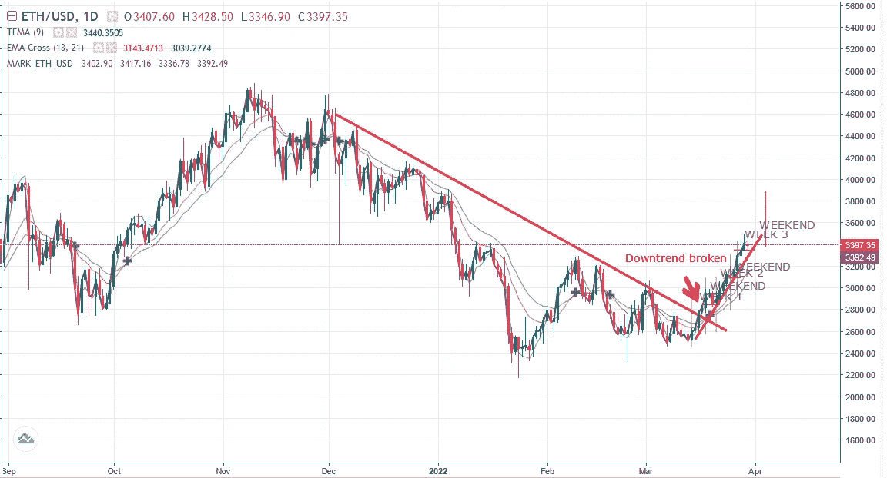

# 技术分析解释

> 原文：<https://medium.com/coinmonks/technical-analysis-explained-ac92048be2a9?source=collection_archive---------58----------------------->

## 支撑、阻力和趋势线

我们以前都听说过，“趋势是你的朋友”，“旧的阻力成为新的支撑”，…让我们更专业一点，定义一下到底发生了什么。

## 支持和抵抗

阻力线是从最近的一个极端峰值开始的水平线，指向未来。

支撑线是**水平线，从最近的修正低点开始，指向未来。**

只要价格不断创造更高的高点(突破过去的峰值)并保持在最近声称的支撑位之上，上升趋势就保持有效。如果价格持续跌破近期低点，突破支撑位，并且未能升至阻力位以上，则下跌趋势保持不变。

我们可以使用水平支撑位在上升趋势中建立多头头寸，使用该水平以下 1%的止损，并在测试更高的低点时向上追踪，我们在最后一个低点以下设置新的止损(1%，取决于波动性)。像这样，我们可以避免过早平仓。这也有助于在制定长期战略的过程中获得更多利润。

4Hour chart ETHUSD @ [Gate.io](https://www.gate.io/futures_trade/btc/ETH_USD)

在打破日线图(下图)的中期(1-2 个月)下降趋势后，在 4 小时图上，这是一个 3 周的短期上升趋势(上图)

Daily chart ETHUSD @ [Gate.io](https://www.gate.io/futures_trade/btc/ETH_USD)

## 趋势线

趋势线是**斜线的支撑线或阻力线，连接下跌趋势中的高点或上涨趋势中的低点，至少有 3 个接触点。**

当价格在上升趋势中跌破或在下降趋势中突破至少 2 天时，趋势被打破。这可以结合前期支撑线或阻力线的损失或回收(水平方向)。像这样我们可以避免收盘太快，我们可以坚持一个趋势更长的时间。

这让我想到了一个主要交易账户来维持长期头寸，其次是一个次要账户，用于交易和日内交易，只是为了好玩，你知道:)。

资料来源:瑞士瑞信银行，全球技术研究和行为金融

> 加入 Coinmonks [电报频道](https://t.me/coincodecap)和 [Youtube 频道](https://www.youtube.com/c/coinmonks/videos)了解加密交易和投资

# 另外，阅读

*   [Bookmap 评论](https://coincodecap.com/bookmap-review-2021-best-trading-software) | [美国 5 大最佳加密交易所](https://coincodecap.com/crypto-exchange-usa)
*   最佳加密[硬件钱包](/coinmonks/hardware-wallets-dfa1211730c6) | [Bitbns 评论](/coinmonks/bitbns-review-38256a07e161)
*   [新加坡十大最佳加密交易所](https://coincodecap.com/crypto-exchange-in-singapore) | [收购 AXS](https://coincodecap.com/buy-axs-token)
*   [红狗赌场评论](https://coincodecap.com/red-dog-casino-review) | [Swyftx 评论](https://coincodecap.com/swyftx-review) | [CoinGate 评论](https://coincodecap.com/coingate-review)
*   [投资印度的最佳加密软件](https://coincodecap.com/best-crypto-to-invest-in-india-in-2021)|[WazirX P2P](https://coincodecap.com/wazirx-p2p)|[Hi Dollar Review](https://coincodecap.com/hi-dollar-review)