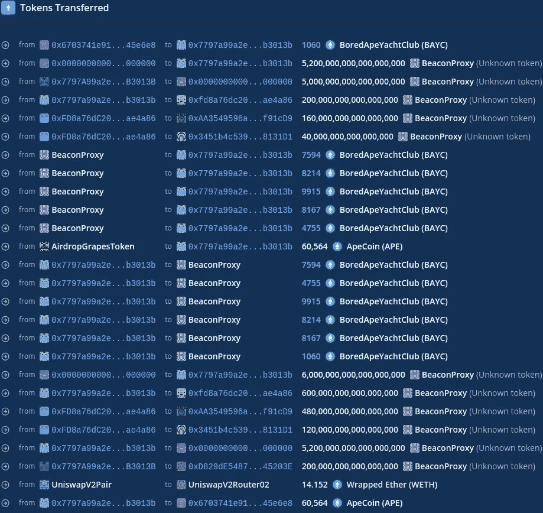
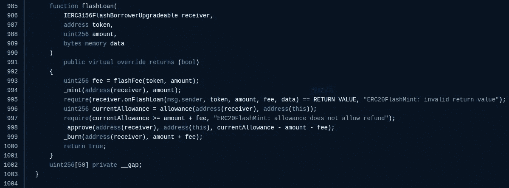
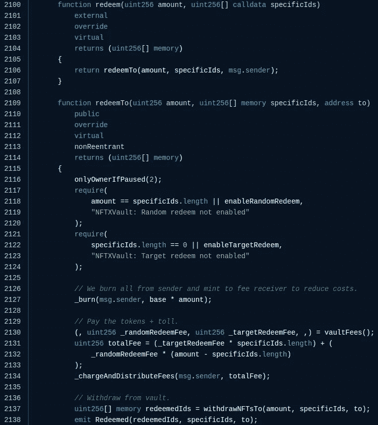
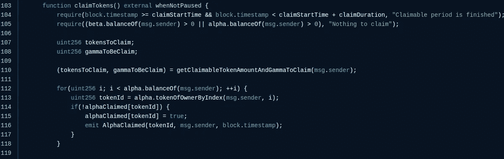
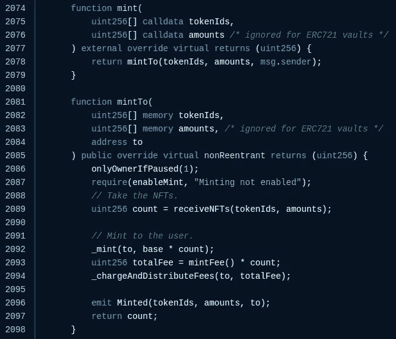

# APE 攻击事件技术分析

> 原文：<https://medium.com/coinmonks/technical-analysis-of-ape-attack-events-2c624d56c42d?source=collection_archive---------12----------------------->

## 0x01 硬币

在前一篇文章中我们已经提到了整个事件，这篇文章我们将以技术的方式进行分析。Apecoin 是为无聊猿游艇俱乐部社区和相关社区服务的治理和实用工具。由于 Bored Ape 游艇俱乐部品牌的广泛流行，这次空投是 NFT 社区最受期待的空投之一。

## 0x02 攻击者信息

攻击发生在以太坊链条上，主要攻击信息如下:

**攻击者钱包地址:**

*   0x 6703741 e 913 a 30d 6604481472 B6 d 81 F3 da 45 E6 e 8

攻击者创建的相关合同地址:

*   0x 3 EBD 3d 86 f 810 b 141 f 9 B2 e9 b 15961 fc 66364 b 54 f 3
*   0x 7797 a 99 a2 e 91646 abdc 9 DC 30 e 838 a 149 CCB 3013 b

**代币合同(易受攻击合同):**

*   0x 025 c 6 da 5 BD 0 e 6 a5 DD 1350 FDA 9 E3 b 6 a 614 b 205 a1f

**攻击交易流程:**

0 xeb 8 C3 bebed 11 e 2e 4 fcd 30 CBF C2 FB 3c 55 C4 ca 166003 c 7 f 7d 319 e 78 ea ab 9747098

**漏洞相关合同:**

*   beacon proxy:0 xea 47 b 64 E1 BF CCB 773 a 0420247 c 0 aa 0a 3a 3 C1 D2 e 5c 5
*   nftxvaultupgradable:0x 73 D2 ff 81 fcea 9832 fc 9 ee 90521 abde 1150 f 6b 52a

## 0x03 攻击分析

**攻击者主要进行了三个步骤:**

**第一步**:攻击者通过闪贷获得 ERC 20 代币，并将其转换为 NFT

**步骤 2:** 攻击者使用交换的 NFT 获得 APE 空投令牌

**第三步**:归还 NFT，获取质押的 ERC 20 代币，归还闪贷，将获利资金转入钱包地址

## 0x04 漏洞详细信息

攻击成功的原因:

第一步:快速贷款(合同:NFTXVaultUpgradeable)

如上图第 999 行所示:“数量+费用”的 vToken 会被破坏，所以攻击者准备的 vToken 需要大于借用的 vToken 才能执行 flashLoan()函数。

第二步:赎回 NFT(合同:NFTXVaultUpgradeable)

如图:赎回函数调用**赎回到**函数，在 2127 行销毁代币，在 2134 行扣除手续费，在 2137 行直接将 NFT 发给调用者。

第三步:认领空投令牌(合同:AirdropGraphsToken)

如图所示:在第 105 行检查 beta.balanceOf()和 beta.balanceOf()，以确保调用者确实是 BAYC/MAYC 持有者。然后，在第 114–115 行，使用列表标记声明的 tokenId。第 110 行中的 getClaimableTokenAmountAndGammaToClaim()函数允许契约调用方只要求可以要求的 ApeCoin 的数量。

第 4 步:铸造(合同:NFTXVaultUpgradeable)

如图:2089 行送 NFT 契约，2092 行送代币，2094 行消费手续费。整个 NFTXVaultUpgradeable 合同提供铸造、赎回和快速贷款功能。攻击者利用这种方法轻松绕过了对 AirdropGraphsToken 契约持有的当前 NFT 数量的检查，获得了很好的收益。

到目前为止，攻击者已经利用这一攻击过程攻击了 **AirdropGraphsToken** 和**nftxvaultupgradable**合同，共获利约 35 万美元(以攻击时的市场价格计算)。

## 0x05 总结

从这次攻击事件来看，攻击成功的最重要因素在 AirdropGraphsToken 合同中:没有对空投的原理进行合理的验证。攻击者可以通过用闪贷换取 NFT 来获得 APE 空投，然后把 NFT 币还给闪贷，对项目构成威胁。

## 0x05 安全建议

*   不依赖可以操纵的因素对资产进行定价
*   使用机制来判断依赖条件是否合法(例如:判断依赖条件的持续时间)

> 加入 Coinmonks [电报频道](https://t.me/coincodecap)和 [Youtube 频道](https://www.youtube.com/c/coinmonks/videos)了解加密交易和投资

# 另外，阅读

*   [Bookmap 评论](https://coincodecap.com/bookmap-review-2021-best-trading-software) | [美国 5 大最佳加密交易所](https://coincodecap.com/crypto-exchange-usa)
*   最佳加密[硬件钱包](/coinmonks/hardware-wallets-dfa1211730c6) | [Bitbns 评论](/coinmonks/bitbns-review-38256a07e161)
*   [新加坡十大最佳加密交易所](https://coincodecap.com/crypto-exchange-in-singapore) | [购买 AXS](https://coincodecap.com/buy-axs-token)
*   [红狗赌场评论](https://coincodecap.com/red-dog-casino-review) | [Swyftx 评论](https://coincodecap.com/swyftx-review) | [CoinGate 评论](https://coincodecap.com/coingate-review)
*   [投资印度的最佳密码](https://coincodecap.com/best-crypto-to-invest-in-india-in-2021)|[WazirX P2P](https://coincodecap.com/wazirx-p2p)|[Hi Dollar Review](https://coincodecap.com/hi-dollar-review)