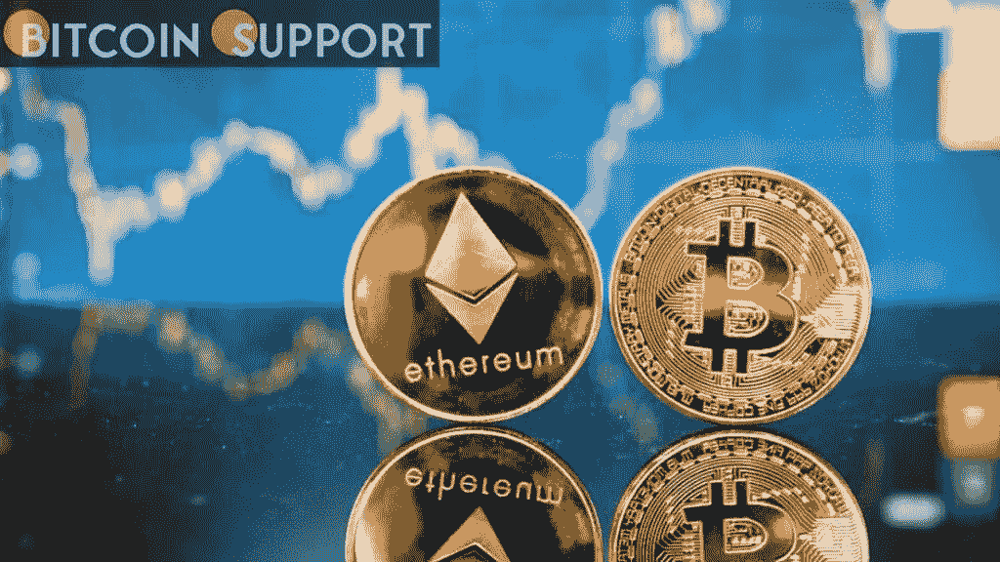
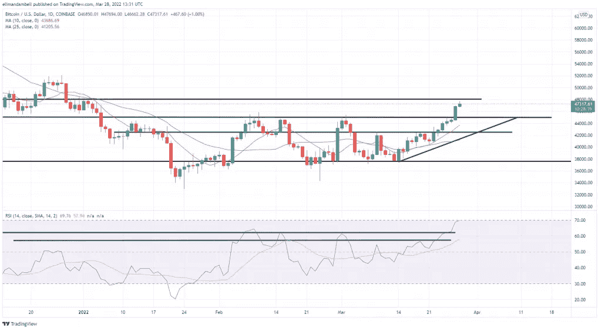
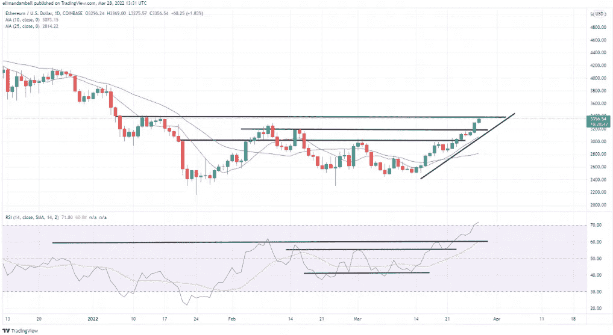

# 比特币和以太坊的技术分析:BTC，本周开始 ETH 接近 3 个月高点

> 原文：<https://medium.com/coinmonks/technical-analysis-of-bitcoin-and-ethereum-btc-eth-close-to-3-month-high-to-begin-the-week-552418a6e2ad?source=collection_archive---------82----------------------->

**Visit our website:-** [**https://bitcoinsupports.com/**](https://bitcoinsupports.com/)

比特币和以太坊的价值在周日晚间飙升，接近近三个月来的最高水平。本周开始，BTC 超过 47，000 美元，而 ETH 超过 3，300 美元大关。

**比特币**

比特币价格本周开始强劲上涨，自年初以来首次突破 47000 美元。

BTC/美元盘中高点达到 47245 美元，为 1 月 2 日以来的最高水平。今天的上涨紧随周日突破 44，950 美元阻力位之后，价格现在的目标是另一个上限。

**Visit our website:-** [**https://bitcoinsupports.com/**](https://bitcoinsupports.com/)

比特币多头的下一个目标可能是 50000 美元，但他们必须首先清除 48200 美元的阻力。然而，看一下图表就会发现，14 天 RSI 指标已经进入深度超买区域，跟踪 70 附近，这是 10 月份以来的最高水平。这几乎肯定是多头要克服的一个重大障碍，因为价格力量似乎已经见顶，空头可能正在等待理想的进场点。

**以太坊**

全球第二大加密货币 ETH 周一也飙升至多月高位，延续此前涨势。

今天的上涨推动 ETH 达到 3351.07 美元的盘中高点，为 1 月 16 日以来的最高水平。当前的 ETH 多头可能会感到忧虑，因为逼近的 3390 美元上限可能会阻碍进一步的上涨。

**Visit our website:-** [**https://bitcoinsupports.com/**](https://bitcoinsupports.com/)

与 BTC 类似，以太坊的 14 天 RSI 目前超买，跟踪在 71，这是自 9 月以来的最高水平。即将到来的障碍可能是 ETH 试图夺回 4000 美元关口的主要障碍之一。

**访问我们的网站:-**[**https://bitcoinsupports.com/**](https://bitcoinsupports.com/)

**免责声明:以上为作者观点，不应视为投资建议。读者应该自己做研究。**

> 加入 Coinmonks [电报频道](https://t.me/coincodecap)和 [Youtube 频道](https://www.youtube.com/c/coinmonks/videos)了解加密交易和投资

# 另外，阅读

*   [最佳加密交易信号电报](/coinmonks/best-crypto-signals-telegram-5785cdbc4b2b) | [MoonXBT 评论](/coinmonks/moonxbt-review-6e4ab26d037)
*   [Coinswitch 俱吠罗评论](/coinmonks/coinswitch-kuber-review-1a8dc5c7a739) | [电网交易机器人](https://coincodecap.com/grid-trading) | [比特币基地收费](/coinmonks/coinbase-fees-831e77d4f2c5)
*   [Bitget 回顾](https://coincodecap.com/bitget-review)|[Gemini vs block fi](https://coincodecap.com/gemini-vs-blockfi)|[OKEx 期货交易](https://coincodecap.com/okex-futures-trading)
*   [OKEx vs KuCoin](https://coincodecap.com/okex-kucoin) | [摄氏替代品](https://coincodecap.com/celsius-alternatives) | [如何购买 VeChain](https://coincodecap.com/buy-vechain)
*   [币安期货交易](https://coincodecap.com/binance-futures-trading)|[3 comas vs Mudrex vs eToro](https://coincodecap.com/mudrex-3commas-etoro)