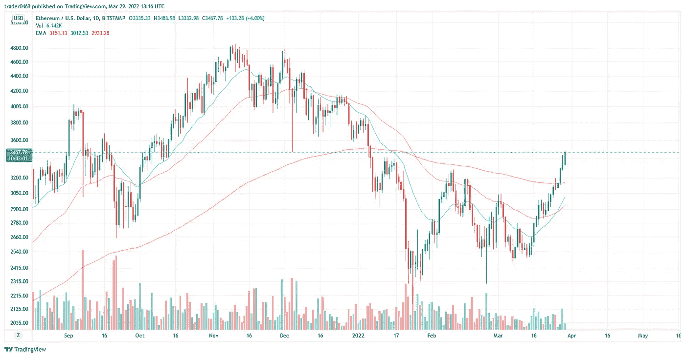

# 以太坊图的技术分析

> 原文：<https://medium.com/coinmonks/technical-analysis-on-the-ethereum-chart-3ae508975155?source=collection_archive---------41----------------------->

## 让我们打一些数字和计算

## 价格、趋势、模式和时间跨度

首先让我从 [Tradingview](https://www.tradingview.com/chart/V6aqEZhP/?symbol=BITSTAMP%3ABTCUSD) 平台拉一张图表。写作时间 3 月 29 日。

Daily ETHUSD chart, source: Bitstamp

我们可以看到，在最近的下跌趋势之后，从大约 12 月 16 日(20-50 均线交叉)到 1 月 17 日的投降阶段，价格形成了一个 3-4 个底部的侧向形态，最终在 3 月 16 日左右打破了看涨趋势。在周线图上，我们可以看到一个非常常见的模式，叫做“三个看涨的士兵”，告诉我们我们即将连续第三周上涨。这将在四月一日产生一根漂亮的绿色蜡烛。

## 指数移动平均线或均线

在这项研究中，20-50 和 200 指数移动平均线用于洞察价格行为背后的趋势和动力。

我们可以看到势头非常强劲，因为价格已经突破了 200 日均线。20 日均线在几天前穿过了 50 日均线，这让我对这种中期(2-4 个月)和长期(6-12 个月)看涨趋势的持续持非常积极和自信的态度。

> 跳上船，开始航行吧！

> 加入 Coinmonks [电报频道](https://t.me/coincodecap)和 [Youtube 频道](https://www.youtube.com/c/coinmonks/videos)了解加密交易和投资

# 另外，阅读

*   [BlockFi vs Celsius](/coinmonks/blockfi-vs-celsius-vs-hodlnaut-8a1cc8c26630)|[Hodlnaut 回顾](/coinmonks/hodlnaut-review-best-way-to-hodl-is-to-earn-interest-on-your-bitcoin-6658a8c19edf) | [KuCoin 回顾](https://coincodecap.com/kucoin-review)
*   [Bitsgap 审查](/coinmonks/bitsgap-review-a-crypto-trading-bot-that-makes-easy-money-a5d88a336df2) | [Quadency 审查](/coinmonks/quadency-review-a-crypto-trading-automation-platform-3068eaa374e1) | [Bitbns 审查](/coinmonks/bitbns-review-38256a07e161)
*   [密码本交易平台](/coinmonks/top-10-crypto-copy-trading-platforms-for-beginners-d0c37c7d698c) | [Coinmama 评论](/coinmonks/coinmama-review-ace5641bde6e)
*   [印度的加密交易所](/coinmonks/bitcoin-exchange-in-india-7f1fe79715c9) | [比特币储蓄账户](/coinmonks/bitcoin-savings-account-e65b13f92451)
*   [OKEx vs KuCoin](https://coincodecap.com/okex-kucoin) | [摄氏替代度](https://coincodecap.com/celsius-alternatives) | [如何购买 VeChain](https://coincodecap.com/buy-vechain)