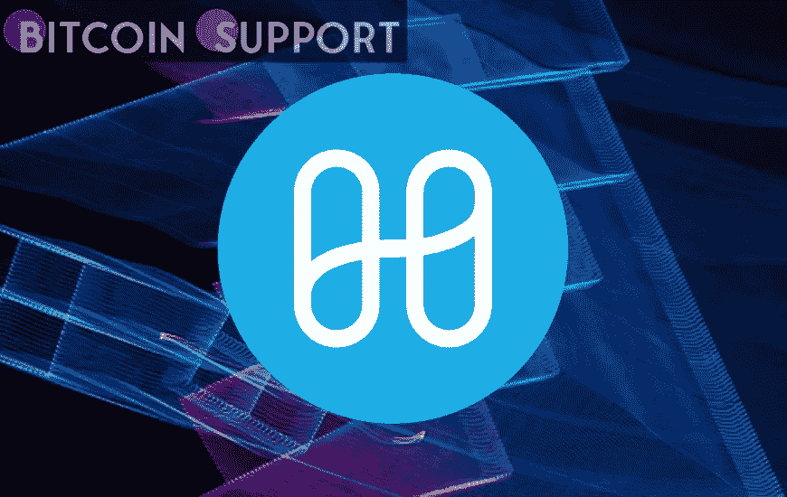
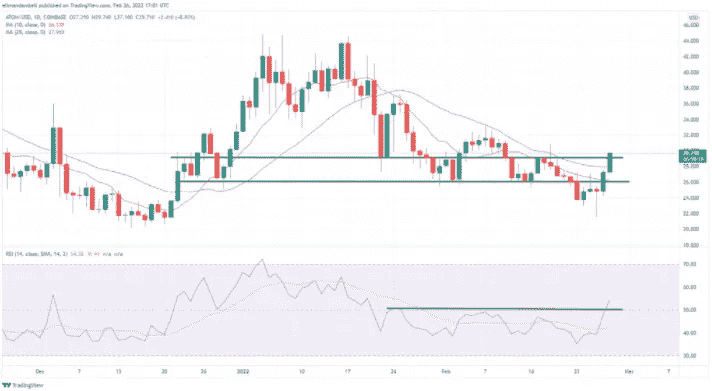
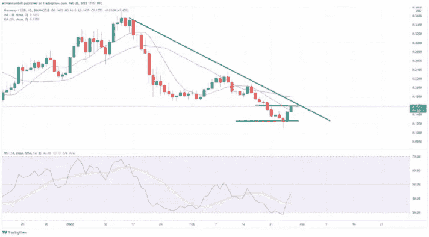

# 技术分析:宇宙和和谐的价格在周六飙升

> 原文：<https://medium.com/coinmonks/technical-analysis-prices-for-cosmos-and-harmony-surge-on-saturday-a331191c57d4?source=collection_archive---------46----------------------->

**Visit our website:-** [**https://bitcoinsupports.com/**](https://bitcoinsupports.com/)

今天值得注意的赢家包括宇宙(ATOM)和和谐(ONE)，全球加密市值在周末开始时上涨了 1.23%。Terra (LUNA)也走高，连续第六个交易日延续近期涨势。

宇宙(ATOM)

宇宙(ATOM)目前在今天的盘中上涨超过 13%，达到 2 月 17 日以来的最高水平。

周六，ATOM/USD 价格短暂突破 29.10 美元关口，盘中最高触及 29.36 美元。

在突破 50.40 上方后，14 天 RSI 飙升至五周高点，目前跟踪 52.09。

**Visit our website:-** [**https://bitcoinsupports.com/**](https://bitcoinsupports.com/)

今天的高点距离 ATOM 触及 25.27 美元的低点不到 24 小时，之后反弹至 26.10 美元的支撑。尽管最近该图呈三角形下跌，但价格势头正逐渐企稳，均线呈横向运行。许多人认为这是长期好转的前兆，一些交易员甚至盯上了 30.00 美元关口。

根据技术分析，Cosmos 和 Harmony 的价格在周六飙升

今天值得注意的涨幅包括 Cosmos (ATOM)和 Harmony (ONE)，全球加密市值在周末开始时上涨了 1.23%。Terra (LUNA)也走高，连续第六个交易日延续近期涨势。

**宇宙(ATOM)**

宇宙(ATOM)目前在今天的盘中上涨超过 13%，达到自 2 月 17 日以来的最高水平。周六，ATOM/USD 价格短暂突破 29.10 美元关口，盘中最高触及 29.36 美元。在突破 50.40 上方后，14 天 RSI 飙升至五周高点，目前跟踪 52.09。根据技术分析

ATOM/USD 日线图

今天的高点距离 ATOM 触及 25.27 美元的低点不到 24 小时，之后反弹回到 26.10 美元的支撑。尽管最近该图呈三角形下跌，但价格势头正逐渐企稳，均线呈横向运行。许多人认为这是长期好转的前兆，一些交易员甚至盯上了 30.00 美元关口。

**【平静地(一)**

今天涨幅最大的显然是和谐(一)，在过去 24 小时内攀升了 20%左右。在第二天的大幅上涨后，截至本文撰写之时，一美元兑 0.1612 美元的高点。昨天，随着价格从 0.1249 美元的长期底部下跌，一只交易到 0.1314 美元的低点。这是自 9 月下旬以来的最低点，随后飙升至 0.1650 美元的阻力。

**Visit our website:-** [**https://bitcoinsupports.com/**](https://bitcoinsupports.com/)

在突破 41.70 阻力位后，14 天的相对强弱指标现处于 10 天来的最高水平。如果当前趋势继续，许多多头肯定会在 0.2000 美元附近寻找出口。

**访问我们的网站:-**[**https://bitcoinsupports.com/**](https://bitcoinsupports.com/)

**免责声明:以上为作者观点，不应视为投资建议。读者应该自己做研究。**

> 加入 Coinmonks [电报频道](https://t.me/coincodecap)和 [Youtube 频道](https://www.youtube.com/c/coinmonks/videos)了解加密交易和投资

# 另外，阅读

*   [折叠 App 回顾](https://coincodecap.com/fold-app-review) | [LocalBitcoins 回顾](/coinmonks/localbitcoins-review-6cc001c6ed56) | [Bybit vs 币安](https://coincodecap.com/bybit-binance-moonxbt)
*   [加密保证金交易交易所](/coinmonks/crypto-margin-trading-exchanges-428b1f7ad108) | [赚取比特币](/coinmonks/earn-bitcoin-6e8bd3c592d9) | [Mudrex 投资](https://coincodecap.com/mudrex-invest-review-the-best-way-to-invest-in-crypto)
*   [WazirX vs coin dcx vs bit bns](/coinmonks/wazirx-vs-coindcx-vs-bitbns-149f4f19a2f1)|[block fi vs coin loan vs Nexo](/coinmonks/blockfi-vs-coinloan-vs-nexo-cb624635230d)
*   [比斯勒评论](https://coincodecap.com/bitsler-review)|[WazirX vs coin switch vs coin dcx](https://coincodecap.com/wazirx-vs-coinswitch-vs-coindcx)
*   [7 大副本交易平台](https://coincodecap.com/copy-trading-platforms) | [BuyCoins 点评](https://coincodecap.com/buycoins-review)
*   《XT.COM 评论》的|[T42](https://coincodecap.com/xt-com-review)
*   [SmithBot 评论](https://coincodecap.com/smithbot-review) | [4 款最佳免费开源交易机器人](https://coincodecap.com/free-open-source-trading-bots)
*   [杠杆代币](/coinmonks/leveraged-token-3f5257808b22) | [最佳密码交易所](/coinmonks/crypto-exchange-dd2f9d6f3769) | [Paxful 点评](/coinmonks/paxful-review-4daf2354ab70)
*   [加密套利](/coinmonks/crypto-arbitrage-guide-how-to-make-money-as-a-beginner-62bfe5c868f6)指南| [如何做空比特币](/coinmonks/how-to-short-bitcoin-568a2d0b4ae5)