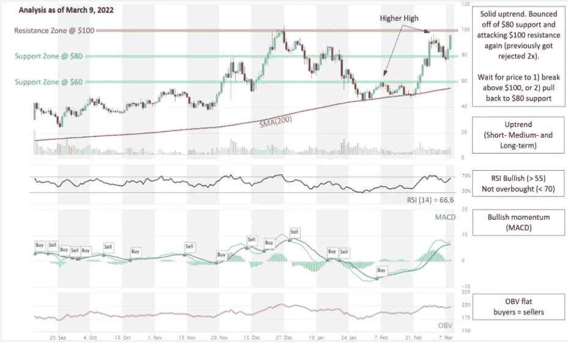
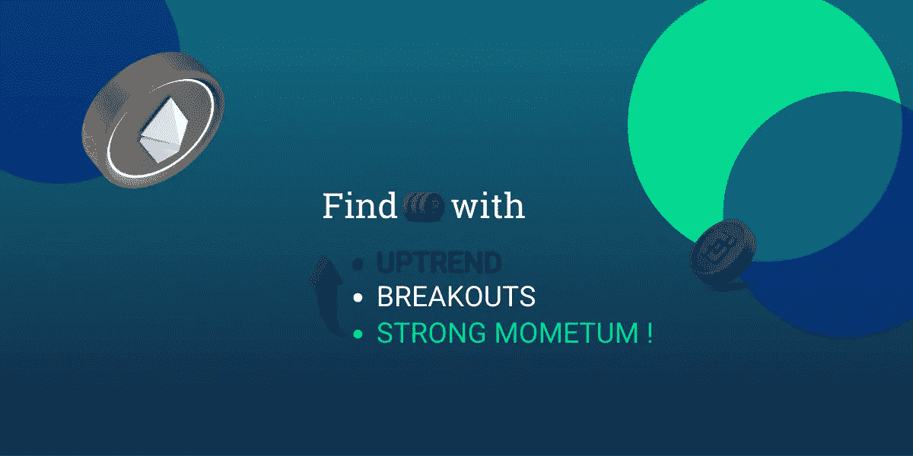

# BTC、ETH、LUNA、XMR 技术分析综述

> 原文：<https://medium.com/coinmonks/technical-analysis-review-of-btc-eth-luna-xmr-169f2f23536c?source=collection_archive---------46----------------------->

在视频中，我们报道了一些监管方面的新闻，回顾了 T2、BTC、瑞士联邦理工学院、露娜和 XMR 的图表，并观察了其他处于上升趋势的硬币。

Source: altFINS

**拜登政府发布了一项期待已久的关于加密法规的行政命令**，该命令似乎基本上只是将问题搁置，没有任何具体的指令，而是要求每个联邦机构协调并制定该资产类别的法规，平衡创新与消费者保护。

在短期内，政府似乎专注于稳定资本的监管。我认为，一些合理的监管实际上可能对数字资产空间的扩展非常积极，因为它降低了零售和机构投资者主流采用的风险。

这至少暂时消除了 crypto 的一个威胁，我们看到了隔夜的强劲反弹。

**硬币分析:**

**BTC -** 横盘动作，再次逼近 45K 美元阻力——最近拒绝了 3x。

ETH -下降三角形-明显形成更低的高点-看跌，但 2300 美元左右的支撑位迄今仍保持不变。需要突破下降趋势线，但信号趋势反转。

围绕隐私币也有一种说法，比如 Monero (XMR) 和 ZCash (ZEC) ，它们昨天大幅上涨，因为人们认为俄罗斯人可以用它们将部分财富转移出俄罗斯。

有趣的是，两人都被 200 天 MA 选中并拒绝了…..不要低估这个关键的阻力位/支撑位。

如果你想在这个市场上拥有自己的密码，你应该找到那些由于一些特定的催化剂、事件或驱动因素而仍处于上升趋势的少数硬币。

**LUNA 分析-** 反弹至 80 美元支持，我们在[策划图表](https://platform.altfins.com/curatedCharts)中强调了这一点

Source: altFINS

Luna 交易设置:稳定的上升趋势。反弹 80 美元的支持，并再次攻击 100 美元的阻力(之前被拒 2 次)。等待价格 1)突破 100 美元，或 2)回落到 80 美元的支撑位，这是一个进场机会。(设定一个价格[提醒](https://altfins.com/knowledge-base/create-alert-for-cryptocurrencies/))。最近的行动是由一个积极的公告推动的，该公告宣布在 1B 为 UST 建立一个保护区。

趋势:所有时间范围内的上升趋势(短期、中期和长期)。

势头看涨( [MACD](https://altfins.com/knowledge-base/macd-line-and-macd-signal-line/) 线在 MACD 信号线上方，RSI 在 55 上方)。

OBV(平衡成交量):持平，表示上涨日的成交量等于下跌日的成交量。因此，买方的需求和卖方的供应处于平衡状态

支撑和阻力:最近的支撑区域是 80 美元，然后是 60 美元。最近的阻力区是 100 美元。

Source: altFINS

**为什么要用奥特芬？**

在 [**altFINS 平台**](https://platform.altfins.com/) 可以找到**上升趋势、强劲势头**或**突破**的硬币！

altFINS 测量数千枚 altcoins 的最新**趋势**、**动量**和**交易模式**。

altFINS 会为您进行分析，并为您的投资组合生成一份**替代硬币的简短列表。**

在我们的 YouTube 频道中，我们分享在 altFINS 平台上发现的分析和交易机会。

你有兴趣成为一个真正成功的交易者吗？

加入我们由数万名交易者组成的社区，他们依靠 altFINS 发现交易理念！

**立即免费使用最好的硬币分析平台！别猜了，开始赢吧！**

**📈altFINS 官方链接:**
✅网站:[https://platform.altfins.com/](https://www.youtube.com/redirect?event=video_description&redir_token=QUFFLUhqa2s1clhtVk9PU2F6eHFnOGpTUWJtUFlWcm5xZ3xBQ3Jtc0ttUkh5d2xTZFd2OVVLTzdwTTdGMFJoZHJENnZseGNmX2JyUUVmQnpuaXBYYzFzSHBHUDJJQVhlZnhjRmJlX2ZKbllzUWVSS3ppOU5Ld09VU2cwQ0N4VFZJa2tUN1RqcFRNTHUyRTAxRnktTmdxZU1CYw&q=https%3A%2F%2Fplatform.altfins.com%2F)
✅不和:[https://discord.gg/kgHHyEDC92](https://www.youtube.com/redirect?event=video_description&redir_token=QUFFLUhqa3NXbnVFM0d5RzVPZmZjMzJjWlkwNnNGcWFaUXxBQ3Jtc0ttWmdVSVRwMGIzMkZsRlkyMzFydkZSWVQ4WXFyU1VOR3hQaFpxS21ETklvcGlIQjF5eGUwMmRMTTR6ZmllU3c0eU0tR3BGVTJEUExOWHhBRk5nUlN6TGlrdUloNDVwNXNxY0RZNFBYOEVtNVhfaGctOA&q=https%3A%2F%2Fdiscord.gg%2FkgHHyEDC92)
✅电报:[https://t.me/altfins](https://www.youtube.com/redirect?event=video_description&redir_token=QUFFLUhqbmZqdENaanRhWlE0Q24tQmNWaTc2MEh4NDdvUXxBQ3Jtc0tsdEI3Z19yNlVaQ2Z2cmQ2QjNjUlZmTjVlbmhKZWZkVFZMUmxnbE9wdmZDOUhSZktvX2dubHhnc19QUkZueEh5S2huVjBISFBjYlJmQUx5RlVhWURGZnFnTFhnT014ZFV0V2hNd2k1MTBHbS16U01CQQ&q=https%3A%2F%2Ft.me%2Faltfins)
✅推特:@AltfinsA 你有问题吗？请随时通过聊天或 invest@altfins.com 联系我们

> 加入 Coinmonks [电报频道](https://t.me/coincodecap)和 [Youtube 频道](https://www.youtube.com/c/coinmonks/videos)了解加密交易和投资

# 另外，阅读

*   [杠杆代币](/coinmonks/leveraged-token-3f5257808b22) | [最佳密码交易所](/coinmonks/crypto-exchange-dd2f9d6f3769) | [Paxful 点评](/coinmonks/paxful-review-4daf2354ab70)
*   [加密套利](/coinmonks/crypto-arbitrage-guide-how-to-make-money-as-a-beginner-62bfe5c868f6)指南| [如何做空比特币](/coinmonks/how-to-short-bitcoin-568a2d0b4ae5)
*   [币安期货交易](https://coincodecap.com/binance-futures-trading)|[3 comas vs Mudrex vs eToro](https://coincodecap.com/mudrex-3commas-etoro)
*   [如何购买 Monero](https://coincodecap.com/buy-monero) | [IDEX 评论](https://coincodecap.com/idex-review) | [BitKan 交易机器人](https://coincodecap.com/bitkan-trading-bot)
*   [尤霍德勒 vs 考尼洛 vs 霍德诺特](/coinmonks/youhodler-vs-coinloan-vs-hodlnaut-b1050acde55a) | [Cryptohopper vs 哈斯博特](https://coincodecap.com/cryptohopper-vs-haasbot)
*   [顶级付费加密货币和区块链课程](https://coincodecap.com/blockchain-courses)
*   [MXC 交易所评论](/coinmonks/mxc-exchange-review-3af0ec1cba8c) | [Pionex vs 币安](https://coincodecap.com/pionex-vs-binance) | [Pionex 套利机器人](https://coincodecap.com/pionex-arbitrage-bot)