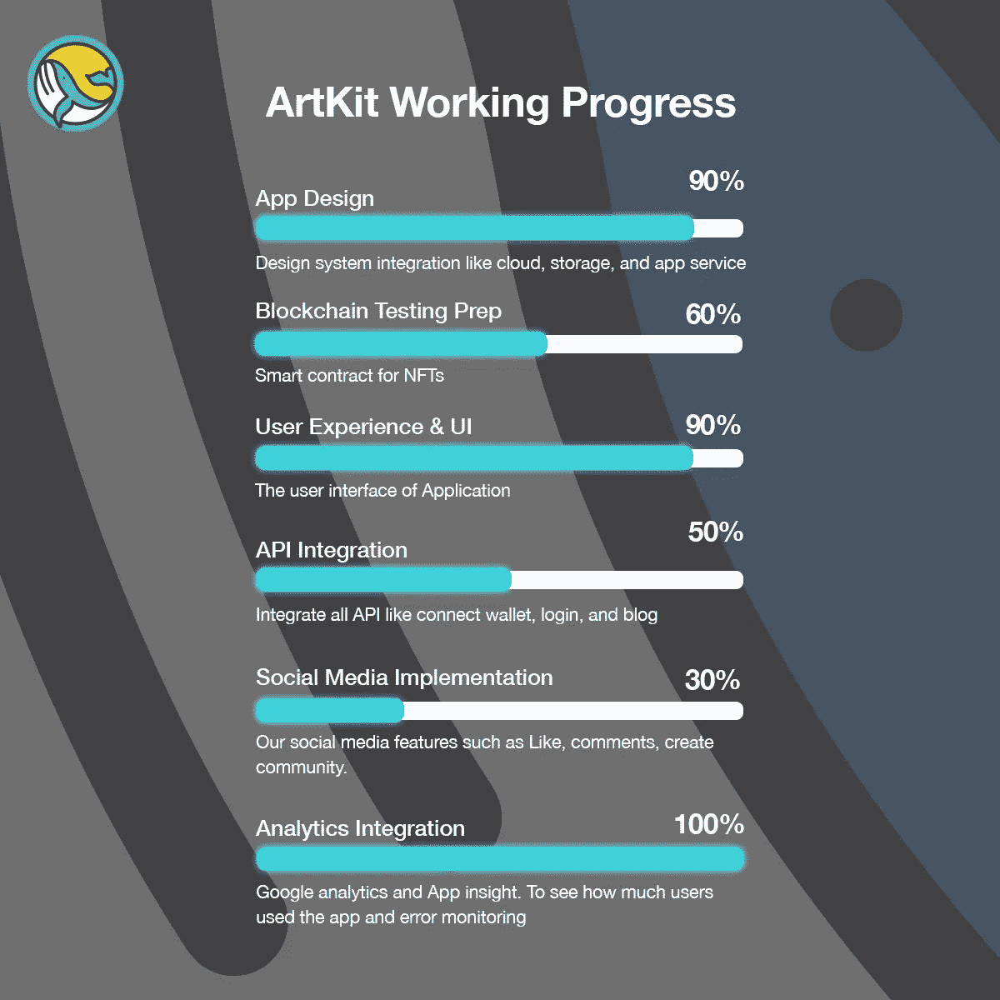

# 技术更新和时间表

> 原文：<https://medium.com/coinmonks/technical-update-timelines-e147d62c3c91?source=collection_archive---------43----------------------->

2022 年 5 月 4 日。

# **美术工具箱**

目前，我们是领先的去中心化 NFT 市场，这将使用户和项目能够创造、购买和销售 NFTs，关注他们最喜欢的创作者，并撰写 NFTs 故事。我们的用户也可以访问我们的社交媒体，并通过步行赚取被动收入，其他项目也可以创建他们的社区团体。

总的来说，我们正在弥合社交媒体、NFT 和元宇宙之间的差距。我们将实施多链(最多六个或更多区块链)和多支付(最多 500 次支付)系统/网关，使每个人都更容易获得，并允许各地获得他们最喜爱的 NFT。

# 这是我们的产品清单。

`See list below for our valuable products:`

*1。* [*ArtKit*](https://artkit.art/) *去中心化多链 _ 多付款 NFT 个人和项目市场*(活 5 月)
2 .*走路赚*(即将推出)
3。*社交媒体* (Testnet 已经上线)

# 自我们于 2022 年 3 月 21 日推出***【PancakeSwap】***以来的主要发展。

*答:具有社交媒体的分散式多链多支付 NFT 市场。2022 年 3 月 25 日-4 月 5 日-设计架构&基础设施。*

2.4 月 8 日至 15 日——发布 Beta 版社交媒体测试网(网络和移动版),漏洞搜索和修复

3.4 月 17 日至 19 日-测试版社交媒体(Testnet)的小型更新

4.2022 年 4 月 5 日至 10 日——NFT 多链智能合同的开发。第一层测试和错误修复

3.4 月 13 日至 24 日-开发 NFT 多付款智能合同。第一层测试和错误修复

4.四月二十五日至二十九日-网站更新

5.5 月 4 日至 6 日:我们将重点整合 NFT 造币厂的特色。我们期望我们可以在这个时期利用屏幕来铸造、购买和销售 NFT。可以在 Testnet 上测试进度和功能。

6.5 月 9 日至 20 日:我们将把所有 API 整合到发现、推广 NFT、NFT 详情、搜索、关注/取消关注、喜欢、评论和使用基本设置(如个人资料管理、密码等)的屏幕中

7.5 月 23 日至 27 日:测试和错误修复

8.5 月 28 日:预计 beta 2 的发布日期，beta 2 将覆盖多付款 NFT 市场，并将 BSC 链作为我们的第一个链。

# *B:通过散步赚取的被动收入*

详情将在 NFT 市场启动后公布

# 即将发布的更新

1.继续创建 beta-3。这将涵盖其他功能，如 gacha，锁定令牌奖励，和 NFT 融合。细节将在我们完成 beta-2 后公布。
2。通过散步赚取被动收入。

# 有关以下链接的更多信息

[**网站**](https://artkit.art/)
[**电报(全球):**](https://t.me/artkitofficial) [**推特:**](https://twitter.com/artkit_art)
`Whitepaper:` [点击此处](https://artkitstorage.blob.core.windows.net/artkitshare/Whitepaper%20English.pdf)
`Audited by Interfi Network:` [点击此处](https://github.com/interfinetwork/smart-contract-audits/blob/auditupdates/ArtKit_0xAB9ed2C3D76a1877d959C0d7E8DE48a33c55205C.pdf)
`Contract safety:` 100/100 令牌嗅探器:**(合同所有权声明放弃)** [点击此处查看](https://tokensniffer.com/token/9jhod3lao2nb082q8k9u6vqq2uh1hbdx2qmao5mvl24aosv900gpb11nx31b?h=3031)

# `Vote for us on the following platforms`

[**Crypto.com:**](https://crypto.com/price/artkit)

[币安:](https://www.binance.com/en-IN/price/artkit)

[**CoinMarketCap:**](https://coinmarketcap.com/currencies/artkit/)

[**CoinGecko:**](https://www.coingecko.com/en/coins/artkit)

[**在这里购买**](https://poocoin.app/tokens/0xab9ed2c3d76a1877d959c0d7e8de48a33c55205c)