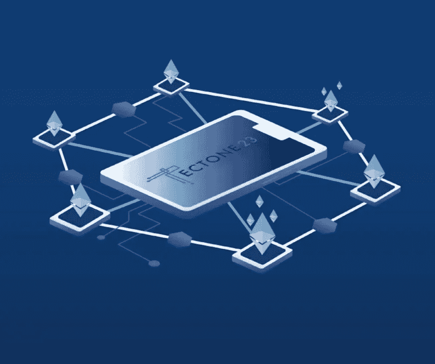
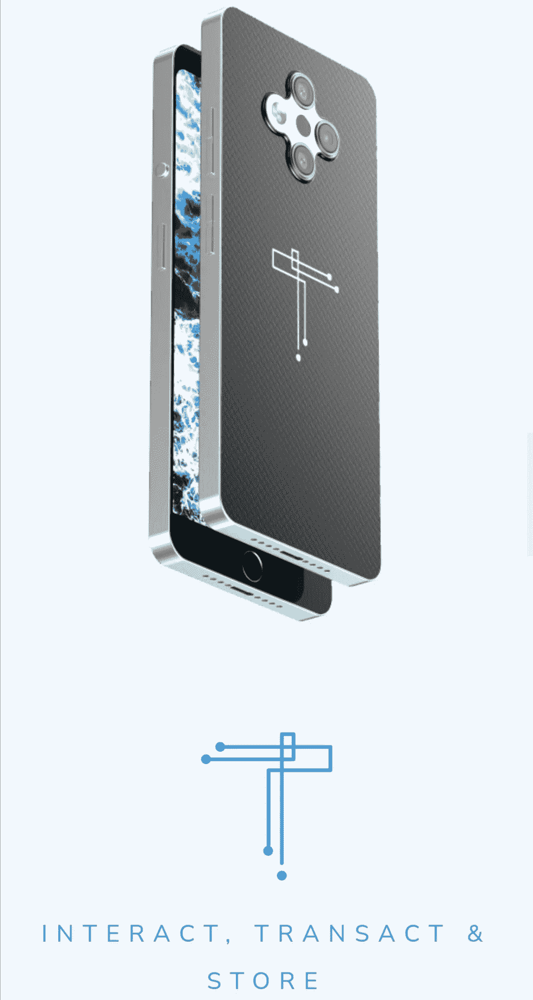
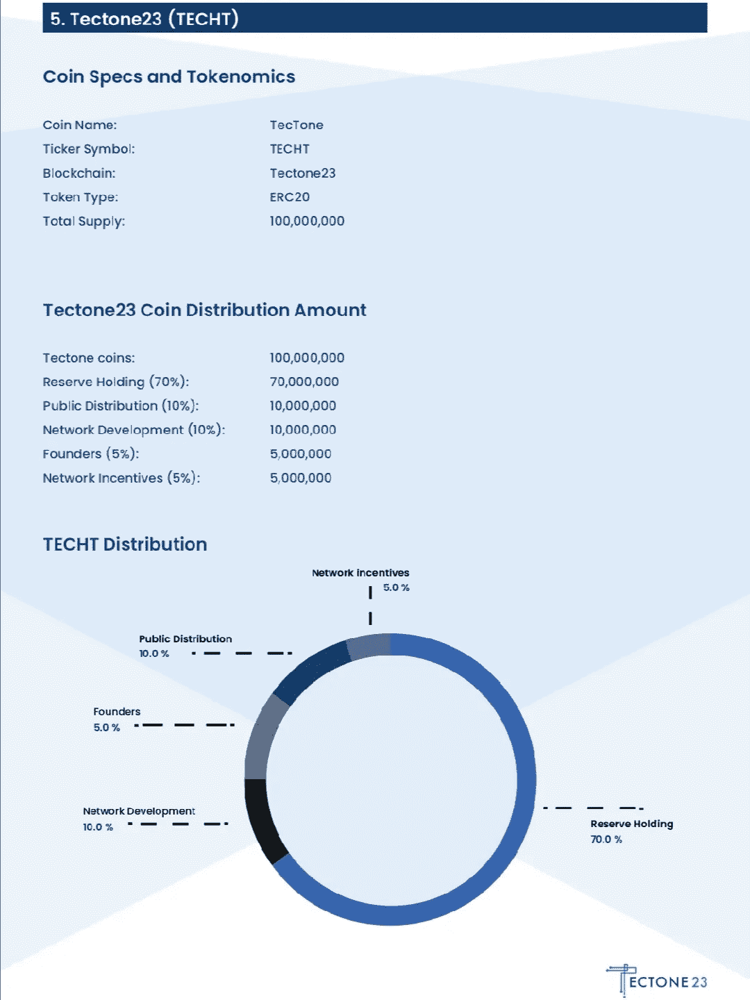

# tectone 23-WEB 3.0 去中心化智能手机会是什么样

> 原文：<https://medium.com/coinmonks/tectone23-what-a-web-3-0-decentralized-smartphone-could-be-f26f8209ebf0?source=collection_archive---------19----------------------->

你有没有想过智能手机可以受益于区块链技术？

这正是 Tectone23 带来的东西:一部完全基于区块链技术的智能手机。

由于关于 web 3.0 的无休止的讨论，人们越来越意识到将最终控制权放在用户手中的技术系统。通常，web 3.0 强调消费者将如何完全控制互联网，并能够选择他们参与的内容。然而，web 3.0 特性“超越网络使用”的想法是大多数人忽略的。

需要将 web 3.0 的范围扩展到互联网接入之外，这促使 Tectone23 开发人员设计了一种机制，允许在区块链上构建智能手机技术。

Tectone23 产品将分两个阶段推出。第一部分将包括一个 Android 软件应用程序，允许智能手机用户使用 Android 操作系统来享受 Tectone23 提供的功能，而第二阶段将包括一个完整构建的 Tectone23 智能手机，其中将包括该软件的所有升级功能。

该系统将在众所周知的 Android 操作系统上运行，但采用完全分散的形式。摆脱了[谷歌的控制](https://www.avast.com/c-how-google-uses-your-data)

**这是什么意思？**

当然，这是前所未有的(至少还没有成功的)，将 Tectone23 置于这种开发的前沿，利用区块链进行智能手机开发。

除了创造一个独特的下一代智能手机，该程序还包括加密货币。这家科技公司创造了 [TECHT](https://tectone23.com/wp-content/uploads/2022/01/TecTone-Whitepaper-v1.0.pdf) ，这是泰克东 23 区块链的本地实用令牌。它目前是区块链以太坊的 ERC 20 代币，计划在泰克东 23 主网完全运行后转移到它自己的区块链。

我们只能说，Tectone23 是智能手机、区块链、加密货币和技术的结合。有道理？

TECHT 将用于与智能手机上的 [dApps](https://en.wikipedia.org/wiki/Decentralized_application) 进行交互。它将利用大多数 DeFi 项目中发现的著名赌注机制，但这一次，用户将通过智能手机获得免费社交活动，而不是赚钱。

数据对于分析至关重要，组织可以利用这些现成的数据进行分析，从而帮助他们监控市场、了解消费者的痛点，并提供有助于他们长期保持业务的服务。作为一款 web3.0 智能手机，Tectone23 将为每个用户提供对其数据的最终控制权，使那些从用户数据中获利的大公司变得无能为力。然后，用户将对他们的数据发生什么有发言权，他们可以出售这些数据来换取 TECHT 令牌或保持隐私。

这种智能手机技术将支持 GameFi ，允许用户通过 web 3.0 系统上的游戏赚钱(就像大多数游戏赚钱一样)。因为手机预计会有自己的内置数字/加密钱包，所以不需要为了玩 web 3.0 P2E 游戏而与第三方钱包进行交互。

**接入电话**

每个用户都将拥有自己的私钥，这将允许他们访问和控制自己的设备。这套独一无二的私钥将区分每个用户(使他们成为一个节点)，并允许他们在智能手机区块链上反映他们的互动。这意味着私钥将作为平台上每个使用它的人的唯一电话号码。

Tectone23 智能手机的 dApps 将与普通智能手机的 App Store/PlayStore 功能相似。dApp 将使开发者发布用户可能使用的 web 3 应用程序变得简单。它将建立在一个基本的 onboarding 系统上，不需要开发人员有丰富的编码技能。

为了增加手机的隐私功能，将实施生物识别等安全措施。确保只有经过授权的个人才能访问智能手机。

由于开发人员整合了桌面技术，这款智能手机将具有一个功能，可以像电脑一样工作。这意味着 Tectone23 的所有者可能不需要额外花钱买电脑。

**关于泰克托尼 23** 你应该知道的事情

数据具有绝对价值:开发系统的构建是为了保护数据的隐私，同时确保其价值。这种价值延伸到提供个人数据以换取回报的能力。

允许非区块链用户参与区块链技术:它完全允许非加密参与者参与区块链技术，并受益于它所提供的一切。web 3.0 的最终目标就是实现这一点。

POS/POA 算法:采用了利益证明(POS)和授权证明(POA ),在 POS 中，用户将他们的 TECHT 货币作为赌注奖励，在 POA 中，用户利用他们在区块链上的个人信息来获得一些好处。

安全性是一个至关重要的问题:智能手机的开发是为了创造更安全的系统，需要人类的互动。

不需要特殊的手机:任何安卓手机都可以轻松安装该软件并使用其服务。

交易速度/费用:以光速收发信息，交易成本低。将它与易于使用的区块链相结合。

dApp 的 DAO :促进一个分散的投票系统来决定 dApp 上做什么和不做什么。

支持多链 dapp:dapp 将在智能手机系统上有效运行，而不管它们构建在哪个链上。

利用 P2P 系统:P2P 代表“个人对个人”，Tectone23 广泛使用该技术来保证数据安全。P2P 将对通过手机技术和系统发送的数据进行加密，使其只对参与个人对个人信息共享和参与的各方开放。

**技术词汇学**

TECHT token 的总供应量为 1 亿个 token。当它最终移动到 23 号构造带区块链时，将按 1:1 的比例进行转换。

分发:

创始人持有 5%

5%作为网络激励

10%用于网络开发

10%用于价格分配

70%用于储备控股

Bounty0x 用户名:@dammykhudz

为获得赏金而写的赞助文章

[网站](https://tectone23.com/) | [白皮书](https://tectone23.com/wp-content/uploads/2022/01/TecTone-Whitepaper-v1.0.pdf) | [推特](https://twitter.com/tectone23) | [电报](https://t.me/Tectone23)|[LinkedIn](https://www.linkedin.com/company/tectone23-software)|[insta gram](https://instagram.com/tectone23)

> 加入 Coinmonks [电报频道](https://t.me/coincodecap)和 [Youtube 频道](https://www.youtube.com/c/coinmonks/videos)了解加密交易和投资

# 另外，阅读

*   [5 款最佳加密交易终端](https://coincodecap.com/crypto-trading-terminals) | [最佳 DeFi 应用](https://coincodecap.com/best-defi-apps)
*   [最佳网上赌场](https://coincodecap.com/best-online-casinos) | [币安评论](/coinmonks/binance-review-ee10d3bf3b6e) | [BitMEX 评论](https://coincodecap.com/bitmex-review)
*   [麻雀交换评论](https://coincodecap.com/sparrow-exchange-review) | [纳什交换评论](https://coincodecap.com/nash-exchange-review)
*   [美国最佳加密交易机器人](https://coincodecap.com/crypto-trading-bots-in-the-us) | [经常性回顾](https://coincodecap.com/changelly-review)
*   [在印度利用加密套利赚取被动收入](https://coincodecap.com/crypto-arbitrage-in-india)