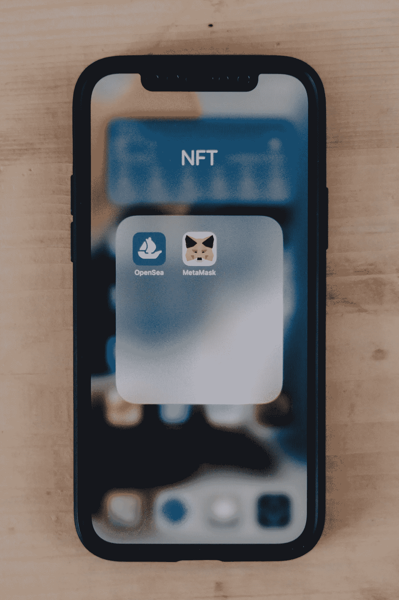
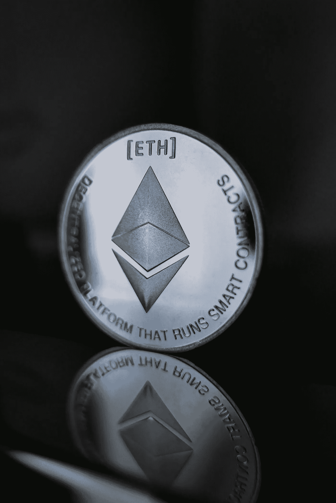

# Ted Nelson 和 Xanadu，他们在网络上的问题，以及区块链和 Nfts 正在做些什么

> 原文：<https://medium.com/coinmonks/ted-nelson-and-xanadu-their-problems-with-the-web-and-what-blockchain-and-nfts-are-doing-about-5b11995d887d?source=collection_archive---------30----------------------->

在 NFTs 之前，有了互联网，在互联网之前，有了 Vaneer Bush，Ted Nelson 和蒂姆·伯纳斯·李。后者被称为互联网之父，因为他创建了万维网，这可能是第五次或第六次尝试。蒂姆的万维网利用了超文本和泰德的系统“世外桃源”的一些特性。万维网是 URL(统一资源定位器)、HTTP(超文本传输协议)和 HTML(超文本标记语言)的顶峰。

泰德·纳尔逊在 1963 年创造了超文本这个术语，并在此基础上建立了他的超文本系统，Xanadu，比万维网早了几十年。超文本是一种系统，它允许读者跟随链接，从一段引文无限制地到达原文。Ted 已经在很多场合展示了他的系统，每次看到都很开心。世外桃源意味着文学记忆的神奇之地，这是 Ted 的观众在这些演讲结束时留下的印象。拥有一个从未见过天日的美丽互联网的知识不是很酷，因为人们会对我们可能拥有的不同未来感到好奇，Xanadu 随后被选中，给了我们今天拥有的互联网。

那么《世外桃源》为什么没有成功呢？毕竟走在了时代的前面。原因包括时机、想法的复杂性、来自同行和许多其他人的破坏。人们只能猜测是什么打击了他的想法。

那么这和 NFT 氏症有什么关系呢？我相信 NFT 和泰德·尼尔森心里有同样的想法。他们都希望作者在使用他们的作品时获得报酬，NFTs 甚至更进一步，因为不仅作者得到他们应得的，任何创作者都可以通过该平台获得报酬。更令人惊讶的是 NFT 给其他行业带来的创新和破坏的数量。我最近遇到了一群尼日利亚电影制作人，他们利用 NFT 的电影为他们的项目筹集资金，看到他们身上发生的事情真是令人惊讶。

NFT 和超文本的另一个相似之处是，它们都显示了文档的起源，超文本通过在连接的文档之间创建并行连接来实现这一点，NFT 确保了这一点，因为它基于区块链。

泰德·纳尔逊的想法可能因为附带的小额支付而失败。互联网可能没有起飞，因为它的原始观众会发现很难使用，因为他们必须付费。最近的一项研究报告称，40%的互联网是商业附属的，其他百分比的网络是由热情或义务经营的。人们首先被吸引到互联网上，然后开始收费。

NFT 背后的概念并不特别新，2012 年比特币网络上开发了第一个彩色 NFT。它在比特币网络上没有成功，因为存在如何赋予它们价值的问题。以太网于 2015 年推出，并由此创建了 ERC-20、ERC-721 和 ERC-1155 标准。这些标准，根据项目类型，已经被用于构建不同种类的 NFT。通过区块链的 NFT 已经彻底改变了艺术、音乐、收藏品、游戏(GameFi)、体育(NFT)、金融(DeFi)和元宇宙。这场革命才刚刚开始。

尼尔森在 Xanadu 的最大问题可能是他没有意识到技术正在“变得”像凯文·凯利在他 2016 年的书《不可避免》中所说的那样。在这本书里，凯文回顾了他在创造网络世界方面的工作和贡献。他说“然而在每一个阶段，当时很难看出会发生什么。通常很难相信。有时我们看不到正在发生的事情，因为我们不希望它以这种方式发生”。如果我们专注于我们所拥有的，就很难看到更大的图景。

Ted 在接受 Devon Zuegel 的采访时谈到有人向他寻求帮助，在区块链建造世外桃源，但他都拒绝了。很遗憾意识到世外桃源没有成为互联网，文学界可能永远不会欣赏或看到他的作品的美。

技术在不断变化，导致它们所在的系统也在变化。区块链技术将变得强大，因为它忠于技术不断变化的本质。加密货币彻底改变了货币、GameFi 游戏、DeFi 金融和许多其他新兴行业的定义。在这一点上，可以肯定地说，只有那些改变的人才会被改变。

*图片来源:* [*Unsplash*](https://medium.com/u/2053395ac335?source=post_page-----5b11995d887d--------------------------------)

*第一张图片是随机图片，与文章*中提到的任何人都没有关系

你可以在这里找到我

推特: [**埃罗普莱尼**](https://twitter.com/Eromplaini)

邮箱: [**耶利米**](http://johnjeremiah627@gmail.com)

> 加入 Coinmonks [电报频道](https://t.me/coincodecap)和 [Youtube 频道](https://www.youtube.com/c/coinmonks/videos)了解加密交易和投资

# 另外，阅读

*   [ProfitFarmers 回顾](https://coincodecap.com/profitfarmers-review) | [如何使用 Cornix 交易机器人](https://coincodecap.com/cornix-trading-bot)
*   [如何在势不可挡的域名上购买域名？](https://coincodecap.com/buy-domain-on-unstoppable-domains)
*   [印度的加密税](https://coincodecap.com/crypto-tax-india) | [altFINS 审查](https://coincodecap.com/altfins-review) | [Prokey 审查](/coinmonks/prokey-review-26611173c13c)
*   [赢取注册奖金——10 大最佳加密平台](https://coincodecap.com/earn-sign-up-bonus)
*   [Blockfi vs 比特币基地](https://coincodecap.com/blockfi-vs-coinbase) | [BitKan 点评](https://coincodecap.com/bitkan-review) | [Bexplus 点评](https://coincodecap.com/bexplus-review)
*   [南非的加密交易所](https://coincodecap.com/crypto-exchanges-in-south-africa) | [BitMEX 加密信号](https://coincodecap.com/bitmex-crypto-signals)
*   [MoonXBT 副本交易](https://coincodecap.com/moonxbt-copy-trading) | [阿联酋的加密钱包](https://coincodecap.com/crypto-wallets-in-uae)