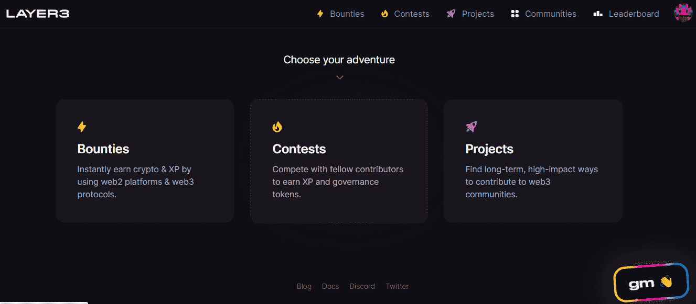
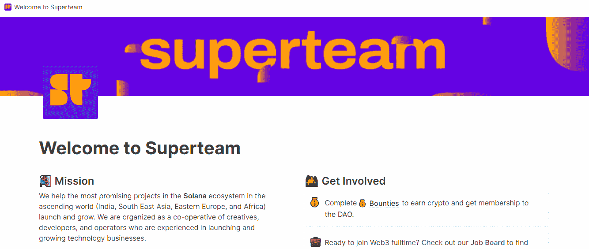
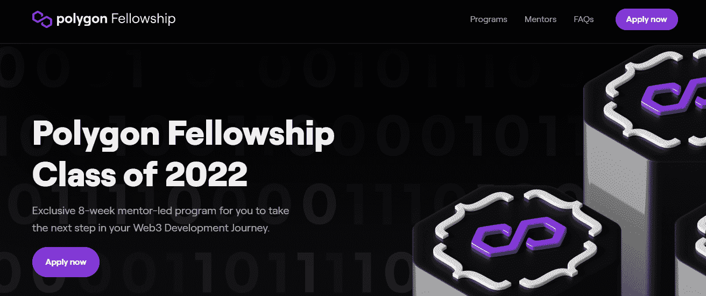
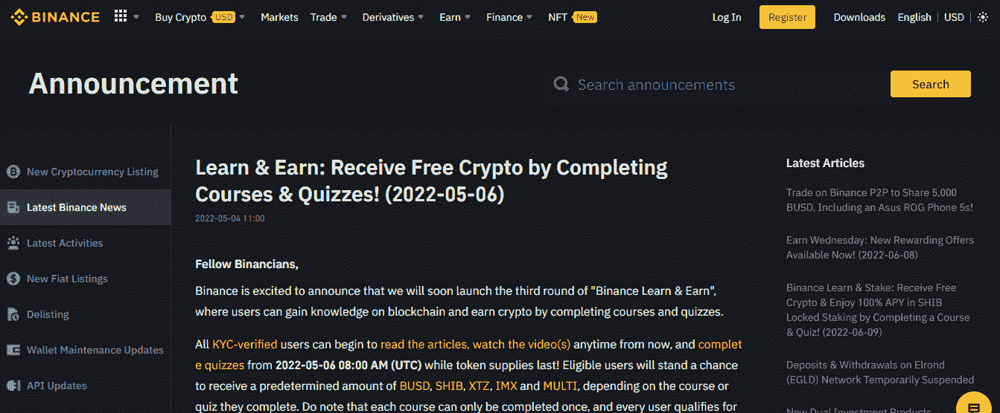
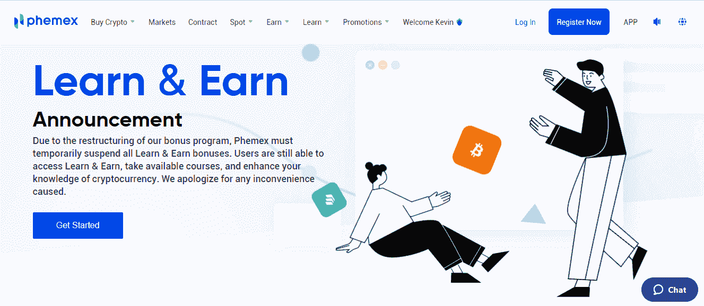
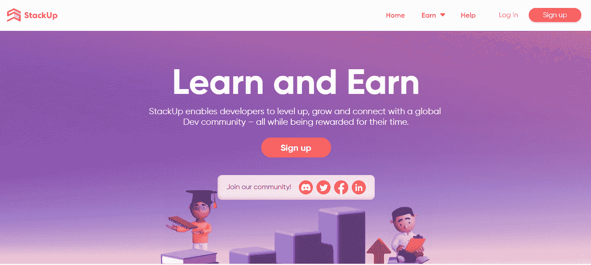
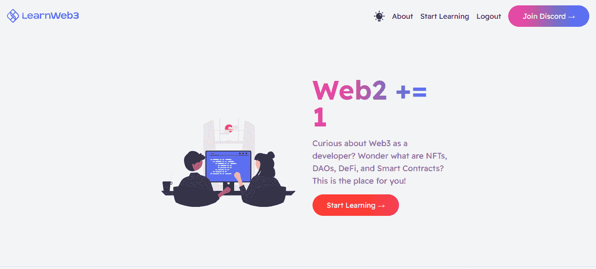
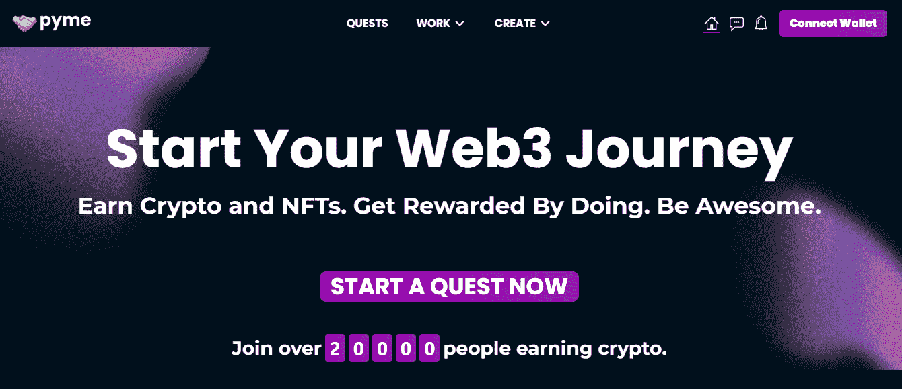
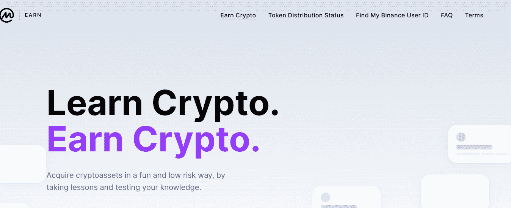
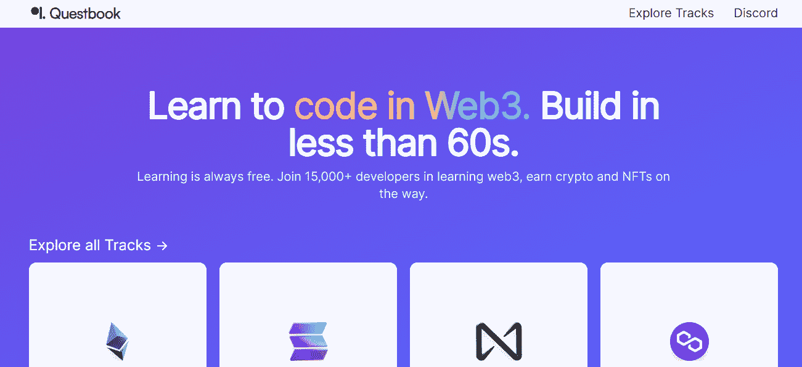

# WEB3 中十个值得学习和获得的地方

> 原文：<https://medium.com/coinmonks/ten-places-to-learn-and-in-in-web3-b37fae5ac78d?source=collection_archive---------1----------------------->

# 介绍

听到 web3 和区块链技术，你可能会问自己一些问题:我从哪里开始？我该如何开始？我如何在这个领域获得工作？有什么我可以遵循的工作计划吗？等等。事实是，网络的发展创造了大量的就业机会，这反过来弥补了失业的差距，唯一剩下的事情就是确定你能提供什么技能。点击[此处](/coinmonks/how-to-get-a-crypto-job-with-little-or-no-experience-805bc6ae56d7)了解更多关于加密作业的信息。

所以，为了回答你的问题，我将向你展示十(10)个可以帮助你踏上 web3 之旅的网站。这些网站会自动向你支付学习 web3 的费用，它们只是简单地被标记为“学会赚钱”。那么，让我们开始吧

## WEB3 中最值得学习和赚钱的 10 个地方

web3 中有很多可以学习和赚钱的地方，但是，我将列出我尝试过的 10 个学习赚钱的地方，因此:

1.  [**第三层**](https://beta.layer3.xyz/earn)

第三层是一个平台，让世界上任何地方的任何人都可以对 web3 做出贡献。Dao 和分散的社区在第三层平台上以奖金、竞赛和项目的形式上传他们的任务，而用户则探索社区并完成任务，这些任务将在 crypto 中获得奖励。点击[此处](https://docs.layer3.xyz/layer3/)了解更多关于第 3 层的信息。

2. [**超级团队**](https://superteam.fun/)

在这个平台上，你不仅仅是学习，你还有机会接触到活跃的工作角色。Superteam 还帮助 Solana 生态系统中最有前途的项目启动和发展。所以，如果你想报道索拉纳生态系统，那么 Superteam 是你的最佳选择。

3. [**多边形相交**](https://polygon.technology/polygon-fellowship/)

该奖学金允许您在您的 web3 开发计划中获得为期 8 周的独家辅导计划，并为您的工作做好准备。他们有途径 1 和途径 2 指导流程。路线 1 是为没有任何知识或试图从 web2 迁移到 web3 的人准备的。这些人在课程结束后将获得 1500 美元的津贴，而途径 2 是为已经掌握 web 3 知识并需要成为大师的人准备的。属于这一类别的人将获得 3000 美元的 Web 3 Builder Track 津贴。他们还会在网站上列出一系列工作机会，这样你就有机会获得工作角色。

4. [**【币安学】和【T2 学】**](https://www.binance.com/en/support/announcement/5aee07d467314086ab204ed92ee1bbaa)

币安学习赚取允许用户获得区块链的知识，并通过完成课程和测验赚取加密。但是，值得注意的是，每门课程只能完成一次，每个用户每完成一门课程最多可获得一次奖励。

5. [**Phemex 学而赚**](https://phemex.com/learn-crypto) :

Phemex 将学习和获得作为一个教育项目。然而，即使他们的网站正在进行某种形式的重组，你仍然可以学习，参加课程，提高你的区块链技术知识。

6.[堆叠](https://app.stackup.dev/):

这个是给开发者的。StackUp 使开发人员能够升级、成长并与全球开发社区保持联系——同时获得时间回报。所以，如果你是一个开发者，那么你可能想看看它。

7. [**Learnweb3**](https://www.learnweb3.io/) :

这是面向开发者和非开发者的，他们的目标是让尽可能多的开发者加入 Web3，教授 NFTs、DAOs、DeFi、智能合约等等

8. [**Pyme** :](https://pyme.team/)

这个平台用他们自己的话说就是让你牛逼。你有机会学习，获得和归属。他们提供实习角色，并为你完成一些任务支付报酬。在这个网站上你可以做很多事情，例如，作为一个自由职业者，你可以完成正在进行的项目并获得固定的报酬，你可以通过加入一个建设未来的 web3 公司来全职工作，等等。

[9。**coin market cap**](https://coinmarketcap.com/earn/)

Coinmarketcap 是一个区块链资源中心，提供各种形式的区块链新闻、更新和分析。在他们的“学习赚钱”课程中，CoinMarketCap 精心挑选并与可信和新兴项目合作，为用户提供边学习边赚钱的机会。您可以从阅读有关项目的信息或观看简单易懂的视频开始，通过免费测验测试您的新知识，并申请您的密码。

10. [**任务书**](https://openquest.xyz/) :

这也是开发商的另一个。最有趣的是，它让用户有机会在赚钱的同时选择自己喜欢的区块链进行学习。作为一个开发者，你可以选择以太坊、索拉纳、近景或多边形等。

这些是你可以学习和了解 web3 的一些地方。

# 结论

随着网络的发展，财务自由的未来已经升级，网站愿意为你的时间和知识付费。你需要做的就是抓住机会，开始学习赚钱。

不要犹豫，分享你的想法，并关注我的页面以获取更多更新。

# 关于作者

Igwe Ihuoma Patience 是一名自学成才的创意和特定行业内容作家，也是一名加密货币爱好者，拥有 2 年多的经验和不断发展的区块链空间的知识。

我擅长内容创作、文案撰写、字幕管理、视频编辑和手机图形设计，我教其他人如何在加密货币和区块链领域起步，我的目标是让区块链的学习和更新易于任何人理解。

> 加入 Coinmonks [Telegram group](https://t.me/joinchat/Trz8jaxd6xEsBI4p) 并了解加密交易和投资