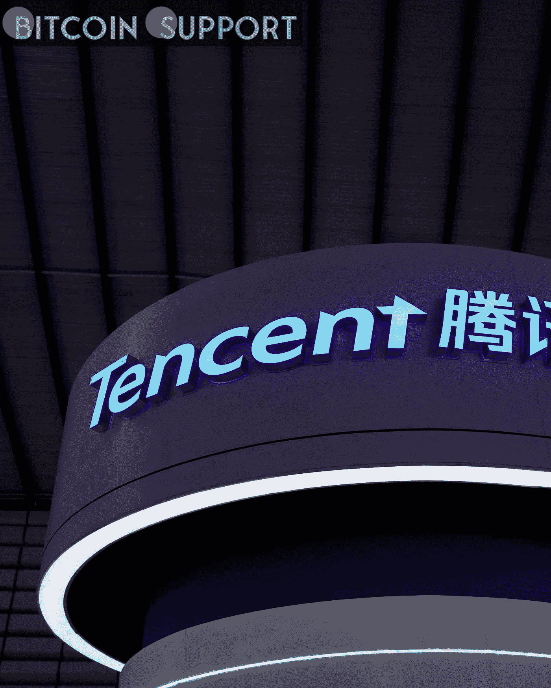

# 腾讯已经为元宇宙的虚拟音乐会申请了专利

> 原文：<https://medium.com/coinmonks/tencent-has-filed-a-patent-for-virtual-concerts-in-the-metaverse-aa748b30b87c?source=collection_archive---------34----------------------->

**Visit our website:-** [**https://bitcoinsupports.com/**](https://bitcoinsupports.com/)

中国数字巨擘腾讯(Tencent)不顾中国各银行和当局的担忧，提交了一项虚拟音乐会专利，从而扩大了其在元宇宙的努力。根据行业数据追踪者奇查查的数据，中国互联网公司腾讯已经向中国国家知识产权局(CNIPA)申请了虚拟音乐会专利。这项申请是在中国公司争夺元宇宙商标的时候提出的。

尽管中国人民银行(PBoC)在 11 月对元宇宙和不可伪造代币(NFT)采取了强硬立场，声称将使用反洗钱工具对其进行追踪，但据中国新闻媒体《中国日报》报道，仍有超过 1000 家中国公司提交了超过 16000 份与元宇宙相关的商标申请。尽管受到警告，中国跨国科技和视频游戏集团腾讯一直处于中国进军元宇宙的最前沿。据《南华早报》报道，去年 10 月，腾讯向员工发出了一封内部信，内容是关于在其子公司 TiMi Studios 下开发一个新的“F1”工作室，据消息人士称，该工作室将包括来自中国、美国、加拿大和新加坡的员工。去年 12 月 31 日，腾讯在元宇宙举办了中国第一场虚拟音乐会，名为“TMELAND”的新年庆祝活动，在整个音乐节期间吸引了超过 110 万粉丝。总部位于洛杉矶的动画音乐会初创公司 Wave 也已被腾讯收购，该公司采用动作捕捉技术来创建逼真的虚拟音乐会。

[https://Twitter . com/Tencent global/status/1476875578145914896](https://twitter.com/TencentGlobal/status/1476875578145914896)

Wave 演唱会在过去曾大受欢迎，在疫情期间更是成为歌手与观众互动的新鲜方式。去年 8 月，威肯使用 Wave services 在抖音直播了一场虚拟音乐会，吸引了全球 200 多万人，并为平等正义倡议捐赠了 35 万美元。当地监管机构是否会对这家中国跨国公司的目标产生影响，还有待观察。在 11 月 26 日的一次国家金融安全峰会上，中国人民银行反洗钱(AML)部门主任苟文军警告称，加密生态系统的新趋势，如 NFTs 和元宇宙，可能带来危害。他警告说，如果这些资产不受监管，它们可能会被用于非法目的，包括洗钱和逃税。12 月 9 日，中国共产党的官方报纸《人民日报》发布了一份关于元宇宙的警告，指出“监管应先于创新”尽管国家控制的媒体和银行发出了警告，但中国仍未对相关政策做出任何进一步澄清。

**访问我们的网站:-**[**https://bitcoinsupports.com/**](https://bitcoinsupports.com/)

**免责声明:以上为作者观点，不应视为投资建议。读者应该自己做研究。**

> 加入 Coinmonks [电报频道](https://t.me/coincodecap)和 [Youtube 频道](https://www.youtube.com/c/coinmonks/videos)了解加密交易和投资

# 另外，阅读

*   [SmithBot 评论](https://coincodecap.com/smithbot-review) | [4 款最佳免费开源交易机器人](https://coincodecap.com/free-open-source-trading-bots)
*   [比特币基地僵尸程序](/coinmonks/coinbase-bots-ac6359e897f3) | [AscendEX 审查](/coinmonks/ascendex-review-53e829cf75fa) | [OKEx 交易僵尸程序](/coinmonks/okex-trading-bots-234920f61e60)
*   [如何在印度购买比特币？](/coinmonks/buy-bitcoin-in-india-feb50ddfef94) | [瓦济克斯审查](/coinmonks/wazirx-review-5c811b074f5b)
*   [隐翅虫替代品](/coinmonks/cryptohopper-alternatives-d67287b16d27) | [HitBTC 审查](/coinmonks/hitbtc-review-c5143c5d53c2)
*   [CBET 评论](https://coincodecap.com/cbet-casino-review) | [库科恩 vs 比特币基地](https://coincodecap.com/kucoin-vs-coinbase)
*   [折叠 App 审核](https://coincodecap.com/fold-app-review) | [Kucoin 交易机器人](/coinmonks/kucoin-trading-bot-automate-your-trades-8cf0ca2138e0) | [Probit 审核](https://coincodecap.com/probit-review)
*   [如何匿名购买比特币](https://coincodecap.com/buy-bitcoin-anonymously) | [比特币现金钱包](https://coincodecap.com/bitcoin-cash-wallets)
*   [币安 vs FTX](https://coincodecap.com/binance-vs-ftx) | [最佳(索尔)索拉纳钱包](https://coincodecap.com/solana-wallets)
*   [比诺莫评论](https://coincodecap.com/binomo-review) | [斯多葛派 vs 3Commas vs TradeSanta](https://coincodecap.com/stoic-vs-3commas-vs-tradesanta)