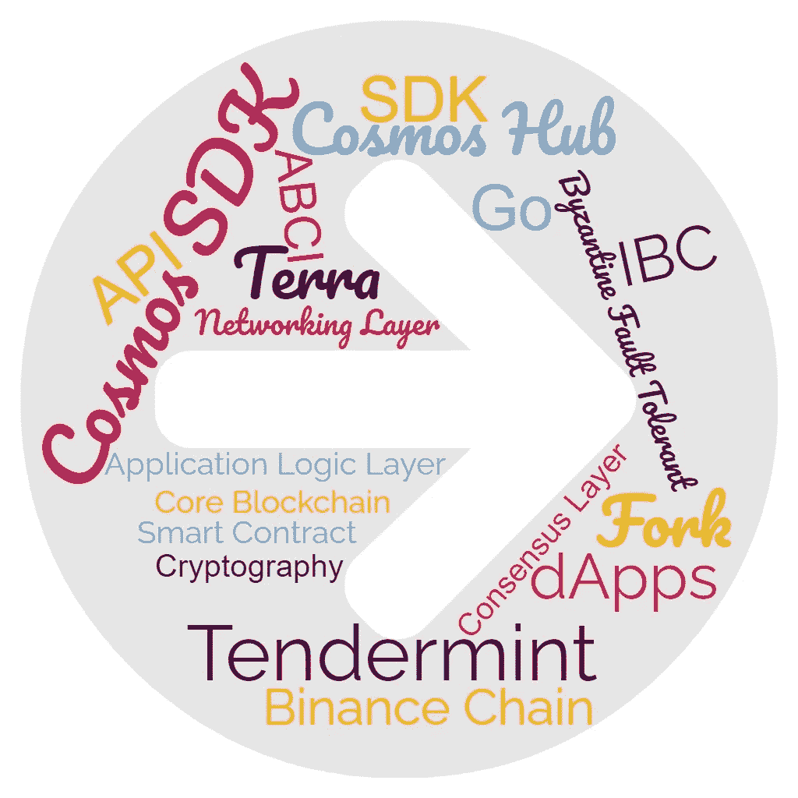

# Tendermint & Cosmos SDK 揭秘

> 原文：<https://medium.com/coinmonks/tendermint-cosmos-sdk-demystified-47385cf77cf6?source=collection_archive---------1----------------------->

## Tendermint & Cosmos SDK 如何帮助我们开发核心区块链或 dApps？



```
**Table of Contents:** · [Blockchains Architecture](#5a47)
  ∘ [#1 — Consensus Layer](#bc45)
  ∘ [#2 — Network Layer](#bee1)
  ∘ [#3 — Application Logic Layer](#8caf)
· [Approaches to Develop Blockchains](#f76d)
  ∘ [#1 — Fork Existing Blockchains](#5eb4)
  ∘ [#2 —Develop  Smart Contracts on Existing Blockchains](#3d8b)
  ∘ [#3 — Develop](#7284)…
```