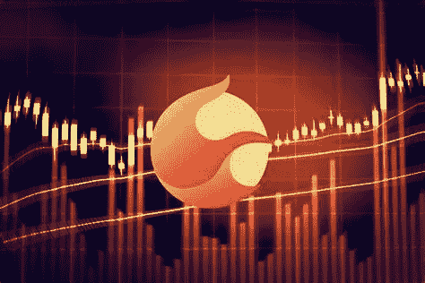

# terra 2.0(LUNA)2022–2025 年价格预测

> 原文：<https://medium.com/coinmonks/terra-2-0-luna-price-prediction-2022-2025-87f7216ad2a0?source=collection_archive---------4----------------------->

Source photo [terra 2.0 LUNA — Bing images](https://www.bing.com/images/search?view=detailV2&ccid=TqdkSuGn&id=076F1EE82D19ECD03AA3E22B85FBEF0E6EA8D520&thid=OIF.Hy8F6ftc5KBE46vJockU%2fg&mediaurl=https%3a%2f%2fnulltx.com%2fwp-content%2fuploads%2f2022%2f06%2fterra-luna-2-lunc-price-1024x684.jpg&cdnurl=https%3a%2f%2fth.bing.com%2fth%2fid%2fR.4ea7644ae1a79cf6dbbaae2da65618fa%3frik%3d%26pid%3dImgRaw%26r%3d0&exph=684&expw=1024&q=terra+2.0+LUNA&simid=7097620413526&FORM=IRPRST&ck=1F2F05E9FB5CE4A044E3ABC9A1C914FE&selectedIndex=10&ajaxhist=0&ajaxserp=0)

## Terra(露娜)是什么意思？

这个系统的本地加密货币 LUNA 对于建立稳定的货币挂钩至关重要。根据目前对这些稳定的硬币的需求，你可以得到折扣或支付更多。作为一种分散的加密货币，Terra 允许用户在全球任何地方快速便捷地进行交易，无论他们身在何处。