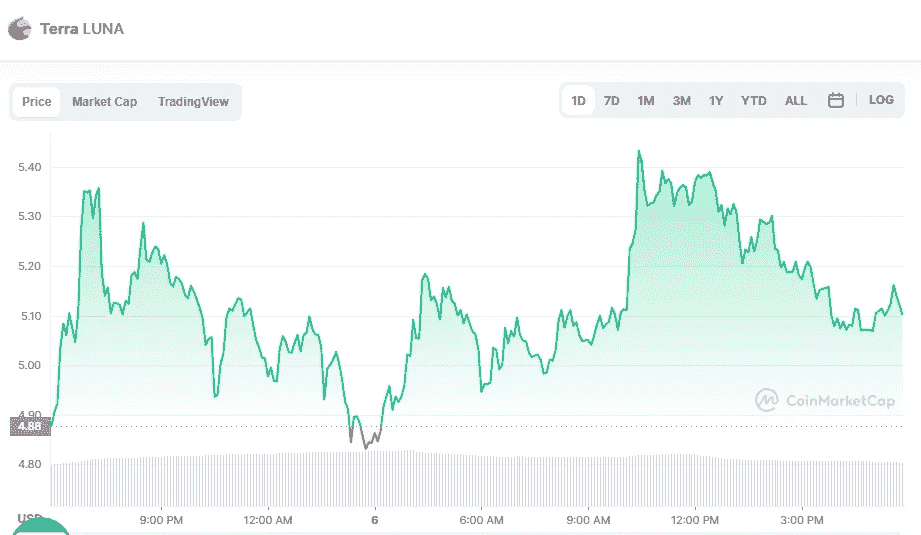

# Terra 2.0 (LUNA)价格分析

> 原文：<https://medium.com/coinmonks/terra-2-0-price-analyse-d2bafafe31c6?source=collection_archive---------31----------------------->

Source photo [Terra price today, LUNA to USD live, marketcap and chart | CoinMarketCap](https://coinmarketcap.com/currencies/terra-luna-v2/)

自从 Terra 链分裂和 Terra 随后推出 LUNA 2.0 以来，Luna 2.0 经历了剧烈的波动。例如，上周在加密货币市场 KuCoin 上市时，LUNA 令牌的价格上涨了 39.41%。由于卢娜/USDT 大幅上涨，象征性价格跌至 10 美元以下。

在市场上仅仅七天之后，卢娜硬币已经下跌了超过其最初价值的一半。作为…