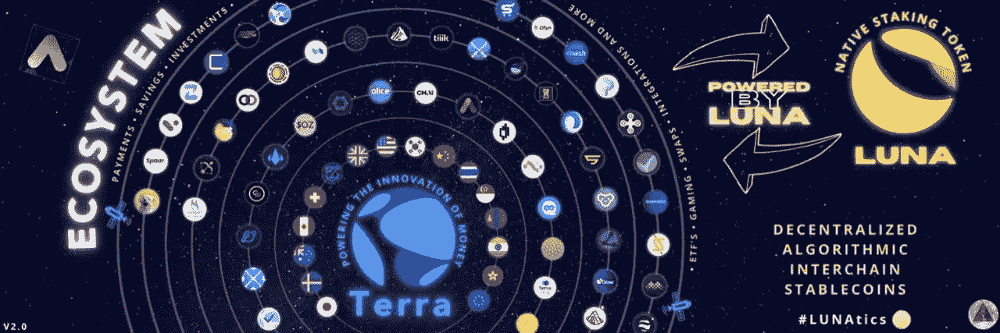

# Terra:一个稳定的算法平台

> 原文：<https://medium.com/coinmonks/terra-an-algorithmic-stablecoin-platform-f407eff9f480?source=collection_archive---------76----------------------->

基于 Cosmos 的协议，使用其算法 stablecoin 支持价格稳定的全球支付网络。

# 什么是 TERRA(露娜)？

Terra 是一个专门从事稳定币开发的区块链网络，由**宇宙 SDK** 构建。每一种稳定的货币都可以转换成网络的自然资产 LUNA，而不是使用现金或过度抵押的密码作为储备。

LUNA 的持有人可以支付网络费用，对治理进行投票，参与 Tendermint 委托的股权共识证明方法，并钉住 stablecoins。

丹尼尔·申**和**道权**创立了 Terra 项目，这是第一层区块链。Terra 于 2018 年初在韩国成立，被公认为市场上最有前景的一级连锁酒店之一。其**月神令牌 2021 年增长 17000%**！UST，一种没有货币储备支持的分散算法稳定货币，是建立在 Terra 和它的原生货币 CW20-token LUNA 的基础上的。**

UST 是 Terra 最重要的产品，它的成功很可能会决定整个生态系统的成功。在成为 Terra DeFi 生态系统的骨干之前，UST 已经与支付系统连接，如韩国的 Chai 和蒙古的 Memepay。

# 什么是露娜，它如何与 UST 一起工作？

Terra 的本土统治令牌**卢娜**，作为其 **UST** 稳定币的抵押品。

不像其他稳定的国家，如 USDC 或 USDT，UST 没有固定数量的法定货币支持。相反，LUNA supply 作为 UST 的后盾，通过控制供应来吸收 UST 需求的变化。基本的机制是，顾客总是可以用一个 UST 兑换 1 美元的露娜。

假设市场上有一百万个 UST，每个都有一百万美元的月神支持。假设 UST 需求上升，钉住汇率制度被打破，1 UST 价值超过 1 美元。为了修复钉子，Terra 熄灭等量的 LUNA，制造出新的 UST。如果 UST 需求下降，挂钩被打破，UST 持有者可以用他们的代币换 1 美元的 LUNA，直到挂钩恢复。

换句话说，如果对 UST 的需求上升，月神的供应就会下降，导致月神的价格攀升。如果对 UST 的需求下降，月神的供应就会增加，导致月神的价格下跌。因此，波动性正从 UST 向卢娜转移。

从长远来看，更高的 UST 需求将导致月神供应量的减少和月神需求量的增加。随着新的 dApps 在 Terra 出现，更多的桥梁连接到其他区块链，对 UST 的认知和需求会上升，对 LUNA 的需求也会上升，导致 LUNA 供应下降。

# 创始人及其背景

**Daniel Shin 和 Do Kwon 于 2018 年 1 月创建了 Terra。**这一概念是由两人设计的，旨在通过关注**的价格稳定性和可用性**，加速区块链技术和加密货币的应用。Kwon 被任命为 Terraform 实验室的首席执行官，该公司创造了 Terra。

**Shin** 在创立 Terra 之前，共同创立并领导了韩国大型电子商务网站“票怪”，通常被称为“TMON”。后来，他与人共同创立了亚洲快车道公司，这是一家创业孵化器，与企业家合作建立功能齐全的企业。

Kwon 之前开发并领导了 Anyfi，这是一家提供分散式无线网状网络解决方案的公司。他还作为软件工程师在微软和苹果公司工作过。

## **与 TENDERMINT 的利益相关共识机制证明**

Terra 区块链采用由 Tendermint 验证系统支持的利益证明(PoS)共识架构。

首先选择提议者验证者，以便向网络提议和添加新的块。这个验证器提出一个阻塞，所有其他验证器投票赞成或反对它。如果提议的区块在投票中被否决，则选择另一个提议者，并重复该过程，直到确认者投票赞成提议的区块。

在此过程中，所有验证者和委托者都将获得大宗交易费用的补偿。此外，成功通过她的区块的提议者验证者将得到额外的奖励。

使用这种共识模型，可以在几秒钟内对批量交易进行验证和认证(根据官方文档，大约需要 6 秒钟)。

# 陆地生态系统

**锚协议**

Anchor 是一种货币市场协议，类似于以太坊的 MakerDAO。它拥有最高的稳定利率之一，为 19.5%，用户可以存放非 Terra 本地的合成资产，如 bETH。由于它在 Terra 项目中的重要性，Anchor 几乎可以被称为 Terra bank。

Anchor 提供了三个主要的用例:债券资产、货币市场基金和贷款清算。

**抵押资产**是泰拉区块链的令牌化股权。代币持有者不仅从债券资产中获得整体回报，还从其可替代性和可转让性中获利。理论上，任何具有智能合约的区块链都可以支持保税资产，也称为包装资产。

它的**货币市场**是由一系列 LUNA 存款定义的，这些存款可以用来发放超额抵押贷款。借款人向流动性池提供抵押品(UST 或债券资产)以换取贷款。利率是根据池的使用率动态计算的。

如果一笔**贷款的贷款价值比** (LTV)低于某个阈值，它将被清算。贷款的 LTV 由抵押品决定。锚寻求实现其所谓的**锚利率作为利率目标**。为了做到这一点，它的智能合约在动态的基础上在借款人和存款人之间从抵押资产中分割整体回报。

**镜像协议**

Mirror 是一个**合成资产协议**，支持加密资产和传统金融资产的合成交易。

镜像生成资产的镜像表示，如代表加密资产的**方法**或 **mBTC、**，以及代表股票或商品的其他群体。用户可以利用 UST 来交易这些群体，这些群体的价格是由神谕确定的。与传统金融市场不同，Mirror 不按照固定的时间表运行，允许在周末有套利机会。

用户也可以创建 mAssets，并采取杠杆立场，最大 LTV 比率 150%的允许。这使得投资者能够在他或她可能看涨或看跌的资产中建立大量杠杆头寸。用户还可以采用 delta 中性策略来保护自己免受资产价格波动的影响，同时最大化他们在 MIR 的回报。

**TERRASWAP**

[Terraswap](https://coinmarketcap.com/exchanges/terraswap/) 是 Terra 的原生 [DEX](https://coinmarketcap.com/alexandria/glossary/decentralized-exchange-dex) ，是一个完全分散的协议，用于在 Terra 上自动提供流动性。它的使命是“**让开发商、流动性提供者和交易者能够参与到一个对所有人开放的金融市场中来。”**类似于竞争对手区块链的其他分散式交易所，如 [TraderJoe](https://coinmarketcap.com/exchanges/traderjoe/) ，投资者可以以非托管和分散的方式在不同的本土资产之间进行互换。

**柴**

CHAI 是一款移动支付应用，也是 Terra DeFi 最初的投资项目之一。**截至 2022 年 2 月，约有 281 万韩国人在使用 CHAI。**该项目允许市民只需将他们的银行账户加入 DApp，就可以立即将他们的法币兑换成 KRT 稳定币。

有关联的公民可以用 KRT 支付，它为零售商提供更低的费用和更快的支付。由于费用降低，商店可以向用柴付款的顾客提供奖励。

> ***TERRA 站到底是什么？***

Terra Station 是官方的 Terra 加密钱包和仪表板，LUNA 持有者可以通过它访问他们的资金、股份和参与治理。它可以作为移动应用程序和浏览器扩展来访问。

**土地表征组学**

**TerraUSD (UST)、TerraKRW (KRT)、TerraMNT (MNT)和其他 stablecoins 已经是 Terra 生态系统的一部分。**如有必要，用户可以创建与其他法定货币绑定的新稳定货币。让我们看看与美元挂钩的 UST 稳定币。目前，Terra 是十大加密货币之一，截至 2022 年 3 月 15 日**，当前 LUNA 价格为**90.60 美元(6955.2 印度卢比)**，市场规模超过**330 亿美元。****

# **想吃点露娜吗**

**使用印度最安全的加密交换# COINDCX。**

** [## CoinDCX -加密交易所|购买、出售和交易比特币和顶级替代币

### CoinDCX 是印度最大、最安全的加密货币交易所，在这里你可以买卖比特币和其他…

coindcx.com](https://coindcx.com/) 

# 加入我们的社区

# WHATSAPP

 [## ⚡BLOCKENTHU⚡

### WhatsApp 群邀请

chat.whatsapp.com](https://chat.whatsapp.com/FTKme4XzkOU73ZDv99Oatj) 

# 电报

 [## ⚡·布洛克登胡·⚡

### 可以马上查看并加入@blockenthu。

t.me](https://t.me/blockenthu) 

# INSTAGRAM

[https://www.instagram.com/blockenthu/](https://www.instagram.com/blockenthu/)

# 商务化人际关系网

 [## Blockenthu | LinkedIn

### blockenthu | LinkedIn 上有 230 名关注者。“面向大众的 Web 3.0 福利”加密和区块链| BlockEnthu 是社区…

www.linkedin.com](https://www.linkedin.com/company/blockenthu/) 

# blockenthu # terra # luna # coincxpath breaker

> 加入 Coinmonks [电报频道](https://t.me/coincodecap)和 [Youtube 频道](https://www.youtube.com/c/coinmonks/videos)了解加密交易和投资

# 另外，阅读

*   [3 商业评论](/coinmonks/3commas-review-an-excellent-crypto-trading-bot-2020-1313a58bec92) | [Pionex 评论](https://coincodecap.com/pionex-review-exchange-with-crypto-trading-bot) | [Coinrule 评论](/coinmonks/coinrule-review-2021-a-beginner-friendly-crypto-trading-bot-daf0504848ba)
*   [莱杰 vs Ngrave](/coinmonks/ledger-vs-ngrave-zero-7e40f0c1d694) | [莱杰 nano s vs x](/coinmonks/ledger-nano-s-vs-x-battery-hardware-price-storage-59a6663fe3b0) | [币安评论](/coinmonks/binance-review-ee10d3bf3b6e)
*   [Bybit Exchange 评论](/coinmonks/bybit-exchange-review-dbd570019b71) | [Bityard 评论](https://coincodecap.com/bityard-reivew) | [Jet-Bot 评论](https://coincodecap.com/jet-bot-review)
*   [3 commas vs crypto hopper](/coinmonks/3commas-vs-pionex-vs-cryptohopper-best-crypto-bot-6a98d2baa203)|[赚取加密利息](/coinmonks/earn-crypto-interest-b10b810fdda3)
*   最好的比特币[硬件钱包](/coinmonks/hardware-wallets-dfa1211730c6) | [BitBox02 回顾](/coinmonks/bitbox02-review-your-swiss-bitcoin-hardware-wallet-c36c88fff29)
*   [BlockFi vs 摄氏](/coinmonks/blockfi-vs-celsius-vs-hodlnaut-8a1cc8c26630) | [Hodlnaut 点评](/coinmonks/hodlnaut-review-best-way-to-hodl-is-to-earn-interest-on-your-bitcoin-6658a8c19edf) | [KuCoin 点评](https://coincodecap.com/kucoin-review)**