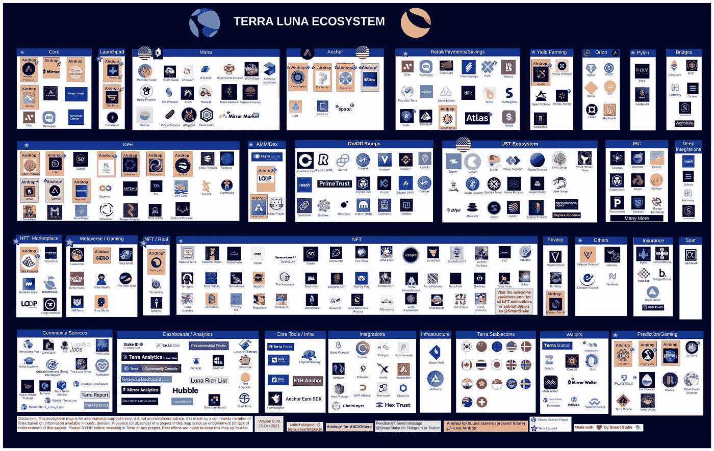

# Terra 坠毁概述

> 原文：<https://medium.com/coinmonks/terra-crash-overview-cef18c862c4?source=collection_archive---------24----------------------->

月神号失事是如何发生的？有什么经验教训？Terra 的下一步是什么？

# 什么是 Terra？

Terra protocol 是一个开源的公共区块链，以其本地标记 LUNA 而闻名。直到最近，Terra 还是一系列算法稳定点的所在地。这些稳定硬币中最广为人知的是 UST，一种用于追踪美元价格的数字资产。

在其巅峰时期，UST 的市值达到了 187 亿美元。不幸的是，UST 的成功相对短暂，当时一个据说财大气粗的神秘玩家引发了一系列事件，导致 UST 跌破 1 美元的盯住汇率，最终导致灾难性的市场崩溃，UST 跌至 1 美元以下，导致许多人损失惨重。

那么这是怎么发生的呢？为了更好地理解这一系列事件是如何展开的，让我们从简要讨论 Terra 的算法稳定币设计开始。

Source: [https://twitter.com/stablekwon/header_photo](https://twitter.com/stablekwon/header_photo)

# 算法稳定积分

通过跟踪法定货币的价格，数字稳定币旨在提供一种价值储存手段，以抵御典型的加密市场波动。

为了维持稳定的价格，算法稳定币通常依赖于两个令牌——一个是稳定币，另一个令牌的值控制新稳定币的发行，这通过算法来控制。

相比之下，诸如 Tether (USDT)和 Circle (USDC)等监管稳定的银行则由法定货币提供 1:1 的支持，这最终使它们更容易受到监管压力的影响。

泰拉是一只**的区块链，带着原生令牌，月神。月神令牌有两个目的:**

1.  **为负责保护网络安全和向链中添加新块的验证者提供利益激励。**
2.  ****作为抵押品，吸收 UST 稳定币的价格波动。****

**从算法上吸收 UST 稳定币的价格波动涉及两种机制:**

*   ****铸币税——铸造 1 UST 需要消耗价值 1 美元的月神，减少月神供应量，增加 UST 供应量。****
*   ****收缩——兑换价值 1 美元的月神需要燃烧 1 个 UST，收缩 UST 供给并膨胀月神供给。****

**遵循这些机制的代币兑换通过 [**市场模块**](/@jp12/understanding-terras-market-module-and-redemption-capacity-5bd62e2d7879) 进行，该市场模块是原生集成到 terra station 钱包中的虚拟流动性池。**

****

**UST algorithmic stablecoin design explained by [Danku_R.](https://twitter.com/danku_r)**

# **通过套利维持联系汇率**

**除了这些算法机制，用户还受到激励，通过套利机会维持 UST 盯住美元的汇率制度。**

**通过算法机制，当 UST 价格跌破 1 美元时，套利机会就出现了。在 UST 的价格为 0.98 美元的情况下，投资者可以在市场模块中用 0.98 美元的 UST 兑换 1 美元的卢纳。为了完成套利交易，投资者将在公开市场上以 1:1 的价格卖出他们的 UST 月亮，获利 0.02 美元。**

****

**Maintaining the UST peg via arbitrage. Source: [https://chaindebrief.com/what-happened-to-terra-luna-crash-ust/](https://chaindebrief.com/what-happened-to-terra-luna-crash-ust/)**

**这对 UST 价格有两个积极的影响。首先，在市场模块中把 UST 换成露娜会减少 UST 的供应量。第二，在公开市场上为 UST 出售卢娜增加了对 UST 的需求。供应的减少，加上对 UST 需求的增加，共同将价格推高至 1 美元。**

**但是，当这些代币只是简单地相互交换时，为什么 UST 保持稳定而卢娜的价值波动呢？**

# **LUNA 令牌值**

**Terra 的成长和 LUNA 令牌的价值都与对 UST 的需求紧密相连。为了让 UST 进入流通领域，卢娜需要被烧死。**

**因此，随着越来越多的人寻求使用 UST 进行日常采购，在 DeFi 内，LUNA 的供应将变得越来越稀缺，许多人猜测这将推高 LUNA 的价格。**

**对 UST 稳定币的需求由两个主要来源推动:**

*   ****CHAI，一个使用韩国 Terra 区块链进行快速廉价支付的电子钱包，每年支付 12 亿美元。****
*   ****DeFi——投资者利用 UST 在 Anchor、Mirror、Astroport、Prism Protocol、OnePlanet 等热门平台上进行交易、借贷、购买 NFT 和流动性农业。****

**考虑到 UST 的市值达到了 180 亿英镑，用于现实世界支付的 12 亿英镑仅占这一需求的一小部分，而 UST 的大部分所谓“效用”主要是由投机驱动的。**

# **Terra 是如何变得如此成功的？**

## **所谓的“久经考验”的稳定硬币钉**

**2021 年 5 月，大多数加密货币价格[暴跌 30%或更多](https://blog.chainalysis.com/reports/cryptocurrency-price-crash-may-2021/)。在这次暴跌中，UST 的价格也跌到了 0.92 美元，但很快又回到了 1 美元。在此期间，UST 稳定币的算法机制经受住了主要的市场波动，从而在许多投资者眼中证明了自己。**

****

**UST was stable — until it wasn’t. Source: [https://www.coingecko.com/en/coins/terra-usd](https://www.coingecko.com/en/coins/terra-usd)**

## **低交易费用**

**此外，区块链土地上提供的低交易费对许多用户来说非常有吸引力，这些用户一直在以太坊上遭受高额的汽油费，有时每笔交易高达 200-400 美元。相比之下，Terra 的税费从每笔交易 0.1%-1%不等。**

## **诱人的收益机会**

**Terra 快速增长战略的另一个关键部分是 Anchor Protocol 的部署，这是一家分散式银行，向用户承诺高达 20%的年收益率(APY ),用于存放他们的 UST。**

**很快，这听起来好得不像是真的——最终证明是真的。虽然 20%的收益率是不可持续的，但从超额抵押贷款、赌注回报和清算中获得这一收益率的机制值得一读。要了解更多关于 Anchor Protocol 的前 20% APY，请查看这篇文章。**

## **蓬勃发展的 Dapps 生态系统**

**正如一句名言所说，“建造它，他们会来”。对 Terra 来说，这绝对是个例子。在认识到用他们的技术进行创新和实验的机会后，一个由高技能开发人员组成的强大社区涌入了特拉区块链。**

****

**Terra Dapp Ecosystem. Source: [https://terra.smartstake.io/eco](https://terra.smartstake.io/eco)**

# **Terra 到底哪里出了问题？**

**总而言之，Terra 的崩溃源于 UST 稳定币的大规模贬值，UST 的价格跌至 1 美元以下，并且无法恢复。**

**与此同时，露娜的价格也内爆了。这在一定程度上归因于负责维持 UST 联系汇率的算法模型。如前所述，在经济收缩期间，将 UST 的价格提高到 1 美元需要减少 UST 的流通供应量，这可以通过焚烧 UST 和铸造更多的卢纳来实现——但这对卢纳持有者来说是一个巨大的成本，因为试图恢复 UST 的挂钩涉及到大幅增加卢纳的供应量，严重稀释了卢纳的价格。**

# *****是什么触发了 UST 的德佩格？*****

**我不会复述这个故事，我会让你参考 Onchain Wizard 写得非常好的 twitter 帖子，该帖子总结了导致 UST 跌破 1 美元大关的一系列事件。**

**Summary of events leading to UST depeg by Onchain Wizard.**

**但是现在你可能想知道——在过去的市场崩溃中，UST 盯住美元的政策已经恢复了。那么，这次有什么不同呢？**

## **高滑点导致的昂贵套利**

**套利交易无法挽救挂钩汇率的主要原因是，从 UST 到卢纳的互换在崩盘期间遭遇了很高的滑点成本。本质上，这使得套利成本无效。**

*****但是首先，什么是滑点？*****

**为了便于卢娜和 UST 使用算法机制进行互换，双方的资产都需要存在于虚拟流动性池中。通过市场模块赎回 UST 或卢娜的互换价格基于 **X*Y=K 常数乘积公式**，这是 Uniswap 等其他流行的**自动做市商(AMMs)** 使用的模型。此 X*Y=K 模型的图表如下所示。**

****

**Constant Product Formula (X*Y=K) used by many Automated Market Maker (AMM). Source: [https://ethresear.ch/t/improving-front-running-resistance-of-x-y-k-market-makers/1281](https://ethresear.ch/t/improving-front-running-resistance-of-x-y-k-market-makers/1281)**

**基本上，如果对一个代币需求的变化影响了池中可用代币的平衡，就会发生价格滑动。**

**随着对代币需求的增加，池中可用代币的数量减少，每个代币支付的价格增加。因此，随着交易的代币越来越多，总的掉期价格最终可能会高得多——掉期价格的这种变化被称为**滑点。****

**对于大型流动性池中的许多交易来说，这种影响相对较小，因为与池的规模相比，被交换的代币只是沧海一粟。然而，当有大量交易，单个代币的大量交易，或大量代币被从池中移走时，滑点的影响可能变得更明显。**

**Not quite the same form of “slippage”… Source: [https://media.giphy.com/media/3oxRmGNqKwCzJ0AwPC/giphy.gif](https://media.giphy.com/media/3oxRmGNqKwCzJ0AwPC/giphy.gif)**

**在 UST 失去联系汇率制后，许多投资者可能会将 LUNA 换回 UST，以保护自己的利润。与此同时，许多其他人可能会将他们的 UST 从流动性池转移到集中交易所，在那里他们可以用 UST 交易比特币或以太坊等蓝筹加密货币，或泰瑟(USDT)等托管货币。**

**此外，由于 UST 盯住美元的汇率大幅下跌，恢复盯住美元的唯一方法是通过市场模块将大量 UST 兑换给卢纳，这是收缩 UST 供应并将其价格推回到 1 美元所需的。**

**在这些因素的共同作用下，UST 交易到卢娜的滑点价格增加了。这一点在 Terra 崩盘期间可以清楚地看到，5 月 11 日，将 UST 换成卢娜的平均价差/滑点出现了大幅飙升，从 0.5%升至近 45%，如下图所示。**

****

**Max and Average slippage/spread for swapping UST to LUNA via the Market Module. Source: [https://app.flipsidecrypto.com/dashboard/terra-market-module-stats-c5WXml](https://app.flipsidecrypto.com/dashboard/terra-market-module-stats-c5WXml)**

**根据 White Whale 在下面的帖子中的报道，在某一点以上，用“便宜的”UST(即低于挂钩价)交换价值 1 美元的 Luna 的成本超过了套利交易时可以获得的利润:**

**最后，随着 UST 汇率与联系汇率制的距离越来越远，恢复联系汇率制的代价就越大，可能性也就越小。**

# **对 Terra 坠毁事件的反思**

**Terra 崩溃的毁灭性影响被广泛感受到。**

**许多投资者在几分钟内损失了大笔资金。在 Terra 上构建的项目的财务跑道从几个月缩短到了几天。一些项目别无选择，只能停止建设，放弃所有艰苦的工作。最悲惨的是听说有人觉得失去太多无法承受，最后结束了自己的生命。对于阅读这篇文章的人来说，如果他们感到无处可去，请寻求帮助。不要做你无法撤销的决定。**

**从 Terra 的崩溃中可以学到许多重要的教训。对于我们中的许多人来说，花了几个小时进行建设并损失了大量的金钱，我们需要接受已经做了的事情——没有什么可以改变这种情况的结果。重要的是我们如何利用这段经历来成长，并比以前更强大。**

**像许多其他人一样，我被分散投资的风气蒙蔽了双眼，过于相信 UST 稳定币，导致我的投资组合严重单一。此外，我变得如此专注于了解所有在区块链土地上建设的创新项目，以至于忽略了一个核心风险，那就是将整个生态系统夷为平地；UST 脱钩的风险。难以下咽，但也是非常宝贵的学习经验。**

**对于从 Terra 崩溃中得到的一系列非常有价值的教训，我强烈推荐在 Defi Edge 保存下面的帖子。**

# **更广泛的影响**

**当 Terra 崩溃时，整个加密市场都感受到了海啸效应。几天之内，整个加密市场的市值蒸发了 4000 多亿美元。**

**尽管这场危机本身不太可能威胁到全球金融体系的稳定，但它绝对足以引起监管者和决策者的注意。**

## **可能即将出台的稳定资本监管条例？**

**随着稳定资本继续快速增长，对其经济影响的担忧开始浮出水面。在最近的崩盘之后，财政部长珍妮特·耶伦(Janet Yellen)呼吁对稳定债券进行“全面”监管。此外，[欧盟将很快推出针对加密货币和市场的具体监管框架](https://www.ft.com/content/83ddff31-fb9a-4765-becf-82a52cc7291d)，这已经引发了一些争议。**

# **Terra 区块链的下一步是什么？**

**5 月 17 日，Terra 的创始人 Do Kwon 提出了一项计划，旨在复兴衰落的生态系统。该提议的细节在 [Terra Agora 平台](https://agora.terra.money/t/terra-ecosystem-revival-plan-2-updated-and-final/18498)上分享，但也可以在下面的 Twitter 帖子中找到。**

**为了提供一个高层次的概述，这个提议将导致区块链一分为二，旧的被称为 Terra Classic，新的被称为 Terra。重要的是，新的链将在没有算法稳定的情况下开发。**

## **专注于留住人才**

**鉴于 Terra 社区内的建设者和开发者的实力，该提案的核心重点是留住这些人才。Terra 上的许多 Dapps 提供了创新的 DeFi 机会、工具、功能和奇妙的 ui，这在其他区块链上还没有看到，例如通过 Prism 协议将资产折射为原则并产生轴承令牌的能力，或者在一个星球上组装/拆卸 NFT 的能力。如果建造者选择留下来，仅仅通过利用这些协议，Terra 就有了希望。**

## **令牌分发问题**

**话虽如此，在 2022 年 6 月 27 日向持有 UST 和卢娜的人分发总共 30%的新卢娜代币的提议引起了一些人的注意。一方面，将月神分配给攻击后持有者的提议可能会增加新月神令牌在更多独特持有者中的分配，但另一方面，这感觉有点像人为创造对原始令牌的需求的最后尝试。**

**此外，对 Terra 区块链的信任和信心受到了重大打击，因此，Terra 要想稍微恢复昔日的辉煌，可能还有很长的路要走。**

# **结束语**

**就个人而言，我将继续支持 Terra，无论是通过发表关于最新发展的文章还是投资创新项目。与此同时，我将花更多的时间了解区块链和 Web3 的其他项目，基于从 Terra 崩溃中吸取的教训，我肯定会以一种全新的眼光看待这些项目。**

# **参考资料:**

**[https://medium . com/ever stake/terra-ecosystem-overview-a-guide-for-新人-1d52b717c429](/everstake/terra-ecosystem-overview-a-guide-for-newcomers-1d52b717c429)**

**[https://medium . com/terra-money/stable coins-defining-the-terra-algorithmic-design-5d 952 fdf 68d](/terra-money/stablecoins-defining-the-terra-algorithmic-design-5d952fdf68d)**

**【https://time.com/6177567/terra-ust-crash-crypto/ **

**[https://www . coin desk . com/business/2022/05/16/kwon-proposes-forking-terra-in-revival-plan-2/](https://www.coindesk.com/business/2022/05/16/kwon-proposes-forking-terra-in-revival-plan-2/)**

**[https://medium . com/@ jp12/understanding-terras-market-module-and-redemption-capacity-5bd 62 e2d 7879](/@jp12/understanding-terras-market-module-and-redemption-capacity-5bd62e2d7879)**

** [## [Terra]市场模块统计

### 编辑描述

app.flipsidecrypto.com](https://app.flipsidecrypto.com/dashboard/terra-market-module-stats-c5WXml) 

> 加入 Coinmonks [电报频道](https://t.me/coincodecap)和 [Youtube 频道](https://www.youtube.com/c/coinmonks/videos)了解加密交易和投资

# 另外，阅读

*   [WazirX vs CoinDCX vs bit bns](/coinmonks/wazirx-vs-coindcx-vs-bitbns-149f4f19a2f1)|[block fi vs coin loan vs Nexo](/coinmonks/blockfi-vs-coinloan-vs-nexo-cb624635230d)
*   [本地比特币评论](/coinmonks/localbitcoins-review-6cc001c6ed56) | [加密货币储蓄账户](https://coincodecap.com/cryptocurrency-savings-accounts)
*   [什么是融资融券交易](https://coincodecap.com/margin-trading) | [美元成本平均法](https://coincodecap.com/dca)
*   [拥护卡审核](https://coincodecap.com/uphold-card-review) | [信任钱包 vs MetaMask](https://coincodecap.com/trust-wallet-vs-metamask)
*   [Exness 评测](https://coincodecap.com/exness-review)|[moon xbt Vs bit get Vs Bingbon](https://coincodecap.com/bingbon-vs-bitget-vs-moonxbt)
*   [如何开始通过加密贷款赚取被动收入](https://coincodecap.com/passive-income-crypto-lending)
*   [BigONE 交易所评论](/coinmonks/bigone-exchange-review-64705d85a1d4) | [电网交易机器人](https://coincodecap.com/grid-trading)**