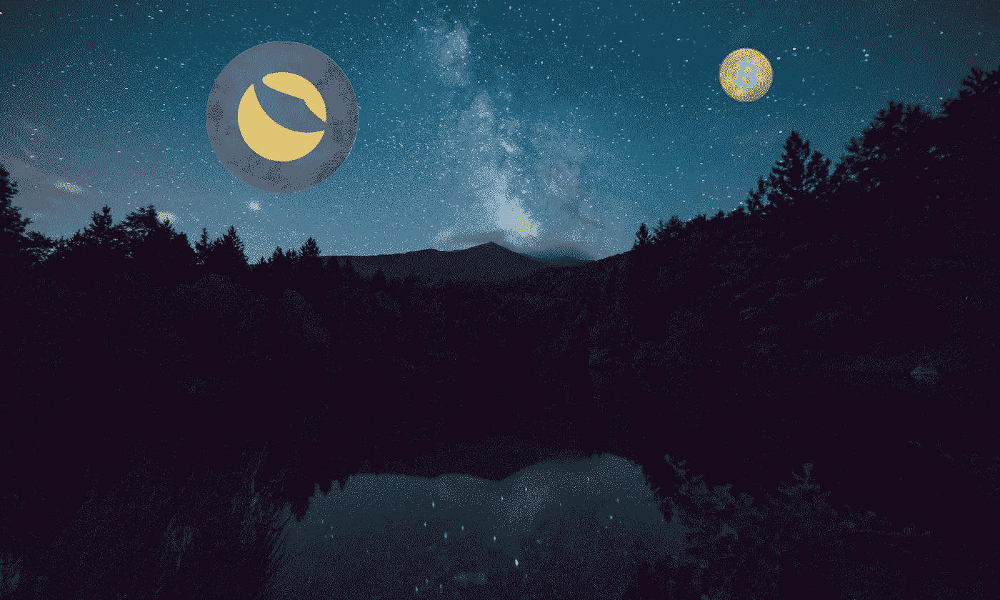

# Terra (LUNA)开始购买第一批价值 100 亿美元的比特币

> 原文：<https://medium.com/coinmonks/terra-luna-begins-first-tranche-of-10-billion-bitcoin-buy-c10308867f7b?source=collection_archive---------26----------------------->

Terra (LUNA)创始人权斗(Do Kwon)最近宣布，批准以 100 亿美元中的第一笔 30 亿美元收购 BTC，作为 Terra UST stable coin 的储备资产。根据区块链的分析，其中的第一笔 1.25 亿美元已经到位。

对 TerraUSD stablecoin 需求的激增和比特币作为储备的使用对 LUNA 来说是积极的事情…