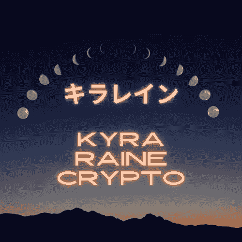

# 为什么我拒绝卖掉我的露娜

> 原文：<https://medium.com/coinmonks/terra-luna-has-recently-soared-to-an-all-time-high-of-over-116-usd-cb971c4510a1?source=collection_archive---------53----------------------->

*更新:露娜堕落了。现在你有机会浏览这篇文章，寻找能帮助你寻找下一个伟大投资机会的智慧。祝你们好运，冒险伙伴们。♡

Luna Phases by Kyra Raine Crypto

Terra (LUNA)最近飙升至超过 116 美元的历史高点。当世界各地的疯子们欢欣鼓舞时，Terraform Labs 正忙于扩大其生态系统。

自 2019 年首次亮相以来，LUNA 创建了一个钻石手社区。然而，一些代币持有者准备向诱惑屈服。

我的熊掌牢牢地扎进了露娜花园床的土壤里，因为我知道最好的东西还来自那些给地球带来生命的头脑。

以下是一些数据驱动的原因，说明为什么我今年一直持有我的 LUNA 令牌，你也应该这样做。

# 露娜属于一个无限的生态系统

Do Kwon 和 Daniel Shin 成功地弥合了本地代币和可编程货币之间的差距。

Terra 的创始人现在在他们的区块链上托管各种各样的分散式应用程序(dApps)。

他们在韩国和美国的国际成功仅在一个 dApp 上就产生了超过 200 万用户。Chai dApp 不可否认的可用性是一个信号，表明 Terra 的增长潜力几乎是无限的。

# 区块链游戏前景光明

你知道 Terraverse 已经推出了多个游戏平台吗？我也没有！从梦幻体育到休闲赌场，一切都可以在 Terra 长长的应用列表中找到。

像 [TerraFloki](https://terrafloki.io/) 这样的游戏为用户提供了在玩 Terra 的第一个通货紧缩代币系统时产生被动收入的机会。

蓬勃发展的 NFT 市场只会增加更多 Terraverse 游戏在不久的将来登场的可能性。我的意思是，谁能拒绝玩小剑 NFT 小狗？我知道我不能！

# Terra 继续投资比特币

Terra 又做了一个大胆的举动，增加了超过[2 亿 BTC](https://www.businessinsider.com/terra-buys-bitcoin-cryptocurrency-crypto-reserves-stablcoin-blockchain-16-billion-2022-4) 的资金。权道还表示，他希望这个数字有一天能达到 100 亿美元。

虽然比特币最大化主义者怀疑 Terra 是否有能力超越他们心爱的 BTC，但 [Luna Foundation Guard](https://lfg.org/) 一直在为其社区的发展铺平道路。

这是我继续坚持我可爱的露娜的最大原因之一。这是地球(UST)的月亮对太阳。

随着 Terraverse 的成长，Terra 的稳定硬币将需要大量的能量供应。那是露娜开始变老、变弱和发光的时候。

# 美国的通货膨胀率只会上升

通货膨胀正严重打击美元，导致许多生态系统回避美元支持的加密货币。

另一方面，对于我们这些渴望数字资产安全感的人来说，黄金支持的加密技术是一个充满希望的趋势。

由于在货币燃烧到平衡之前只能有 10 亿个月神代币，UST 是 DeFi 现在需要的动态稳定的硬币。

# DeFi 需要一个新的傀儡

说到 DeFi，[以太坊的神秘合并](https://www.marca.com/en/lifestyle/us-news/2022/04/09/6251e7b3268e3ea53c8b4576.html)让许多矿工对工作证明协议的未来感到好奇。忠诚的 ETH 矿工怀疑他们的角色是否会被终止，但仍有一些不安全感。

在我的密码职业生涯中，我做过一些糟糕的投资，但在 ETH 涨到 3000 美元之前投资它不在其中。

尽管以太坊无疑将继续推动去中心化金融运动，但我认为 Terra (LUNA)可能是一个更合格的典型代表。

# 月神的许多阶段

尽管随着 DeFi 为自己赢得了一个名字，LUNA 将继续兴衰，但我相信 Terra 生态系统才刚刚开始向我们展示 DeFi 真正的能力。

这个月是我第一次购买 LUNA 的一周年纪念日。当我认为我更了解投资时，我愚蠢地卖掉了一些。

现在我完全意识到我还有很长的路要走，并且已经获得了必要的手指力量来继续抓住我珍贵的 Terra 令牌。

我很高兴与你分享我的错误，并提供免费的教育资源(如[这篇文章](https://www.publish0x.com/psirenaraine/how-to-build-a-creative-career-with-blockchain-tech-xwwjjnv))来帮助开始你的分散金融学习之旅。

做好准备，登月可能会是一段颠簸的旅程！谢天谢地，我们有彼此支撑着。

一路平安，
基拉·雷恩·格雷罗

*最初发表于*[*https://www.publish0x.com*](https://www.publish0x.com/psirenaraine/why-i-refuse-to-sell-my-luna-and-so-should-you-xdgeonr)*。*

> 加入 Coinmonks [电报频道](https://t.me/coincodecap)和 [Youtube 频道](https://www.youtube.com/c/coinmonks/videos)了解加密交易和投资

# 另外，阅读

*   [BigONE 交易所点评](/coinmonks/bigone-exchange-review-64705d85a1d4) | [电网交易 Bot](https://coincodecap.com/grid-trading)
*   [氹欞侊贸易评论](https://coincodecap.com/anny-trade-review) | [CoinSpot 评论](https://coincodecap.com/coinspot-review)
*   [新加坡十大最佳加密交易所](https://coincodecap.com/crypto-exchange-in-singapore) | [购买 AXS](https://coincodecap.com/buy-axs-token)
*   [投资印度的最佳加密软件](https://coincodecap.com/best-crypto-to-invest-in-india-in-2021) | [WazirX P2P](https://coincodecap.com/wazirx-p2p)
*   [7 个最佳零费用加密交易平台](https://coincodecap.com/zero-fee-crypto-exchanges)
*   [最佳网上赌场](https://coincodecap.com/best-online-casinos) | [期货交易机器人](/coinmonks/futures-trading-bots-5a282ccee3f5)
*   [分散交易所](https://coincodecap.com/what-are-decentralized-exchanges) | [比特 FIP](https://coincodecap.com/bitbns-fip) | [宾邦评论](https://coincodecap.com/bingbon-review)