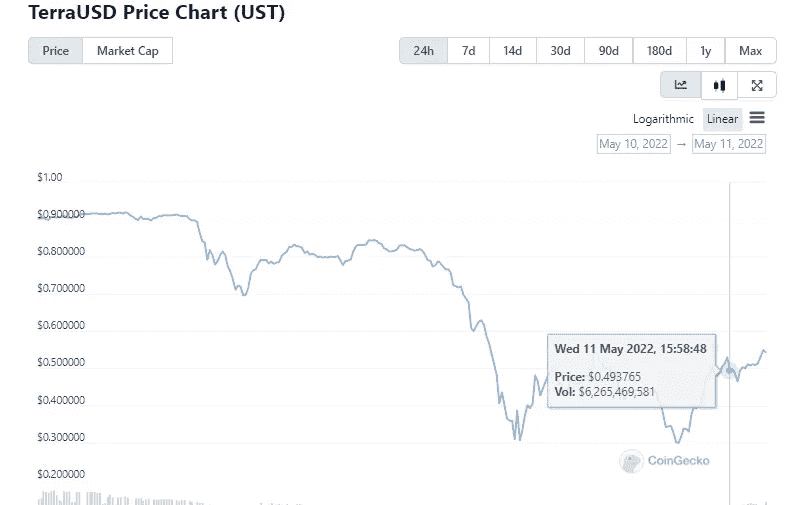

# 当替代硬币在 24 小时内下降 94%时，Terra(Luna)陷入混乱。

> 原文：<https://medium.com/coinmonks/terra-luna-is-in-tumult-as-the-altcoin-drops-by-94-under-24hours-5dc1443db131?source=collection_archive---------44----------------------->

## 在 UST 稳定硬币疯狂跌至 0.29 美元后，Terra 遭受了严重的崩溃。

Image source: [coinpedia](https://image.coinpedia.org/wp-content/uploads/2022/05/11124834/COINPEDIA-BANNER-IMAGE-64.png)

*   另一个可怕的时刻出现在加密领域，UST、露娜(Terra)算法稳定硬币从 1 美元大关跌至令人难以置信的 0.29 美元。
*   在可怕的熊季中，Terra 生态系统遭受了最大的损失，因为本地令牌——露娜和 UST——分别暴跌了 94%和 71% 。
*   泰拉基金会在 4 月份的比特币购买狂潮后，受到了加密社区的称赞。然而其与 1 美元脱钩的消息。然而，最近它因为不同的原因出现在新闻中。

# UST 与 1 美元脱钩，于是露娜流血了

Stablecoins 旨在保持价格稳定(与美元平价)，不受加密市场剧烈波动的影响。通常，在最糟糕的情况下，可以得到 1 美元的整数。但截至发稿时，Terra Luna 已经脱离了稳定硬币的经验法则。根据来自 [coingecko](https://www.coingecko.com/en/coins/terra-usd) 的数据，它已经失去了 1 美元的固定价值，跌至**0.298 美元**的超低价值。

**两天前，UST 跌至 0.68 美元，之后慢慢回升至 0.94 美元。但昨天，随着不稳定-稳定硬币跌至 0.2998 美元，情况变得更加混乱。**

Source: [coingecko](https://www.coingecko.com/en/coins/terra-usd)

# **UST 是如何脱钩的**

根据 CoinGecko 的数据，截至本文撰写之时，UST 的市值为 141 亿美元，而 LUNA 的市值为 123 亿美元。LUNA 的市值低于 UST，这可能表明 Terra 没有足够的资金来支持和维持 Terra 的算法稳定硬币。

在我们回答 UST 是如何脱钩的问题之前，我们需要了解 UST 1 美元盯住美元的机制是如何运作的。

# TERRA UST 是如何工作的？

Terra USD (UST)对另一个叫做 Luna 的 Terra 原生令牌执行这一平衡。因此，如果投资者购买 1 UST，1 美元的月神就诞生了。

在 UST 跌破 1 美元的情况下，它为投资者提供了一个套利机会，将 UST 换成卢纳。这一行动使得 UST 更加稀缺，并有助于价格回升。这种情况反过来也有利于卢娜和 UST 保持平衡。

但在周末，UST 供应过剩，给不到 0.99 美元的稳定硬币造成了巨大压力。

## **余波的原因**

1.  在 Terra 购买了 100 亿美元的比特币和 2 亿美元的雪崩作为额外的储备安全网后，价值数亿美元的可疑出售被抛售，随后从 Anchor Protocol 提取了超过 20 亿美元，目前流通的 180 亿美元 UST 的大部分都存储在那里。

Terraform Labs 首先从 Curve 提取了 1.5 亿美元的 UST 流动资金。一个新设立的账户将 UST 的 8400 万美元汇入以太坊。

——据《硬币电讯报》报道，一条鲸鱼周六开始倾倒价值[2.85 亿美元的 UST](https://cointelegraph.com/news/luna-drops-20-in-a-day-as-whale-dumps-terra-s-ust-stablecoin-selloff-risks-ahead) ，导致 stablecoin 跌至 0.98 美元，LUNA 因恐惧跌至 61 美元。

2.由于 UST 一直在努力恢复其联系汇率，市场上存在足够的恐惧，导致许多人抛售更多的 Terra(Luna ),以保留更多的 UST。

3.面对几个因素，Terra 使用比特币( [BTC](https://cointelegraph.com/bitcoin-price) )来抵押 UST 的策略尚未产生积极影响。作为缓解 UST 不稳定的一种手段，Luna Foundation Guard 周一向专业做市商部署了价值 15 亿美元的 BTC。LFG 还向贸易公司出借硬币以“保护 UST 联系汇率”，并出借 7.5 亿 UST 代币以积累 BTC。然而，根据 CoinGecko 的数据，周二 BTC 价格跌至 30，269 美元[。这一事件给 Terra reserve 带来了更大的销售压力，因为 BTC 缓解策略已经过极限测试。](https://www.coingecko.com/en/coins/bitcoin)

分析师担心，主要由 UST 和露娜组成的 DeFi 平台将会崩溃，因为支持 UST 一部分的比特币(BTC)控股公司被强制出售。

对于许多投资者来说，这个新闻事件一定是最可怕的时刻之一，因为自杀帖子正在 Terra 的 Reddit 论坛上流行。

*目前为****news crypto****教育频道撰稿，可在*[*news crypto . io*](https://newscrypto.io/)*找到。Newscrypto 提供专业工具和免费的学院部分，可以帮助您在以最安全的方式进行交易的同时赚钱，同时让您了解加密。他们的本地令牌是 NWC 令牌，可以从他们的网站上购买。*