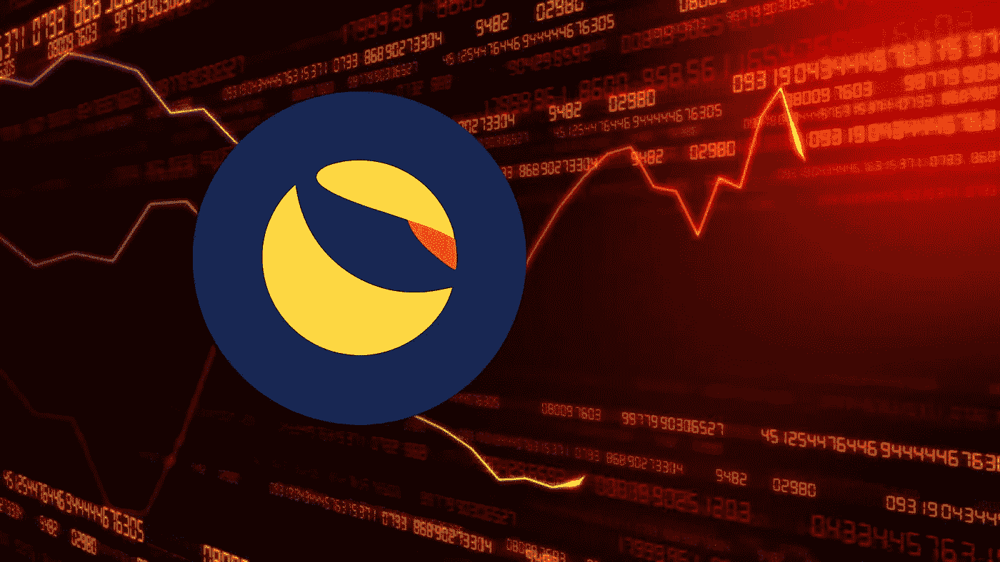

# 特拉·卢娜:UST 和卢娜是雷曼兄弟的密码吗？

> 原文：<https://medium.com/coinmonks/terra-luna-is-ust-and-luna-crash-the-crypto-lehman-brothers-5a4c3e392111?source=collection_archive---------8----------------------->

我想试着解释 Terra-Luna 发生了什么。当然，这是一个高层次的分析，对导致最近的密码历史上最大的生态系统故障的原因的深入理解，将涉及更多的信息和研究。

无论如何，过去 48 小时内 280 亿欧元的下降(2012 年希腊财政援助约为 320 亿欧元，以说明 Terra 正在经历的危机的规模)，以及 370 亿欧元的总规模，已经足够大，值得尝试解释一下。

但是什么是特拉、露娜和 UST 呢？

UST 是一种算法稳定的货币，在上涨时运行良好，在失去固定汇率时运行不佳。我们是怎么知道的？因为无论数学模型怎么说，它都无法维持盯住汇率，这增加了另一个最近的用例(铁金融-泰坦崩溃)，这也是在这个线程中分析的:[https://pabloom 89 . medium . com/Iron-Finance-collapse-first-defi-crash-1a 31 b 4559805](https://pabloam89.medium.com/iron-finance-collapse-first-defi-crash-1a31b4559805)。

它开发了一个名为 Terra 的生态系统，该系统基于前面提到的作为支付铁路的 UST stablecoin 和 LUNA，这是一种通过铸造或焚烧来确保盯住 1 美元的本地令牌。

Terra 协议中部署的主要 dApp 是 Anchor(超越镜像)，这是一种节省协议，为用户提供大约 20%的 APY。该 APY 是市场中的顶级领导者，部分由 Luna 基金会资助，在某种意义上，他们覆盖了 Anchor 自身有机产生的 APY，直到达到 20%的 APY。这种商业模式的工作原理是，将之前锁定在 Lido(POS 锁定协议)中的 UST 锁定，支持剩余的 APY 作为吸引用户的机制。

Terra 的愿景是试图利用 UST 的采用开发一个动态的生态系统，但并没有像预期的那样奏效——因为主要是因为大多数 ut(达到 85%)都被锁定了——这也是他们寻找其他方式的原因，例如 Curve 的 4Pool。

> 加入 Coinmonks [电报频道](https://t.me/coincodecap)和 [Youtube 频道](https://www.youtube.com/c/coinmonks/videos)了解加密交易和投资

**堕落的原因**

一旦我们解释了 Terra 基础知识，让我们来看一个下降趋势的例子，这个例子说明了失去钉住汇率制所产生的负面影响。如果 UST 跌破 1 美元，理论上，稳定机制允许你兑换你的 UST，例如 0.95 卢比兑换 1 美元。这些美国国债被烧掉了，因此，随着货币供应量下降，UST 价格应该会上升到 1 美元。从直觉上来说，这是有意义的，因为我将收回 1 美元的卢那，并且我将卖掉我的 0.95 美元的 UST，它正在被烧掉，因此减少了 UST 的供应，从而增加了 UST 的价格。

然而，在这种情况下，下跌非常强劲，自然稳定机制还不足以支撑下跌。基本上，在 5 月 8 日，大约 2 . 8 亿 UST 被卖出，同时空头头寸被维持，引发了又一次大规模抛售，使联系汇率失衡。

我们已经看到，没有用户希望通过给予 UST 来获得 LUNA，原因有两个:首先，当 LUNA 令牌价格开始下跌时，1 美元的 UST 价值无法恢复(稳定机制不起作用)。其次，Luna 的使用案例并不明确，它们被用来支付使用 Terra 网络的费用，但它不允许参与 LUNA 的管理，因此很难预见其在悲观情况下的采用/收购趋势，特别是当支付网络根本没有被其他 dApps 使用时。

从这个意义上说，UST 代币持有者，那些不参与 Terra 的治理，并且看到 LUNA 代币持续贬值的人，并不想得到 LUNA，尽管 UST 的价格在下跌。由于没有人愿意为露娜献出自己的 UST，这加快了露娜和 UST 的坠落速度(当机制无法触发时，恶性循环不可阻挡)。

最后，Terra 希望在 BTC 实施的 100 亿英镑的买入墙(buy wall)未能实施，以在崩溃时维持联系汇率，因为市场显然在创建该墙之前缩短了美国存托凭证(有一些推文解释了向 BTC 提供价值 7.5 亿英镑的 ust、向一些场外交易公司提供 7.5 亿英镑的贷款以收购 BTC 的 15 亿英镑计划)。目标是把 Terra 变成一个分数算法稳定币(FRAX 类型)，因为 Luna 基金会认识到了生态系统的脆弱性，但没有时间这么做。

**从这个艰难的教训中得到的一些启示**

总之，看起来 stablecoins 无法依靠纯算法机制来抵御剧烈波动的情况，但它们需要围绕有形抵押品进行构建，以确保在无法实施有机稳定机制时 stablecoins 令牌持有者的底线。此外，它还表明，由于补贴机制或其他类型的援助不是当前加密系统的一部分，加密市场能够消除无法通过其激励系统有机持续的项目。