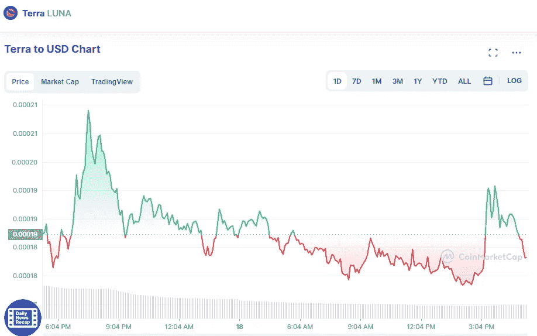

# 5 月 18 日 Terra LUNA 价格分析

> 原文：<https://medium.com/coinmonks/terra-luna-price-analyse-18th-of-may-d7cc7f3dffa4?source=collection_archive---------25----------------------->

今天早上，Terra 的 LUNA 价格在未能从周一的高点 0.000249 美元恢复后停留在 0.000182 美元附近，因为它继续处于熊市盘整阶段。

Source photo [Terra price today, LUNA to USD live, marketcap and chart | CoinMarketCap](https://coinmarketcap.com/currencies/terra-luna/)

在上周的惨败之后，LUNA bears 拒绝放弃，尽管他们前一天的交易价格是 0.000123 美元。