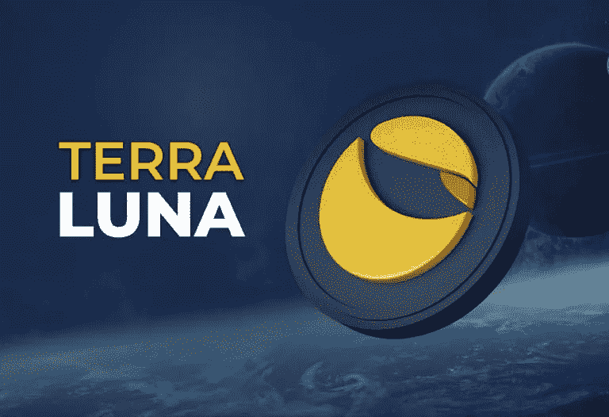

# Terra (LUNA)价格预测:2022–2026 年

> 原文：<https://medium.com/coinmonks/terra-luna-price-predictions-2022-2026-c53ec60d9524?source=collection_archive---------3----------------------->

Source photo [terra luna — Bing images](https://www.bing.com/images/search?view=detailV2&ccid=FLTImg2E&id=AEAA9E8C52FD221DFE117F53A4A896A4BA7CB68C&thid=OIP.FLTImg2EHB_ITNjL56jbJwHaFE&mediaurl=https%3a%2f%2fblog.bitnovo.com%2fwp-content%2fuploads%2f2021%2f06%2fQue-es-terra-luna2-1.jpg&cdnurl=https%3a%2f%2fth.bing.com%2fth%2fid%2fR.14b4c89a0d841c1fc84cd8cbe7a8db27%3frik%3djLZ8uqSWqKRTfw%26pid%3dImgRaw%26r%3d0&exph=526&expw=768&q=terra+luna&simid=608055412515344446&FORM=IRPRST&ck=D7F2EBB55F78F18DA5AA73AD67902540&selectedIndex=8&ajaxhist=0&ajaxserp=0)

Terra 的长期前景看起来比短期要好。LUNA 估计，到 2022 年底，该资产的价值将攀升至 130 美元、210 美元和 980 美元。这是令人难以置信的 818%的增长。

此外，我们必须清楚地了解是什么影响了 Terra LUNA 的定价。了解了这一点，我们就可以更自信地回答这个问题，“我是否应该投资于…