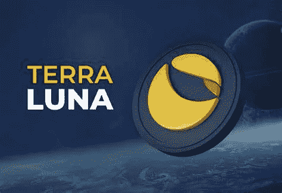

# Terra (LUNA)价格预测:2022–2030 年

> 原文：<https://medium.com/coinmonks/terra-luna-price-predictions-2022-2030-fdb6dbc7f775?source=collection_archive---------5----------------------->

Source photo [terra luna — Bing images](https://www.bing.com/images/search?view=detailV2&ccid=FLTImg2E&id=AEAA9E8C52FD221DFE117F53A4A896A4BA7CB68C&thid=OIP.FLTImg2EHB_ITNjL56jbJwHaFE&mediaurl=https%3a%2f%2fblog.bitnovo.com%2fwp-content%2fuploads%2f2021%2f06%2fQue-es-terra-luna2-1.jpg&cdnurl=https%3a%2f%2fth.bing.com%2fth%2fid%2fR.14b4c89a0d841c1fc84cd8cbe7a8db27%3frik%3djLZ8uqSWqKRTfw%26pid%3dImgRaw%26r%3d0&exph=526&expw=768&q=terra+luna&simid=608055412496557443&FORM=IRPRST&ck=D7F2EBB55F78F18DA5AA73AD67902540&selectedIndex=8&ajaxhist=0&ajaxserp=0)

Terra 看起来长期表现要比近期好得多。根据我们的 LUNA 预测，该资产可能在 2022 年底达到 130 美元，2023 年达到 210 美元，2025 年的平均价格为 980 美元。这是 818%的惊人增长。

除了分析 Terra 的 LUNA 过去的表现，有必要牢牢把握影响其价格的因素。当…