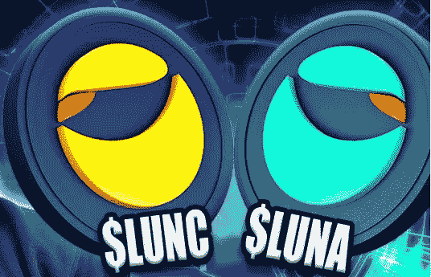

# Terra (LUNA)价格与 Terra Classic (LUNC)价格的对比

> 原文：<https://medium.com/coinmonks/terra-luna-price-vs-terra-classic-lunc-price-f7cdfdb0d79b?source=collection_archive---------0----------------------->

LUNA 2.0 显然是在它的创造者 Do-Kwon 的控制之下，他对崩溃的处理非常糟糕。当 USDT 烧掉 30 亿代币来稳定其联系汇率时，道权可能也采取了类似的方法来稳定其联系汇率。毕竟他坚持要把放了很久的链子换成新的。