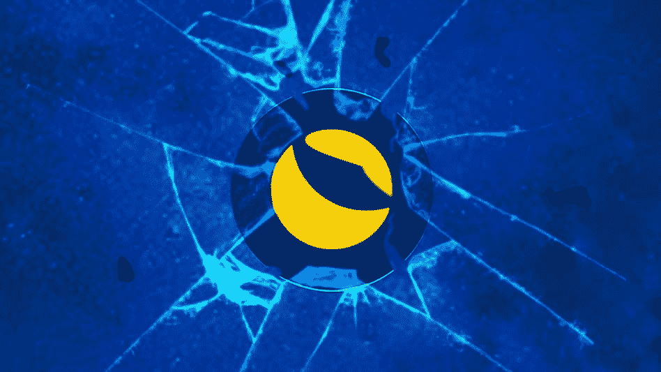
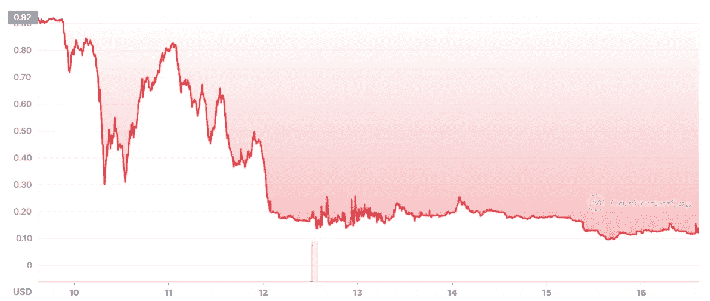
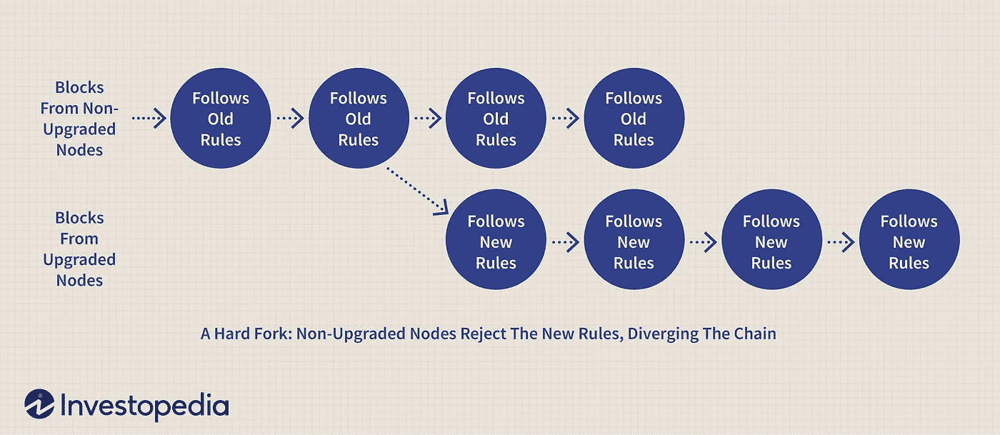

# Terra/LUNA 复兴计划宣布；人们会追回他们的钱吗？

> 原文：<https://medium.com/coinmonks/terra-luna-revival-plan-announced-will-people-recover-their-money-cb061de16397?source=collection_archive---------0----------------------->

## 月神/UST 崩溃

## 道权再次出现在 Terra 论坛上，提议重建 Terra 和 LUNA

嘿，伙计们，希望你们都很好。

今天我们将复习一个你们可能感兴趣的主题:卢娜/UST 崩溃的后果。

成吨的人——包括我自己在内——在这场将载入 crypto 历史书的大规模惨败中失去了警惕和金钱。然而，该项目的负责人权道(Do Kwon)再次出现，带来了可能给投资者带来希望的消息。

让我们深入了解他的“复兴计划”——他称之为——对 Terra 生态系统的“复兴计划”。

# Terra 不仅仅是$UST

至少权道是这么说的。

虽然 Terra 的增长和 UST 的采用几乎完全是因为锚定 APY 的补贴，但 Terraform Labs 的首席执行官似乎有信心，推动它的社区值得战斗。

为了保护这个社区和他的“孩子”的生命，道权提出了一个重建 Terra 的计划，这次是由用户来控制。

# 计划:分叉一个新的链

很明显，Terra 当前的区块链是不可恢复的。LUNA 的供应量飙升至近 7 万亿美元，试图吸收 UST 的销售，但仍然悲惨地失败了，现在“稳定币”的交易价格为 0.12 美元。

Weekly chart of UST.

也就是说，一个硬分叉前崩溃似乎是最好的和最简单的方法。根据 Kwon 的说法，新的链将不会基于算法稳定币。换句话说，UST 将会消失。

> 如果你不知道，一个硬分叉是从一个特定的块区块链分叉，创建一个新的，平行的链。分类帐中的所有信息，直到分叉块迁移到新链。

因此，当前的 Terra 链将采用“Terra Classic”的名称，而其极度膨胀、毫无价值的 LUNA 令牌将成为“LUNA Classic ($LUNC)”新的链和令牌将采用原来的名字，“Terra”和“LUNA”

Thanks Investopedia for the graphic.

这种新的月神令牌将空投到:

*   月神经典赌注
*   LUNA Classic 支架
*   剩余 UST 持有者
*   什么将是 Terra Classic 的基本应用程序开发人员。

Terraform Labs (TFL)钱包不会被列入白名单，这意味着这家曾经领导 Terra 生态系统的公司将不会从 airdrop 获得任何代币。

# LUNA 令牌分发设置和时间表

空投的总金额将是 10 亿(1，000，000，000)新月神币。这些露娜将为新的 Terra 链提供能量，根据一套规则和份额进行分配:

*   **社区公摊，25%**由 staked governance 控制，10%指定给开发商。
*   **攻击前 LUNA 持有者，35%:** 所有绑定/未绑定 LUNA，不包括“攻击前”快照的 TFL 包括赌注衍生品。悬崖和归属期根据余额而不同。
*   **攻击前 aUST 持有者，10%:** 50 万鲸帽——覆盖所有持有者的 99.7%，但仅占 aUST 的 26.72%。创世纪 15%解锁；85%在 2 年后授予，6 个月到期
*   **后攻击月神持有者，10%:** 赌注衍生品包括在内。创世纪 15%解锁；85%在 2 年后授予，6 个月到期。
*   **攻击后 UST 持有者，20%:** 15%在创世纪解锁；85%在 2 年后授予，6 个月到期。

如你所见，该计划旨在通过授予开发者新的 LUNA 令牌来帮助他们迁移到新的链，并补偿社区的损失。

至于快照，它们的定义如下:

*   **“攻击前”快照:**Terra Classic[block 7544915](https://finder.terra.money/mainnet/blocks/7544915)。
*   **“遇袭后”快照:** Terra Classic block 7790000。

# **ELI5:这对平民百姓意味着什么？**

本质上，如果你在 7544915 区的 Terra 钱包中持有任何 LUNA，你将获得一部分空投代币。这也适用于粘合和桩月神。

另一方面，如果你没有任何露娜，但却抱着 UST，那就有点棘手了。显然，“攻击前”的快照只考虑了 aUST，所以你只有在你的 UST 锁定锚的情况下才有资格获得赔偿。

然而，如果你的钱包里还装着贬值的 UST 和露娜，你也有资格获得空投。只要把它们放在你的钱包里，直到第 7790000 块，你应该会在发布后收到新链上的 LUNA。

这引发了争议，因为在 depeg 期间亏损的人可能会因机会主义者今天以 0.12 美元的价格购买 UST 而遭受稀释，并出现在“发布”快照中。

# 你有什么看法？

在我看来，这绝对是一个有争议的计划，但这是一个开始。对他有利的是，至少道权正试图让投资者重新团结起来。

> 你怎么想呢?这个计划行得通吗？Terra 能恢复投资者的信任和信心吗？或者任何试图复活它的努力只是推迟了不可避免的死亡？我想知道你是怎么想的！

像往常一样，记住保持安全，在投资前做好自己的研究。如果你想看完整的提案，可以在这里找到[。](https://agora.terra.money/t/luna-go-forward-proposal/7136)

感谢您的阅读，祝您度过愉快的一周！

## 你喜欢这个故事吗？

我很高兴你这么做了！我叫桑蒂。我喜欢并写作视频游戏、加密货币和流行文化。如果你想阅读更多类似这样的内容，可以考虑关注我的****和 [**Twitter**](https://twitter.com/SantiagoSchw_) 。我真的很感激！****

## ****谢谢大家的支持！****

****我是一名独立作家，我的故事没有报酬。如果你想用你想要的任何数量来支持我，我将非常感激！****

*   ****我的多链地址(以太坊，雪崩，多边形，BNB 链):**0x 9 a9 ab 154 aeea 167 AFD F5 AE 1a 88955 ea C9 ADF 5807******
*   ****本人 BTC 地址:**BC 1 q 9h 509 sea 3y 7 zcjp 24 dqjpucfq 44 r 0 ueltz 3 z 3c yh 67 qlhvsflrwqzt 6 pr 0******

******谢谢！******

> ****加入 Coinmonks [电报频道](https://t.me/coincodecap)和 [Youtube 频道](https://www.youtube.com/c/coinmonks/videos)了解加密交易和投资****

# ****另外，阅读****

*   ****[Godex.io 评审](/coinmonks/godex-io-review-7366086519fb) | [邀请评审](/coinmonks/invity-review-70f3030c0502) | [BitForex 评审](https://coincodecap.com/bitforex-review)****
*   ****[10 本关于加密的最佳书籍](https://coincodecap.com/best-crypto-books) | [英国 5 个最佳加密机器人](https://coincodecap.com/uk-trading-bots)****
*   ****[ko only 回顾](https://coincodecap.com/koinly-review) | [Binaryx 回顾](https://coincodecap.com/binaryx-review)|[Hodlnaut vs CakeDefi](https://coincodecap.com/hodlnaut-vs-cakedefi-vs-celsius)****
*   ****[MoonXBT vs Bybit vs 币安](https://coincodecap.com/bybit-binance-moonxbt) | [硬件钱包](/coinmonks/hardware-wallets-dfa1211730c6)****
*   ****[火币交易机器人](https://coincodecap.com/huobi-trading-bot) | [如何购买 ADA](https://coincodecap.com/buy-ada-cardano) | [Geco。一次审查](https://coincodecap.com/geco-one-review)****
*   ****[币安 vs Bitstamp](https://coincodecap.com/binance-vs-bitstamp) | [Bitpanda vs 比特币基地 vs Coinsbit](https://coincodecap.com/bitpanda-coinbase-coinsbit)****
*   ****[如何购买瑞波(XRP)](https://coincodecap.com/buy-ripple-india) | [非洲最好的加密交易所](https://coincodecap.com/crypto-exchange-africa)****