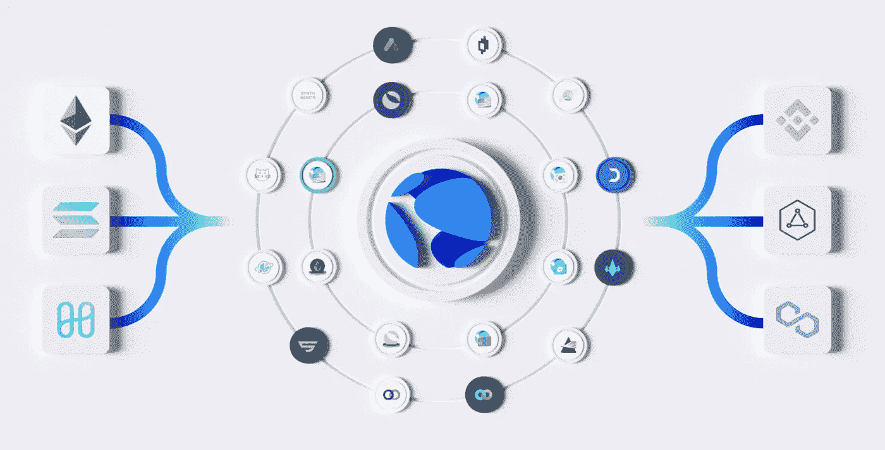
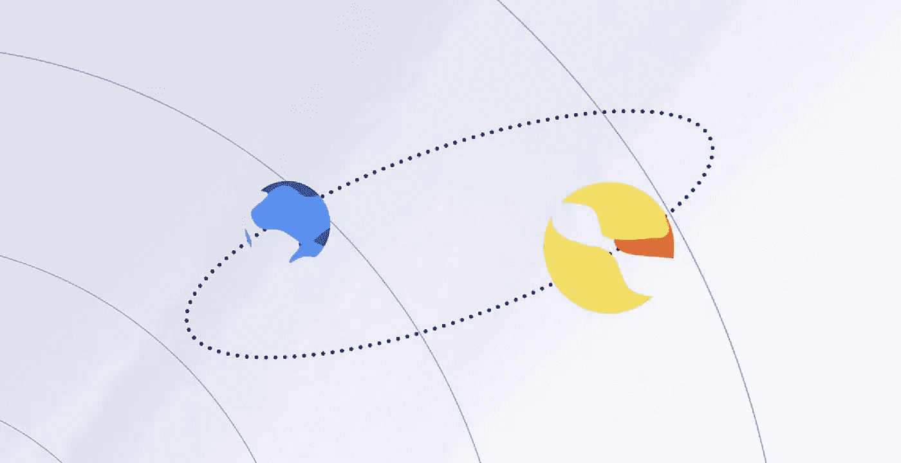
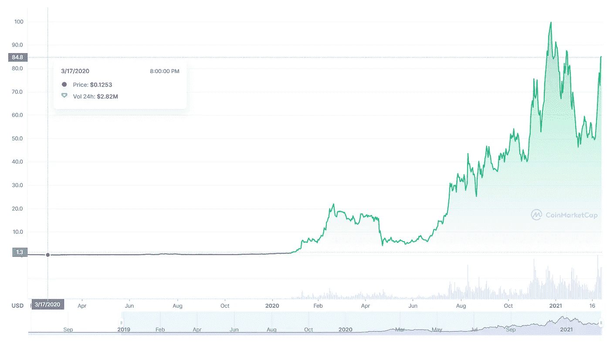

# $LUNA 的迅速崛起 Terra 生态系统

> 原文：<https://medium.com/coinmonks/terra-stablecoins-and-why-luna-is-exploding-56e04790fb6a?source=collection_archive---------23----------------------->

## Terra stablecoins 概述以及$LUNA 爆炸的原因

Image created by [Alexander Iwasiwka](/@aiwasiwka) using [Canva](https://www.canva.com/).

# 什么是 Terra，为什么它如此重要。

密码领域最重要的组成部分之一是稳定密码。它们为用户提供了一个稳定的兑换法定货币的媒介，并释放了分散金融服务的潜力。然而，目前使用的大多数 stablecoins 都是由中央实体控制的，要想建立一个真正去中心化的金融生态系统，你需要底层的 stablecoins 去中心化。

> "分散稳定密码是密码领域最重要的创新."— Do Kwon，Terra 的联合创始人兼首席执行官。

Terra 是一个公共区块链协议，用于发行和铸造算法分散的稳定副本。Terra 的主要稳定货币是 TerraUSD (UST ),它与美元挂钩，并迅速成为所有加密货币中使用最广泛的稳定货币之一。其他稳定的地区包括 KRT(韩元)、MNT(蒙古托洛格)和 EUT(欧元)。

分散算法 stablecoins 解决了全球自由市场贸易中的几个关键问题:

*   它们消除了中间商进行结算的需要，并促进了转账，从而降低了交易成本，提高了交易速度。
*   它们保持与本国法定货币挂钩的稳定价格，从而允许无缝的国际转移和支付。
*   他们取消了银行限制。随时想转多少就转多少，是你的钱。
*   它们使储存价值变得更容易、更安全、更有吸引力，消除了对现金的需求。
*   它们消除了集中控制的风险。

Terra stablecoins 让跨境交易变得很容易。一家三藩市的企业可以向首尔的一家供应商支付服务费用，这种服务是通过一种未经许可且不可信的方式，在区块链的土地上立即将 UST 交换到 KRT。现在，让我们来探索 Terra 蓬勃发展的生态系统以及 Terra stablecoins 是如何被利用的。

# 欣欣向荣的陆地生态系统

Image Credit — [https://www.terra.money/](https://www.terra.money/)

Terra 是 crypto 中发展最快的生态系统之一。DeFi、Web3 和 NFTs 有 100 多个项目，目前锁定的总价值超过 210 亿美元。推动这一增长的主要有 3 种协议和应用。

## 锚协议

用于储蓄，用户可以从他们的 UST 存款中获得利息收益(目前约为 20%)。

## 镜像协议

用于投资，用户可以以去中心化、无权限的方式，以合成资产的形式投资股票(像特斯拉或苹果)等任何资产类别。

## 柴 App

Chai 应用程序用于支付，使用户可以轻松地使用分散资金进行交易。

*   与约 3%的行业标准相比，结算费用通常在 1.1%-1.5%之间。
*   用户福利包括 10%-20%的返现奖励。
*   商家优惠包括即时结算。
*   与韩国的许多商家广泛整合，包括顶级银行、便利店、图书馆和游戏发行商。
*   每年有 200 万 1B 用户使用 KRT 购买从咖啡到家具的任何东西。

与柴类似，MemePay 每月有 4 万用户使用 MNT 在蒙古国购买商品。随着地球生态系统的持续增长，对像 UST 这样稳定的地球的需求将会增加。随着对 Terra stablecoins 的需求增加，Terra 的分散储备资产——LUNA——将会获得更多的价值。

# 露娜的整体角色

Image Credit — [https://www.terra.money/intro-to-terra](https://www.terra.money/intro-to-terra)

我们知道，货币与法定货币挂钩，旨在保持价格稳定。然而，我们还没有讨论 Terra 是如何维持其钉住汇率的。就像稳定地球自转的月亮一样，露娜和她的支持者对 Terra 的稳定至关重要。

利用基本的供求原理，我们知道随着对 UST 需求的增加，其价格也会上涨。为了让价格回落到固定水平，需要增加供给来满足需求。这就给了持有 LUNA 的投资者获利的机会。价值 1 美元的月神可以换成 1 UST，并以更高的价格出售。在交换过程中，卢娜被烧毁，使得流通中剩余的卢娜更加稀缺和珍贵，而新 UST 的铸造增加了 UST 的总供应量。

在经济紧缩时期，当 1 UST 的价格跌破挂钩时，任何 UST 持有者都可以用 1 UST 兑换 1 美元的卢纳。UST 被烧毁，减少了它的供应量，新的月神被铸造出来。在这些紧缩时期，由于投资者寻求从焚烧 UST 中获利，LUNA 的价格预计会下跌。为了减轻这种影响，提高持有 LUNA 的吸引力，投资者会受到赌注回报的激励。

网络上每笔 stablecoin 交易的小额交易费支付给 LUNA 股东。Terra 网络上的交易数量目前超过了除以太坊和比特币之外的所有其他区块链上的交易数量。随着 Terra 区块链上使用的应用程序数量的增加，LUNA 的利益相关者将获得更多费用，使 LUNA 更有价值。LUNA 持有者也可以参与 Terra 的管理，并对诸如铸造新 stablecoins 的提案进行投票。

# 最近的更新和新闻

[*哥伦布-5 更新*](/terra-money/columbus-5-launches-welcome-to-the-future-of-terra-8a9ebfa570c5) (关键变化):

*   在哥伦布-5 号之前，一些被交换的露娜将会去一个社区基金来资助更多的项目。这被称为铸币税。现在所有交换的露娜都被烧掉了，这使得露娜更加稀少。
*   烧掉所有剩余的社区基金。大约 8870 万英镑(约 45 亿美元)的 LUNA 被烧毁。
*   在 Columbus-4 中，社区池产生的 LUNA 的动态百分比被转移到 oracle 奖励池。现有甲骨文奖励金的分配从 1 年期改为 3 年期。
*   通过引入红利互换费增加赌注奖励。奖励提高到 7%-9%。
*   启用 IBC 协议，这将使通过宇宙网络转移 Terra 资产变得更加容易，从而增加对 Terra 稳定副本的需求。

[*【与华府国民(MLB)】*](/terra-money/washington-nationals-join-forces-with-terra-community-dao-in-a-first-of-its-kind-partnership-1a1307e9d4a9)

[*卢娜基金会在 BTC 通过出售卢娜代币筹集了 1B 美元，投资者将在 4 年的归属期内锁定他们的卢娜*](https://www.yahoo.com/now/luna-foundation-guard-lfg-raises-170000356.html?guccounter=1&guce_referrer=aHR0cHM6Ly93d3cuZ29vZ2xlLmNvbS8&guce_referrer_sig=AQAAAC96G1jBwR9aRG5wYcC5_sNOB2HkyUJCEbCVRaeDdfqUp3I4FUC8MTvherrQ609TLUCL5D-_VcZqB-Ct6YxiaPTVxLIr2HeF63qbTufme6KEVR1ukKghuU_ADl__9OlIr0uXTcd2K7w4wSfBo3e3256amriob9IistAkXwJO7vTY)

# $露娜的迅速崛起和目前的统计数据

据 CoinMarketCap.com 报道，露娜的价格已经从 2020 年 3 月的 0.12 美元上涨到 2021 年 12 月底的 103.33 美元。截至本文撰写之时，它的当前价格为 84.85 美元(近两年来涨幅超过 70，000%)，市值为 31.8 亿美元。

Image Credit — [https://coinmarketcap.com/currencies/terra-luna/](https://coinmarketcap.com/currencies/terra-luna/)

> 加入 Coinmonks [电报频道](https://t.me/coincodecap)和 [Youtube 频道](https://www.youtube.com/c/coinmonks/videos)了解加密交易和投资

# 另外，阅读

*   [BigONE 交易所评论](/coinmonks/bigone-exchange-review-64705d85a1d4) | [电网交易机器人](https://coincodecap.com/grid-trading)
*   [氹欞侊贸易评论](https://coincodecap.com/anny-trade-review) | [CoinSpot 评论](https://coincodecap.com/coinspot-review)
*   [新加坡十大最佳加密交易所](https://coincodecap.com/crypto-exchange-in-singapore) | [购买 AXS](https://coincodecap.com/buy-axs-token)
*   [投资印度的最佳加密软件](https://coincodecap.com/best-crypto-to-invest-in-india-in-2021) | [WazirX P2P](https://coincodecap.com/wazirx-p2p)
*   [7 个最佳零费用加密交换平台](https://coincodecap.com/zero-fee-crypto-exchanges)
*   [最佳网上赌场](https://coincodecap.com/best-online-casinos) | [期货交易机器人](/coinmonks/futures-trading-bots-5a282ccee3f5)