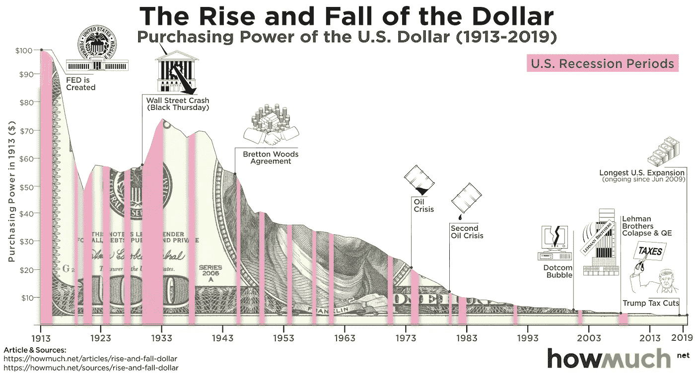

# Terra UST 死了。

> 原文：<https://medium.com/coinmonks/terra-ust-is-dead-60e00d5d65ab?source=collection_archive---------0----------------------->

## 如果您尚未注册，请使用此链接注册为中型。[https://theguywhowrites.medium.com/membership](https://theguywhowrites.medium.com/membership)

Loop 最近在其 Dex 中引入了 aUST 池，这是 Terra 社区中的第一个。让我们看看为什么 aUST 池是必不可少的，以及它们的潜力。

1.  什么是 aUST？
2.  有哪些用例？