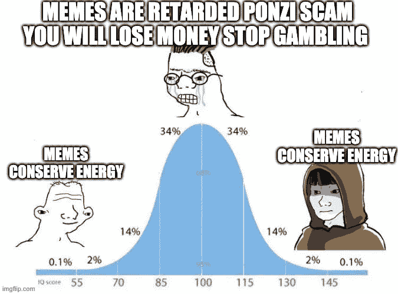
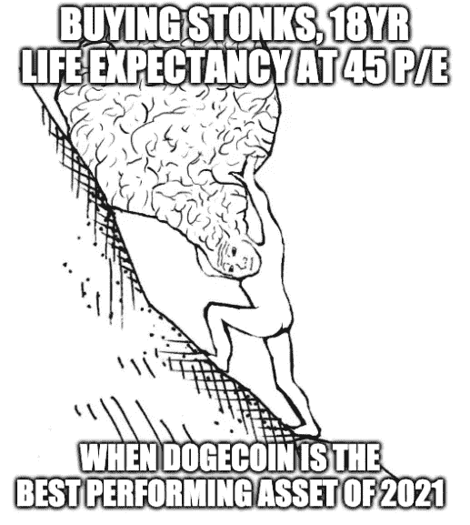
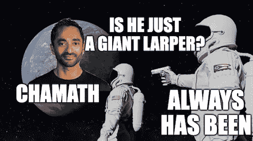
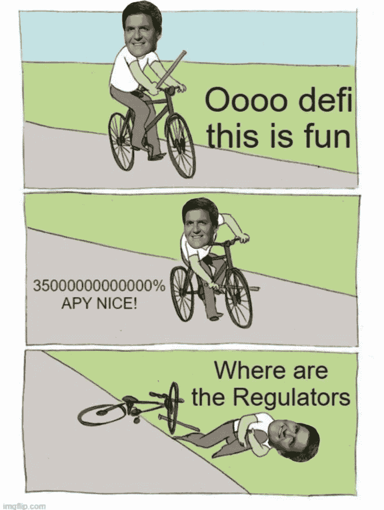

# 土地、产量和 ESG

> 原文：<https://medium.com/coinmonks/terra-yield-and-esg-d241a4f39c05?source=collection_archive---------42----------------------->

直到第二次世界大战，大多数中央银行一直是私人拥有的盈利机构——由银行家建立，为银行家服务——它们的作用是通过基于债务的货币奴役世界。美国的国债超过 30 万亿美元，而全球大多数人的净资产不到 1000 美元。国债的存在保证了税收、政府支出和战争。中央银行和国家银行以债务为基础控制着政府。

Andrew Jackson vs. 2nd Bank of the United States

但并不总是这样。安德鲁·杰克森总统在 19 世纪 30 年代还清了国债，杀死了美国第二银行，直到 1913 年 12 月 23 日，美联储法案才勉强通过，国会的大多数人都离开去过圣诞节。直到那时，美国才重建了央行。金钱从来都是:

1.  一个组织人类智慧和努力的迷因(乔布斯)
2.  门控生活资源(房子、汽车、家庭)
3.  某种形式的能源(黄金、石油、比特币)的衍生品

所有合法的能量形式都必须符合热力学定律，最重要的是能量守恒。时间是有限的。因此，人类的注意力和想象力是有限的。迷因保存能量。

金钱是一种迷因。关于什么构成了赚钱的想法也是迷因。收益率是一个基于债务的婴儿潮迷因——钱被投资到*高风险*资产(例如/恒大债券)而收益率就是承担风险的回报。独角兽股票是千禧年的迷因——当你可以从软银筹集资金时，为什么要用自己的钱冒险呢？然后在纳斯达克以 45 倍的市盈率上市(如果你是优步或邦布尔，市盈率可以是无穷大)，先锋、贝莱德和道富会买下你的包。

密码是 Z 世代的迷因——如果你可以免费创造一枚狗屎硬币，以每月 3000 美元的价格雇佣[埃吉尔陆军](http://twitter.com/eGirlArmy_HQ)来兜售，LARP 以每天 50 万美元的交易量与机器人交换，在币安上上传，在平民上倾销，为什么要支付昂贵的律师和银行家费用。查马斯的 SPACs 也没什么不同。

Terra 已经完成了加密历史上最惊人的退出骗局，构建了一个收益率叙事，说服老练的传统投资者以 19%的股份持有 UST，然后用比特币卖出数十亿 LUNA，同时抬高 LUNA 价格，并被比特币 maxis 骗走。我们知道这将如何结束——还有人记得泰坦和铁银行吗？

收益潮迷因将是即将到来的 2022 年熊市的最大受害者。然而，许多央行被授权将其多余的外汇储备投资于 ESG，澳大利亚银行在过去十年的大部分时间里一直在购买可再生能源证书，预计随着上市公司争相实现碳中和，这些证书将会升值。可持续性思维病毒已经成功渗透到传统金融的各个层面，但在加密领域仍未得到广泛利用。

Watch this space!

> 加入 Coinmonks [电报频道](https://t.me/coincodecap)和 [Youtube 频道](https://www.youtube.com/c/coinmonks/videos)了解加密交易和投资

# 另外，阅读

*   [Bitsgap 审核](/coinmonks/bitsgap-review-a-crypto-trading-bot-that-makes-easy-money-a5d88a336df2) | [Quadency 审核](/coinmonks/quadency-review-a-crypto-trading-automation-platform-3068eaa374e1) | [Bitbns 审核](/coinmonks/bitbns-review-38256a07e161)
*   [加密复制交易平台](/coinmonks/top-10-crypto-copy-trading-platforms-for-beginners-d0c37c7d698c) | [Coinmama 审核](/coinmonks/coinmama-review-ace5641bde6e)
*   [印度的加密交易所](/coinmonks/bitcoin-exchange-in-india-7f1fe79715c9) | [比特币储蓄账户](/coinmonks/bitcoin-savings-account-e65b13f92451)
*   [OKEx vs KuCoin](https://coincodecap.com/okex-kucoin) | [摄氏替代品](https://coincodecap.com/celsius-alternatives) | [如何购买 VeChain](https://coincodecap.com/buy-vechain)
*   [币安期货交易](https://coincodecap.com/binance-futures-trading)|[3 commas vs Mudrex vs eToro](https://coincodecap.com/mudrex-3commas-etoro)