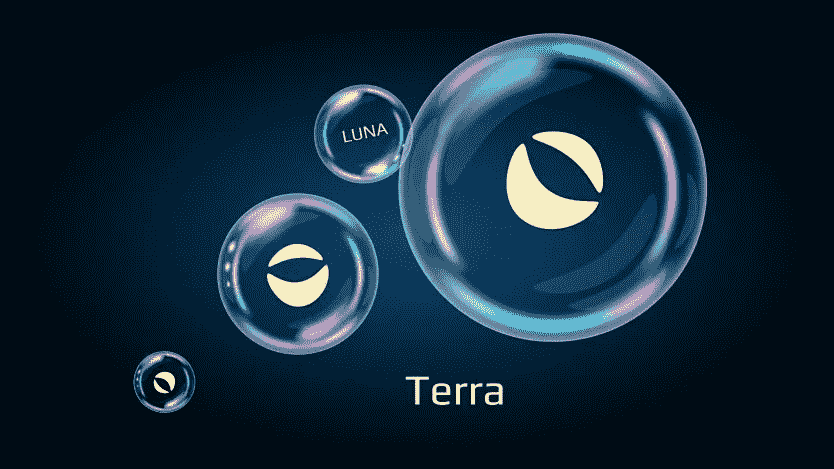
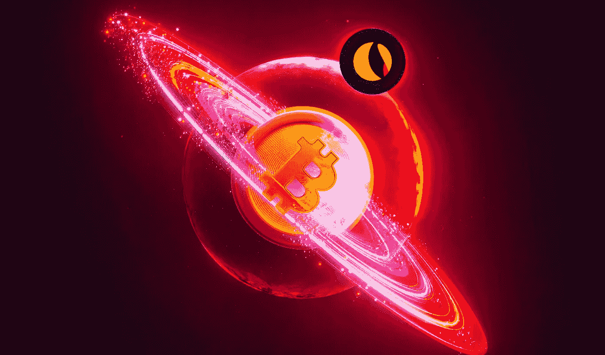
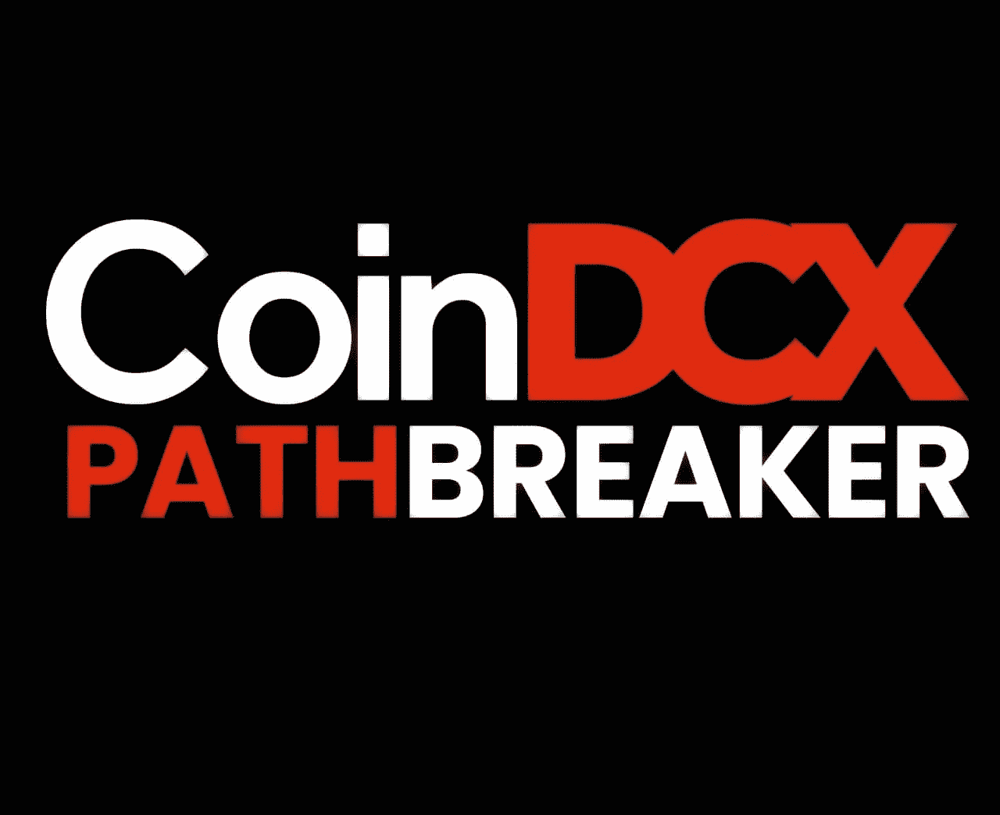

# Terra 的秘密爆炸是不可避免的

> 原文：<https://medium.com/coinmonks/terras-crypto-implosion-was-unavoidable-7cbeae471511?source=collection_archive---------10----------------------->

半个月前，在伦敦北部，一群谦逊但非常了解加密货币的零售金融支持者预计 terra 和 luna 将会崩溃。他们中的一些人嘲笑泰拉或 UST，这是一种稳定的货币，其价值与美元的一致性是由计算和游戏假设而不是金钱或担保来支持的，并且嘲笑它将在长期内保持其股份不变的想法。他们告诉我，这次冒险的“庞兹经济学”过于危险。只有一个金融支持者似乎是有希望的，出于怀疑而不是信任 terra 的稳健。他表示，最终 UST 的成本将远远超过每单位 1 美元，硬币的广告商将选择保持不变，并将稳定币重新命名为“抗通胀的加密货币美元”又一次耸耸肩表示所有的赌注都取消了。“到目前为止，”他说，“这个故事通常遵循最有趣的事件进程。”

你可以打赌今天许多人不想窃笑。UST 的股份已经输给了美元(在写作的时候，你可以在加密货币交易上以 0.58 美元的价格获得它)，它的姐妹资源 luna 已经从上周的 82 美元跌至 0.02 美元。这些加密货币中约 600 亿美元的投机活动的主要部分暂时受到了打击，随着个人争相处理他们减少的硬币，更多的投机活动将随之而来。在本周的过渡期间，更广泛的加密市场陷入混乱，比特币在 24 小时内贬值 8%后跌至 27，000 美元，许多其他加密货币也紧随其后。世界上最大的稳定货币 Tie 周四跌破 1 美元。

在 terra，我们看到了一项事业的瓦解，这项事业的基础是你可以赚钱——并赋予它特定的价值——假设个人会强迫虚假陈述，即现金具有加密组织指定的价值，这与在电脑游戏中假装的情况非常相似。一小部分强硬派密码爱好者会反驳说，在后最佳质量水平的政府发行货币的时代，大多数货币标准肯定只是一种总体幻想。然而，没有政府、国家银行、经济或实际用途支持 terra 的方式很重要。正如伦敦金融学院发展实验室探索协调工作的研究人员布朗特·穆奇所说，“这就像银行挤兑，除了它是一个突然的需求高峰。”UST 作为一种稳定的货币向公众推销，这是一种加密货币，其价值显然在长期内保持稳定，可以有效抵御比特币或以太网等其他加密货币的剧烈价值变化。对于大多数稳定的硬币来说，这种稳健性是由现金持有来保证的——无论是谁制造了一种与美元挂钩的稳定硬币，他都应该在某个地方的金库里保存一种可比的美元——或者其他保险，包括密码。但是 UST 是一个“算法稳定币”,与此无关。它完全不受当前现实的影响，并在其中投入巨资。

孤独的区块链，UST 与它的卫星资源 luna 有着和谐的关系，可以用来获得加密货币奖励。通常可以想象用 UST 和露娜进行交易，反之亦然，而区块链自己的代码通常确保 terra 以一美元一个单位进行交易，而露娜的交易仍然悬而未决，通过计算关注市场。通过利用套利者(努力从市场失灵中获利的金融支持者)的努力，这应该能保持其成本稳定。在加密货币交易上的 UST 拍卖采取措施将其成本降至 1 美元以下的可能性很小，当时的想法是，精明的套利者将竞相收购 UST，并在当地的区块链上以低价收购卢娜——一直在设定 UST 的成本。

万一相反的情况发生，UST 的成本在加密市场上飙升超过 1 美元，个人将利用他们的 lunas 在 Terra 的区块链上获得 1 美元一个单位的 UST，并在不同阶段交换它们，从而降低 UST 的成本。这是一个巧妙的设计。同样，一个人没有也不能工作。“这是一个循环，就像永无止境的运动机器。个人需要找出一些方法来获得免费能源。此外，这些计划很复杂——它们会有滑轮，会有磁铁，会有开关，”Muci 说。"对于算法稳定的硬币，这有点类似的想法."

卡尔加里大学(College of Calgary)商业监管和指导的助理教师瑞安·克莱门茨(Ryan Clements)去年在一篇名为《注定失败》(Built to Fail)的论文中明确指出了这种方法的问题克莱门茨在论文中指出，这些稳定的硬币的一个基本问题是，只要有兴趣，它们就能工作；一般来说，众多的动机等于零。“不管怎样，UST 从来都不是稳定的，也很少被完全抵押，”Clements 说。“它需要无休止地依赖于一个假设，即在 Terra 环境中，对 UST 的不同使用实例会有足够的(不断发展的)兴趣。”

众多的秘密金融支持者开始追踪他们的入口方向。加密货币调查平台 CoinGecko 的赞助人 Bobby Ong 表示，UST 遭遇的一个潜在解释是“乔治索罗斯(George Soros)式的”攻击，这是在 1992 年匈牙利人道主义者和贷款人对英镑的著名押注之后。根据这一假设，UST 的毁灭性下跌——从周一开始，周三螺旋上升为一场灾难——因一个巨大的实体在市场上抛售数十亿 UST 而加速，打破了它的股份。另一个更直截了当的解释是，UST 是不可持续的，当市场情绪发生变化时，这种情况就会持续发生。

这是告诉一些密码字符奠定了所谓的攻击在投机的行政机构贝莱德和共同基金据点入口的故障。就在很久以前，强化曾被赋予另一场货币狂热中的恶棍角色，即所谓的 GameStop adventure——当时大量的零售金融支持者开始数以千计地购买虚弱的游戏连锁店的货物，尽管其基础令人质疑，这是对传统货币的抵制的奇怪表现。当时的一些目击者对形象金融的兴起表示了尊重，在这种金融中，资源的价值通常不是建立在企业的可能性上，而是建立在由总体幻觉、表演性的逆向思维和纯粹的不可知论(“GameStop 的股票价值 200 多美元吗？这要由你根据自己的价值框架来选择，”一位金融支持者在最初引发抵制的 Reddit 上评论道。)

可以说，泰拉的兴衰是那种特殊货币的延伸长度的最后阶段。它很可能不会恢复元气，而且转念一想，继续跟随其他网络 3 的低迷，例如，NFT 泡沫的破灭或大量图像股票和犬币的下跌。

然而，从荒谬主义和不切实际的幻想的角度来细读这一点是自命不凡的。Terra 在最近几个月的流行暴增额外被奇妙的动机计划所决定。“对 UST 的巨大兴趣是由一个名为“泰拉区块链之锚”的储备基金公约驱动的，该公约保证了 20%的年收益率，”Ong 说。个人会购买 UST 并把它藏在 Anchor 中，这是一个可以停止硬币的程序，期望看到它像一棵被施了魔法的摇钱树一样长期发展。Ong 说，真正令人紧张的是，Terra 为其他一些加密项目建立了一个模型，这些项目同样开始承诺荒谬的回报，目前面临崩溃的危险。

# coindcxpathbaker

> 加入 Coinmonks [电报频道](https://t.me/coincodecap)和 [Youtube 频道](https://www.youtube.com/c/coinmonks/videos)了解加密交易和投资

# 另外，阅读

*   [印度最佳 P2P 加密交易所](https://coincodecap.com/p2p-crypto-exchanges-in-india) | [柴犬钱包](https://coincodecap.com/baby-shiba-inu-wallets)
*   [八大加密附属计划](https://coincodecap.com/crypto-affiliate-programs) | [eToro vs 比特币基地](https://coincodecap.com/etoro-vs-coinbase)
*   [最佳以太坊钱包](https://coincodecap.com/best-ethereum-wallets) | [电报上的加密货币机器人](https://coincodecap.com/telegram-crypto-bots)
*   [交易杠杆代币的最佳交易所](https://coincodecap.com/leveraged-token-exchanges) | [购买 Floki](https://coincodecap.com/buy-floki-inu-token)
*   [3 commas vs . Pionex vs . crypto hopper](https://coincodecap.com/3commas-vs-pionex-vs-cryptohopper)|[Bingbon Review](https://coincodecap.com/bingbon-review)
*   [加密复制交易平台](/coinmonks/top-10-crypto-copy-trading-platforms-for-beginners-d0c37c7d698c) | [如何在 WazirX 上购买比特币](/coinmonks/buy-bitcoin-on-wazirx-2d12b7989af1)
*   [CoinLoan 评论【Crypto.com】|](https://coincodecap.com/coinloan-review)[评论](/coinmonks/crypto-com-review-f143dca1f74c)