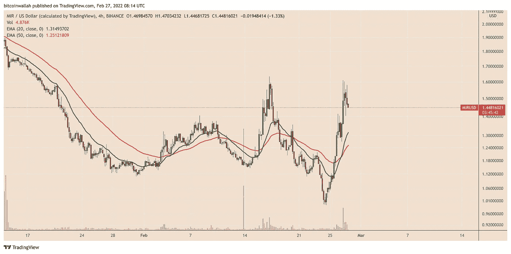
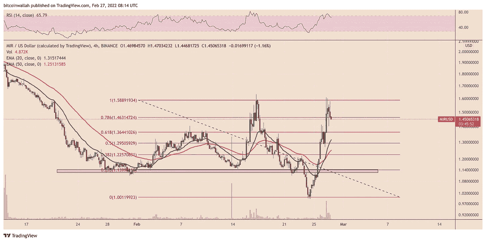
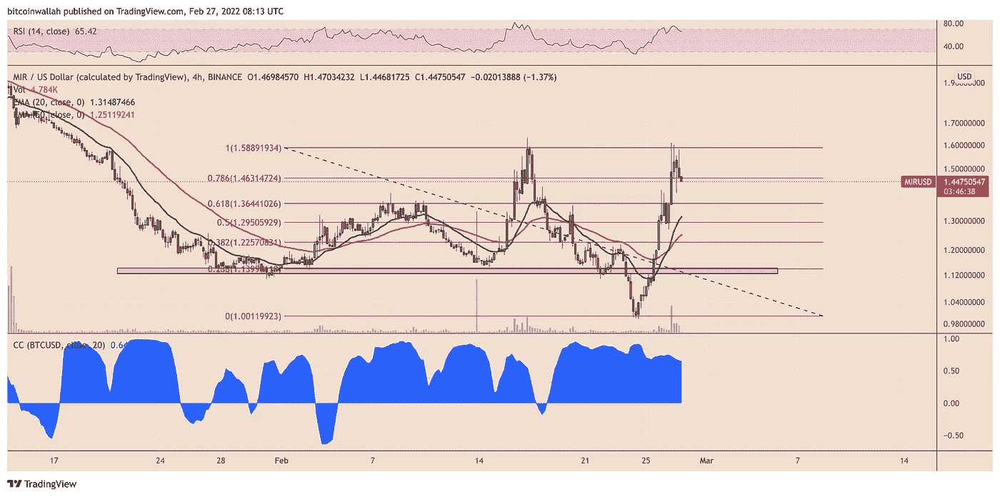

# Terra 的镜像协议 MIR 在创下新低两天后恢复 40%

> 原文：<https://medium.com/coinmonks/terras-mirror-protocol-mir-recovers-40-two-days-after-hitting-a-new-low-30c69787ffce?source=collection_archive---------30----------------------->

**Visit our website:-** [**https://bitcoinsupports.com/**](https://bitcoinsupports.com/)

在弗拉基米尔·普京对乌克兰发动军事攻击后，和平号组成了一个黄金十字勋章。镜像协议(Mirror Protocol)，一个建立在区块链土地上的去中心化金融(DeFi)协议，本周遭遇了历史上最大的金融崩溃之一。

**Terra token 价格上涨** 
镜像协议的原生货币 MIR 在 2 月 24 日跌至 0.993 美元，这是迄今为止的最低水平，此前在更广泛的加密市场上出现抛售。然而，价格迅速反弹，两天后高达 1.41 美元，比 MIR 的历史低点高出 40%以上。

**Visit our website:-** [**https://bitcoinsupports.com/**](https://bitcoinsupports.com/)

MIR 的正回撤跟随加密市场其他地方的类似恢复，就像暴跌一样。然而，MIR/USD 的收益似乎高于一些估值最广泛的数字资产，如比特币(BTC)和以太网(ETH)。例如，自 2 月 24 日在 34500 美元附近触底以来，比特币已经反弹了 17%。另一方面，乙醚从 2300 美元反弹后，在同一时间内上涨了 25%多一点。

另一方面，其协议支持镜像协议的合成资产平台的 Terra (LUNA)在同一时间段内恢复了 50%以上。泰拉区块链支持的加密货币 ANC Protocol(ANC)从 2 月 24 日的低点 2.64 美元上涨超过 45%，达到迄今为止的最高点，接近 4 美元。

最近镜像协议市场的快速增长导致了所谓的黄金十字模式的形成。

**MIR 画了一个“黄金十字”但是……**

根据镜像协议近期的行情历史，MIR 的 20–4H 指数均线(20–4H EMA；绿色波浪)飙升到 50-4 小时均线(红色波浪)上方，这通常是短期上涨的前兆。尽管如此，MIR 的 4 小时相对强弱指数(RSI)在周末升至 70 以上，表明它已经“超买”这与 Mirror Protocol 的市场下跌相对应，MIR 目前从 1.41 美元附近的回撤高点下跌了 10%以上。

**Visit our website:-** [**https://bitcoinsupports.com/**](https://bitcoinsupports.com/)

MIR 跌破 1.36 美元，这是一个先前的支撑位，也与从 1.58 美元的波动高点到 1.00 美元的波动低点绘制的斐波纳契回撤图的 61.8 Fib 线一致。价格目前正在寻找 0.5 Fib 线和 0.236 Fib 线附近的下一个支撑位，这两个支撑位分别在 1.29 美元和 1.13 美元附近。如果 MIR 能够保持在 20-4H 和 50-4H 均线之上，它重新测试 1.58 美元的机会就会增加。它的乐观未来还取决于东欧持续的地缘政治局势及其对比特币的影响。

**Visit our website:-** [**https://bitcoinsupports.com/**](https://bitcoinsupports.com/)

值得注意的是，比特币和镜像协议之间的相关系数接近零以上 0.75，这意味着目前镜像协议的价格或多或少反映了顶级数字资产的走势。

**访问我们的网站:-**[**https://bitcoinsupports.com/**](https://bitcoinsupports.com/)

**免责声明:以上为作者观点，不应视为投资建议。读者应该自己做研究。**

> 加入 Coinmonks [电报频道](https://t.me/coincodecap)和 [Youtube 频道](https://www.youtube.com/c/coinmonks/videos)了解加密交易和投资

# 另外，阅读

*   [货币评论](https://coincodecap.com/coinloan-review)|[Crypto.com 评论](/coinmonks/crypto-com-review-f143dca1f74c)
*   [如何在加拿大购买加密货币？](https://coincodecap.com/how-to-buy-cryptocurrency-in-canada)
*   [无聊猿游艇俱乐部(BAYC)评论](https://coincodecap.com/bored-ape-yacht-club-bayc-review)
*   [5 款最佳加密交易终端](https://coincodecap.com/crypto-trading-terminals) | [最佳 DeFi 应用](https://coincodecap.com/best-defi-apps)
*   [最佳网上赌场](https://coincodecap.com/best-online-casinos) | [币安评论](/coinmonks/binance-review-ee10d3bf3b6e) | [BitMEX 评论](https://coincodecap.com/bitmex-review)
*   [麻雀交换评论](https://coincodecap.com/sparrow-exchange-review) | [纳什交换评论](https://coincodecap.com/nash-exchange-review)
*   [美国最佳加密交易机器人](https://coincodecap.com/crypto-trading-bots-in-the-us) | [经常性评论](https://coincodecap.com/changelly-review)
*   [在印度利用加密套利赚取被动收入](https://coincodecap.com/crypto-arbitrage-in-india)