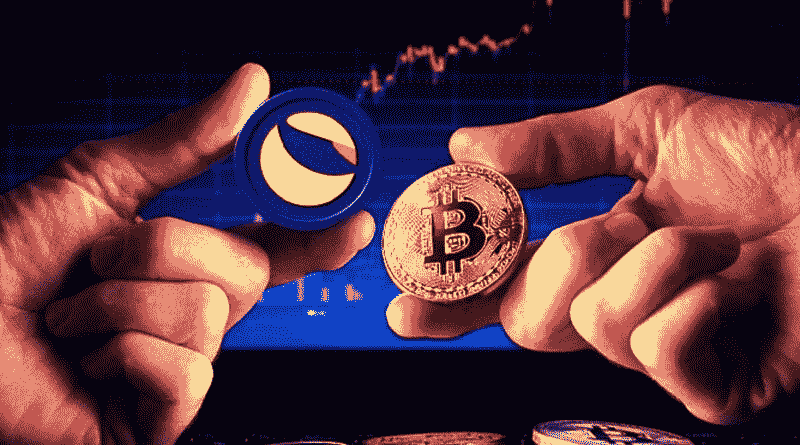
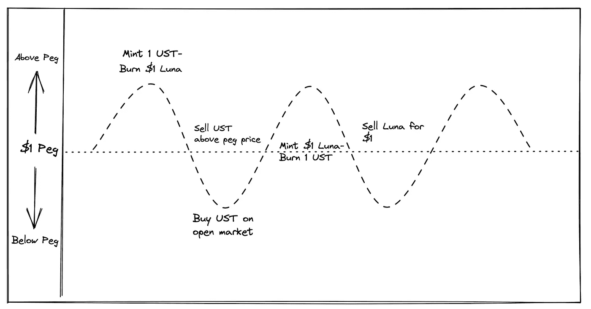
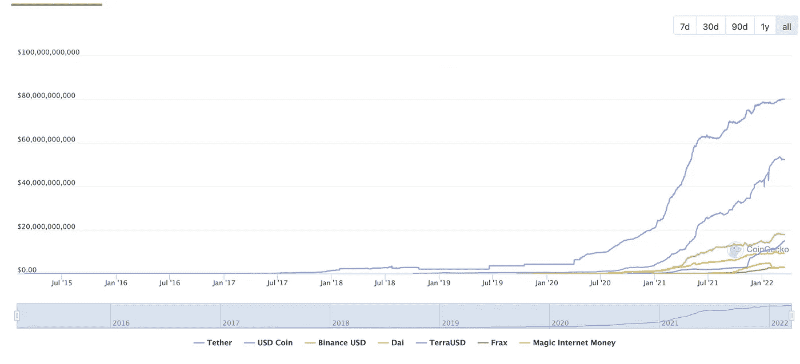
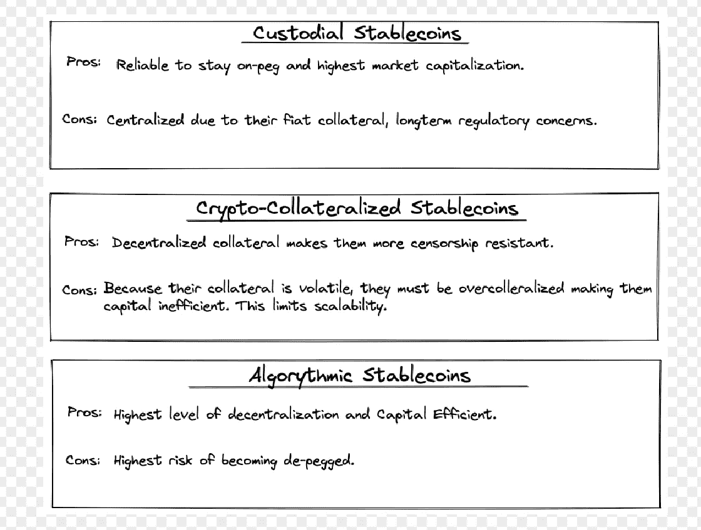
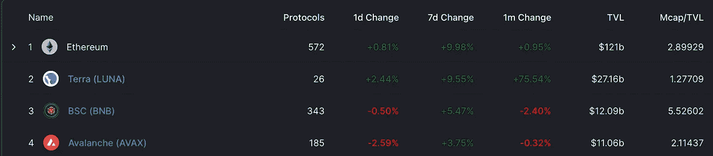
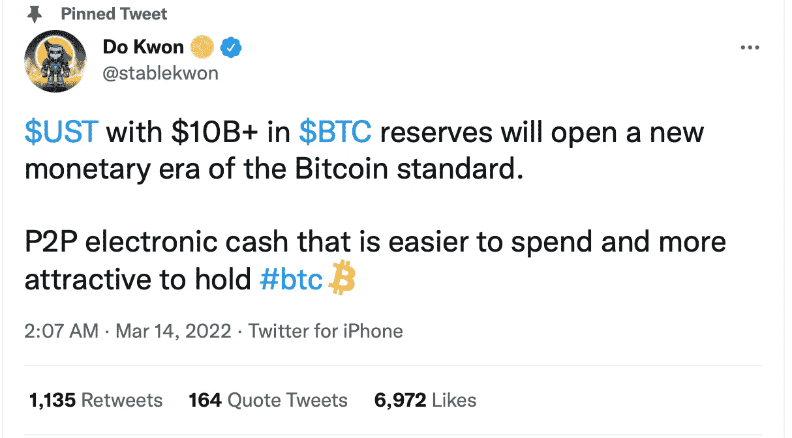
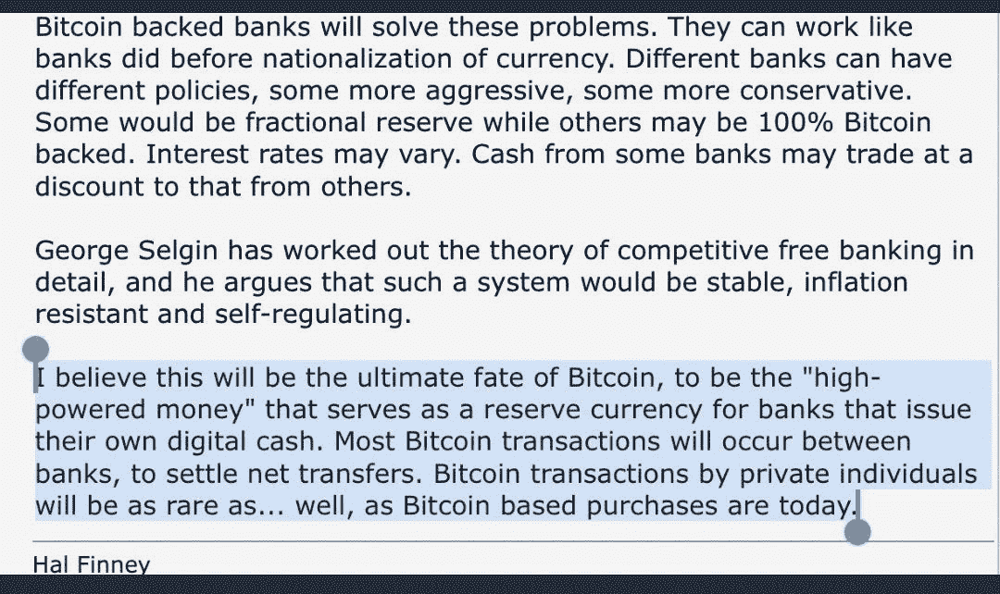
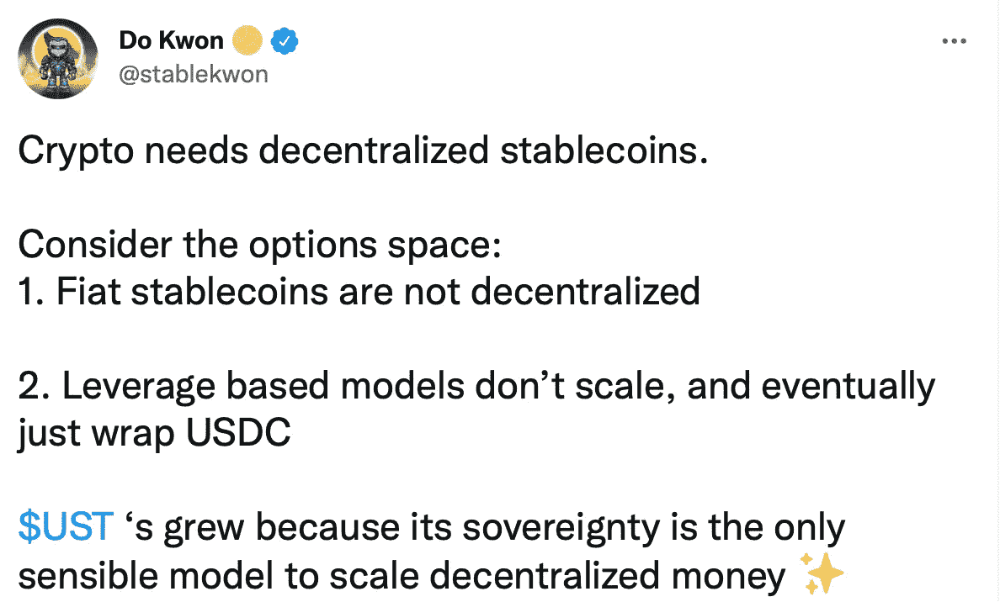

# Terra 的支点:增加比特币储备支持 UST。

> 原文：<https://medium.com/coinmonks/terras-pivot-the-addition-of-bitcoin-reserves-to-back-ust-1ddf56f50abf?source=collection_archive---------22----------------------->

# 介绍

Terra Luna 最近似乎不能置身新闻之外。从 Luna 在熊市期间触及 101.59 美元的 ATH，到 Terraform Labs 首席执行官 Do Kwon 在 Luna 的价格上下了 1000 万美元的赌注，至少可以说事情很有趣。虽然这些事件具有新闻价值，但我更感兴趣的是[**【LFG】**](https://lfg.org/missionandvision/)购买比特币以及这对[**【UST】**](https://www.terra.money/)的未来意味着什么。

## 什么是 Terra？

Terra 是为 [**算法 stablecoins**](https://docs.terra.money/docs/learn/glossary.html#algorithmic-stablecoin) 创建的公共区块链。这些稳定的货币与几种不同的法定货币挂钩，包括美元和韩元。该协议的另一个主要标志是 Luna，用于管理、下注和吸收 Terra 的价格波动。UST 的价格稳定是通过基本的供求力量来维持的。Terra protocol 的市场模块允许用户始终用价值 1 美元的 Luna 兑换 1 UST(或任何其他 Terra stablecoin 面值)，反之亦然，提供了一个 [**套利**](https://www.investopedia.com/terms/a/arbitrage.asp) 机会。Terra 协议使用了一种全新的机制来实现这一点。

**UST/Luna Arbitrage**

# Stablecoin 概述

加密货币容易受到价格波动的影响，这降低了它们作为交易媒介的功能。稳定债券通过将其价格与基础金融资产 1:1 固定来解决这个问题。它们是数字资产领域的基础组成部分。三种主要类型的稳定圈是:

1.  **托管稳定货币:**也称为法定抵押稳定货币，它们通过利用可信赖的第三方持有等量的法定货币储备来保持 1:1 的挂钩。保管 Stablecoins 是 stablecoins 的第一次迭代，并且仍然占据主导市场份额。**例子:**系绳(USDT)，美元硬币(USDC)
2.  **加密抵押稳定账户**:使用智能合约“锁定”其他加密资产作为贷款抵押。从这些贷款中，自动化程序产生新的稳定的利润，并保持基础资产的价格稳定。**例子:**戴(Dai)，合成美元(sUSD)
3.  使用一系列基于区块链的机制来维持他们的固定价格。这些算法充当“中央银行”，在没有抵押品的情况下维持价格挂钩。**例子:**特拉乌斯(UST)，安普尔福思(AMPL)

stablecoin capitalization breakdown

## 利弊比较

## UST 脱钩风险

与它们的对应物相比，算法稳定点天生脆弱。 [**铁。金融**](https://ciphertrace.com/analysis-of-the-titan-token-collapse-iron-finance-rugpull-or-defi-bank-run/)**2021 年 6 月的银行挤兑就是一个显著的例子。对 UST 需求的增加通过相关的燃烧机制使卢娜变得更有价值，因此 [**反射性地**](https://www.investopedia.com/terms/r/reflexivity.asp) 加强了对 UST 的盯住。然而，反过来也是正确的，UST 的大规模货币紧缩导致卢纳被铸造和贬值。这可能导致潜在的 [**死亡螺旋场景**](https://deliverypdf.ssrn.com/delivery.php?ID=983074096009087109029071003096014073019078004010056064085119118127006110102098075031052054028009107063023084081106004093000092119006064001081075070103030107083007068066000066013027120026126106023002099068116064070020029099002107120007066125003012126123&EXT=pdf&INDEX=TRUE) 。Terra 生态系统巧妙地采用了一种增长驱动的模式来产生需求和采用 UST，并帮助降低这种风险。如下图所示，就**而言，Terra 是目前排名第二的区块链。然而，对于 UST 作为一种可靠的稳定货币的长期可行性，仍然存在疑问。****

********

******blockchain TVL ranking (3/21/22)******

# ******UST 的新抵押品:作为外生抵押品的比特币******

****Terra 已经并将继续购买比特币，以进一步确保 UST 作为储备资产的安全。这是 Terra 生态系统中的一个巨大转变，因为 UST 以前没有被土地化。比特币现在将被用于极端市场抛售阻止买家恢复 UST 联系汇率、削弱 Terra protocol 公开市场套利激励的情况。UST 现在有一个 [**外汇储备**](https://en.wikipedia.org/wiki/Foreign_exchange_reserves) 很像中央银行，这将减少反身性并充当后盾。****

********

## ****为什么选择比特币？****

****用 Terra 首席执行官 Do Kwon 的话说，“我的意思是这里有几个原因，但简单地说，比特币是数字货币中唯一被证明的硬储备资产。加密领域的人很难质疑比特币。”许多协议财政部目前使用 ETH 作为储备资产，这与比特币相比似乎不太有利。以太的价值很大程度上来源于它作为智能合同平台的实用性。随着一级市场份额变得越来越分散，很明显，ETH 缺乏成为有效储备资产所需的中立性或主导地位。****

## ****比特币将如何融入 Terra 生态系统****

****Luna Foundation Guard 目前已经筹集了 22 亿美元的比特币储备，计划在不久的将来达到 30 亿美元。长期目标是达到 100 多亿美元的储备。UST 可以兑换大约一美元的比特币(-1%/-2%)。UST 也可以通过对储备进行令牌化比特币交易来铸造。UST [**铸币税**](https://www.investopedia.com/terms/s/seigniorage.asp) 的一部分现在将用于购买比特币。这确保了只有当 UST 低于盯住汇率时，BTC 储备才会被积极交易，而且随着 UST 供应量的增加，BTC 供应量也会随之线性增长。(关于比特币整合的更多细节预计将在不久的将来提供)****

## ****这对露娜有什么影响****

****展望未来，较小比例的露娜将被烧成薄荷 UST，这可能会阻碍其未来的收益。然而，Do Kwon 认为，由于比特币带来的稳定性，生态系统的增长将超过 Luna burn 百分比的下降。****

## ****Terra 和比特币生态系统获得了什么****

****在未来，很可能其他协议会利用比特币作为储备货币，因为它的属性。Cypherpunk 和比特币先驱 [**哈尔·芬尼**](https://en.wikipedia.org/wiki/Hal_Finney_(computer_scientist)) 在 2011 年预测了这一点，2022 年 Terra 是第一个实现的项目。引入比特币增加了 UST 挂钩的弹性，并为 Terra 生态系统吸引了一个全新的社区。在硬币的另一面，比特币将增加跨链和 DeFi 的使用。中本聪设想的比特币是电子现金 **的 [**点对点版本。**时间表明，比特币的属性不太适合大批量的点对点交易，但通过将比特币作为储备资产整合到 Terra 生态系统中，这可以间接实现。](https://bitcoin.org/bitcoin.pdf)******

****

# **分散的经济需要分散的资金**

****

**我很大程度上同意道权的上述观点。在集中资金的基础上建立分散的经济似乎是对立的。目前，稳定注射可能是最安全的选择，但长期来看并不可行。随着联邦法规的临近，监管稳定的监狱将很快面临各种形式的更大程度的控制。加密抵押稳定债券旨在解决这一问题，但资本效率低下，而且主要由 USDC 抵押。Terra 生态系统也有自己的担忧，但比特币的加入似乎是朝着正确方向迈出的一步**

# **结束语**

**加密货币社区充满了部落主义，其中许多是必要的和自然的。但是人们经常忘记，这个领域的项目相似性远远大于不同性。无论你相信 UST 是未来的稳定币还是庞氏骗局，所有对创造一个更加民主的未来感兴趣的人都应该寻找分散化的解决方案。**

**以上所写的一切都是我所知道的。请随意评论和纠正任何错误，毕竟，我正在边做边学！**

**推特:[**@ ColeCarouba**](https://twitter.com/ColeCarouba)**

> **加入 Coinmonks [电报频道](https://t.me/coincodecap)和 [Youtube 频道](https://www.youtube.com/c/coinmonks/videos)了解加密交易和投资**

# **另外，阅读**

*   **[CoinDCX 评论](/coinmonks/coindcx-review-8444db3621a2) | [加密保证金交易交易所](https://coincodecap.com/crypto-margin-trading-exchanges)**
*   **[红狗赌场评论](https://coincodecap.com/red-dog-casino-review) | [Swyftx 评论](https://coincodecap.com/swyftx-review) | [CoinGate 评论](https://coincodecap.com/coingate-review)**
*   **[Bookmap 评论](https://coincodecap.com/bookmap-review-2021-best-trading-software) | [美国 5 大最佳加密交易所](https://coincodecap.com/crypto-exchange-usa)**
*   **[如何在 FTX 交易所交易期货](https://coincodecap.com/ftx-futures-trading) | [OKEx vs 币安](https://coincodecap.com/okex-vs-binance)**
*   **[CoinLoan 评论](https://coincodecap.com/coinloan-review) | [YouHodler 评论](/coinmonks/youhodler-4-easy-ways-to-make-money-98969b9689f2) | [BlockFi 评论](https://coincodecap.com/blockfi-review)**
*   **[XT.COM 评论](https://coincodecap.com/profittradingapp-for-binance) | [币安评论](https://coincodecap.com/xt-com-review)**
*   **[SmithBot 评论](https://coincodecap.com/smithbot-review) | [4 款最佳免费开源交易机器人](https://coincodecap.com/free-open-source-trading-bots)**