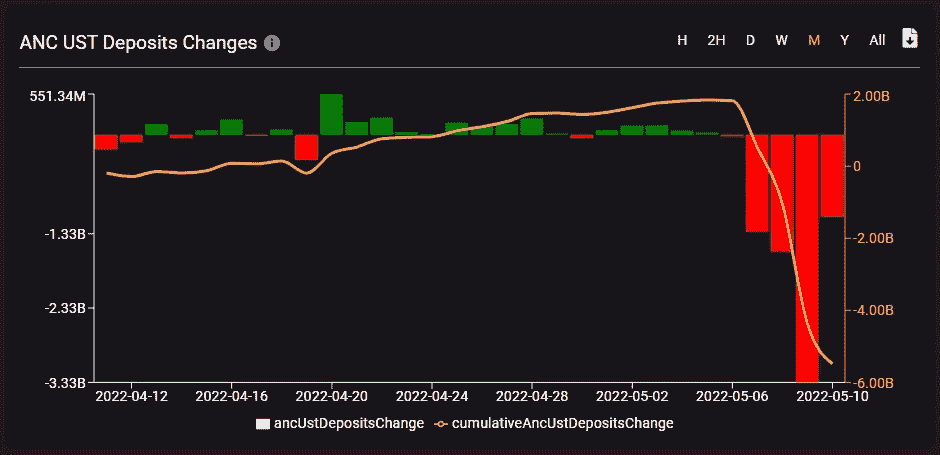
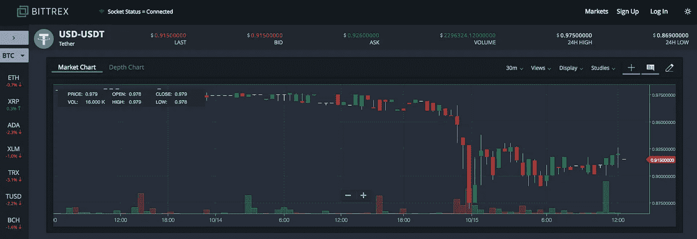

# TerraUSD (UST) —第 1 部分

> 原文：<https://medium.com/coinmonks/terrausd-ust-part-1-88a89a1af107?source=collection_archive---------9----------------------->

Tumbling. Credit: Malte Mueller / Getty

批评者一直认为 [UST 可能是一个骗局](https://forklog.io/ctejblkoin-ust-kratkovremenno-utratil-privyazku-k-dollaru-ssha-na-fone-ottoka-aktivov-iz-anchor/)，其中一些人[强调 UST 是更广泛的加密货币市场的负债](https://twitter.com/kamikaz_ETH/status/1523031511423160320)，因为[卢纳基金会卫队](https://decrypt.co/99567/luna-foundation-guard-buys-another-1-5b-bitcoin-back-terra-stablecoin)，支持 UST 的组织，拥有 35 亿美元的比特币，准备在需要捍卫 UST 稳定时作为最后手段出售。即使这不是真的，随着[价值近 165 亿美元](https://coinmarketcap.com/currencies/terrausd/)的 UST 在流通，稳定货币的崩溃——其中暂时约 30%的价格下跌可能是一个早期迹象——将足以惊吓加密货币投资者和整个市场。

在加密货币市场崩溃的背景下，Terra 生态系统的算法稳定币——**Terra USD(UST)——再次失去了与美元的挂钩。5 月 10 日晚，该资产的价格跌破 0.62 美元([币安](https://www.binance.com/en/trade/UST_USDT))。由于这一事件，加密货币交易所[币安暂时冻结了 Terra 区块链上的取款](https://www.binance.com/en/support/announcement/dc02bedd65be40f7b10022f26bc06879?ref=AZTKZ9XS&utm_source=BinanceTwitter&utm_medium=GlobalSocial&utm_campaign=GlobalSocial)。**

At the time of writing UST is trading ~ 0.9$.

**UST 是最大的美元稳定货币之一。**根据 [CoinMarketCap](https://coinmarketcap.com/currencies/terrausd/) 的数据，其资本总额超过 160 亿美元。UST 的发行采用了 LUNA 本地加密货币分配机制，这两种资产的价格密切相关。LUNA 已经损失了超过 40%的价值，在撰写本文时交易价格接近 30 美元。

Back on Friday, May 6, the price of the LUNA exceeded $80.

昨天，当价格涨到每 UST 0.7 美元**时，我们已经看到平台的一个空订单。**

UST 与美元的平价模式在很大程度上依赖于套利者。如果一枚稳定币的价格跌破 1 美元，交易者可以买入并用卢纳兑换成 1 美元，从而获利。然而，要使这一机制发挥作用，就必须确保对目标资产的需求。在 UST 的例子中，提供这种需求的平台是 Terra 生态系统中最大的协议——Anchor。根据 SmartStake 的说法，用户在 5 月 9 日从该协议中撤回了超过 33 亿 UST。5 月 10 日不到一天，资金又流出 11 亿 UST。

在过去的几天里，从 Terra 的锚定协议中出现了[大规模提款，UST 的压力开始增加，在这里**的 UST 存款目前为投资者带来约 20%的 APY** 。2022 年 5 月 8 日，曲线上的 UST 流动性池显示](https://twitter.com/resonancethis/status/1523050373828980737)[失衡约 67](https://curve.fi/ust) %(通常有 50%的分割)。Curve 是以太坊稳定货币流动性的主要协议，因其深度流动性而备受推崇，通常允许交易者以极低的“滑点”(即交易前后的价格差异)交换 UST 和 USDC 等稳定货币。由于曲线对于 [DeFi](https://decrypt.co/resources/defi-decentralized-finance-explained-guide-learn) 如此重要，因此池中任何不规则的迹象都会引起警报。尽管 Curve 的资金池能够吸收这种失衡，但投资者昨日的恐慌导致了对 UST 的大量抛售，主要是为了购买 USDC 等其它稳定的债券。在 UST 最大的抛售中，一个监控和发布大量互换交易的机器人 Curve Whale Watching，[展示了](https://twitter.com/usdcbull1/status/1523063668807995392)一笔 8500 万 UST 换 8450 万 USDC 的交易。

**存款利率降至 17.87%，用户回笼资金。5 月 8 日，这导致 UST 短暂失去了盯住美元的汇率机制。但在 5 月 9 日，该指标已经回到了 20%——在 Anchor 资金外流的背景下，支付更高的百分比变得更加容易。与此同时,《议定书》的产量储备继续缩减。在撰写本文时，资金池中的 UST 不到 1.8 亿。**

2022 年 3 月，UST 增加了另一个弹性机制，即卢纳基金会卫队(LFG)比特币储备基金。它必须立即在 BTC 提供维持资产价格所需的流动性。5 月份，该机构管理的资产量已经达到 80，394 BTC。连锁数据显示 LFG 的钱包是空的。根据该组织的仪表板，约 1.97 亿美元的资产留在储备基金中——资金的最大份额落在卢娜、UST 和阿瓦克斯身上。

与此同时，Terraform 实验室表示，怀疑论者夸大了正在发生的事情的意义。该公司强调，UST 在 Terra 生态系统中也有活动，套利者需要时间来稳定资产。

**类似的情况在 2018 年 10 月也发生过，市值最大的所谓稳定币，******【USDT】**。据说它还与美元挂钩，并且总是值 1 美元。stablecoin 在交易所短暂交易低于 0.87 美元，然后回升到 1 美元。这是因为，正如德州大学的研究人员在 2018 年 6 月展示的那样，Tether 很可能被用于“提供价格支持和操纵加密货币价格”。**

****

**深入探究 UST 的情况，Terra 生态系统的前景并不乐观。锚点[仪表盘](https://app.anchorprotocol.com)显示存款总量超过流通中借入资金价值的 3 倍以上。该项目严重缺乏债权人稳定获得利息收入所需的资产。原生 ANC 令牌在借款人之间的分配并没有带来多少效果，也没有消除现有的失衡。**

> **加入 Coinmonks [电报频道](https://t.me/coincodecap)和 [Youtube 频道](https://www.youtube.com/c/coinmonks/videos)了解加密交易和投资**

# **另外，阅读**

*   **[加密保证金交易交易所](/coinmonks/crypto-margin-trading-exchanges-428b1f7ad108) | [赚取比特币](/coinmonks/earn-bitcoin-6e8bd3c592d9) | [Mudrex 投资](https://coincodecap.com/mudrex-invest-review-the-best-way-to-invest-in-crypto)**
*   **[WazirX vs coin dcx vs bit bns](/coinmonks/wazirx-vs-coindcx-vs-bitbns-149f4f19a2f1)|[block fi vs coin loan vs Nexo](/coinmonks/blockfi-vs-coinloan-vs-nexo-cb624635230d)**
*   **[比斯勒评论](https://coincodecap.com/bitsler-review)|[WazirX vs coin switch vs coin dcx](https://coincodecap.com/wazirx-vs-coinswitch-vs-coindcx)**
*   **[7 大副本交易平台](https://coincodecap.com/copy-trading-platforms) | [BuyCoins 点评](https://coincodecap.com/buycoins-review)**
*   **[XT.COM 评论](https://coincodecap.com/profittradingapp-for-binance)币安评论 |**
*   **[SmithBot 评论](https://coincodecap.com/smithbot-review) | [4 款最佳免费开源交易机器人](https://coincodecap.com/free-open-source-trading-bots)**