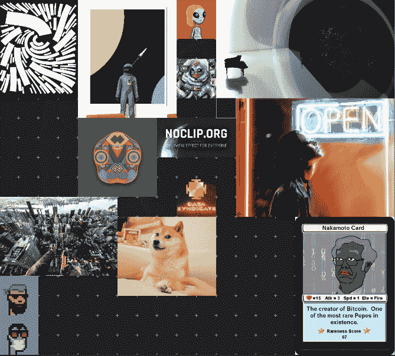

# 特斯拉在仙境

> 原文：<https://medium.com/coinmonks/tesla-in-wonderland-36c4116ac5cf?source=collection_archive---------39----------------------->

***磁暴兔洞有多深！*** *让我们跟着钱走。*

*特斯拉有价值 20 亿美元的比特币，谁知道以太坊有多少，埃隆有比特币，以太坊，Doge，柴犬。他拥有的每家公司的资产负债表上都有密码，嗯？*

Photo by [Ron Lach](https://www.pexels.com/@ron-lach) on Pexels

> esla 刚刚获得了一笔 780 万美元的房地产融资交易，该交易由 6s capital threw Maker Dao 投资。这笔房地产交易是为了一个新的汽车修理厂。我相信这只是一次测试，以证明其对特斯拉的可行性，如果成功，就要准备好迎接来自特斯拉和其他公司的更大规模的资本流动。特斯拉有成为创新先锋的习惯。这是制造商 Dao 推动合并 RWA 的“真实世界资产”的一个很好的例子。去年，制造商道(Dao)组建了一个很有前途的项目离心机，该项目正在开发 256 万亿美元的真实世界资产。拥有世界上最大的公司之一来验证使用案例，这是整个生态系统向前迈出的一大步。
> 
> *“创客金库刚刚被用来为与特斯拉的房地产交易融资……RWA szn 的到来比你想象的要快。”*
> 
> RuneKek，MakerDAO 联合创始人
> 
> pace-X 正在月球上放一枚真的 doge 硬币。不相信我，你就等着瞧吧。留下评论，6 个月后再来！幕后有大事在进行。我第一次注意到塞缪尔·里德和几何空间公司的关系，不是别人，正是奇科密码公司。如果你对密码感兴趣，绝对值得关注。XI 协议让你在太空中的立方体卫星上做广告或显示图像的协议。这里发生了大事。这是让我们登上月球甚至火星的总体计划的一部分吗？

[@elonmusk](https://twitter.com/elonmusk)

抓住生产的模因！

[2021 年 4 月 1 日](https://twitter.com/elonmusk/status/1377567762919292938)

SpaceX 公司将把一个真正的狗窝放在真正的月球上

> 加入 Coinmonks [电报频道](https://t.me/coincodecap)和 [Youtube 频道](https://www.youtube.com/c/coinmonks/videos)了解加密交易和投资

# 另外，阅读

*   [印度最佳 P2P 加密交易所](https://coincodecap.com/p2p-crypto-exchanges-in-india) | [柴犬钱包](https://coincodecap.com/baby-shiba-inu-wallets)
*   [八大加密附属计划](https://coincodecap.com/crypto-affiliate-programs) | [eToro vs 比特币基地](https://coincodecap.com/etoro-vs-coinbase)
*   [最佳以太坊钱包](https://coincodecap.com/best-ethereum-wallets) | [电报上的加密货币机器人](https://coincodecap.com/telegram-crypto-bots)
*   [交易杠杆代币的最佳交易所](https://coincodecap.com/leveraged-token-exchanges)
*   [最佳加密分析或链上数据](https://coincodecap.com/blockchain-analytics) | [Bexplus 评论](https://coincodecap.com/bexplus-review)