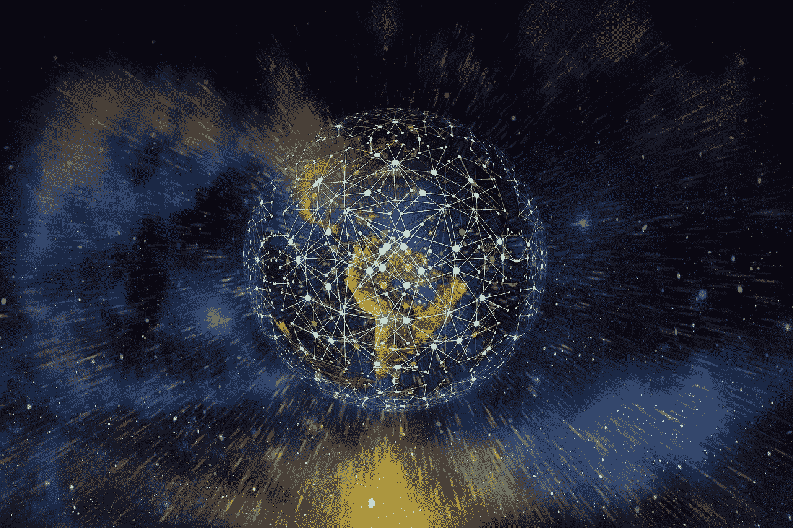
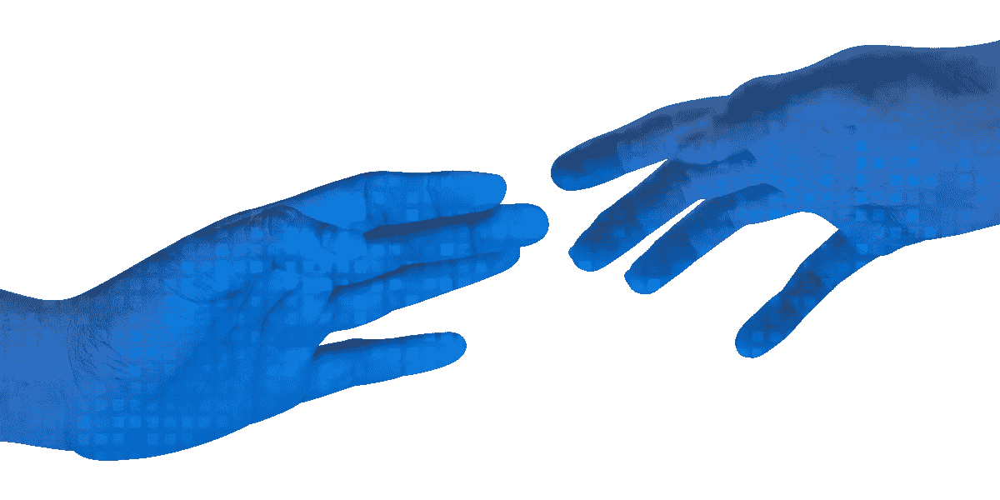

# 区块链/ DeFi 如何创新社会影响

> 原文：<https://medium.com/coinmonks/test-c6ba08da298e?source=collection_archive---------44----------------------->

技术塑造了社会的运作方式。从以物易物、铸币和法定货币创造交换市场的时代，现在我们在区块链和 DeFi 技术上蓬勃发展。分散金融(DeFi)是分散金融的缩写，是加密货币或区块链中旨在扰乱金融中介的各种金融应用的术语。

通过这种颠覆性的能力，区块链科技从三个方面解决了社会不公:去中心化、高效互通、全民财务自由。

在将区块链技术用于社会影响之前，存在许多问题。

> 交易新手？在[最佳加密交易](/coinmonks/crypto-exchange-dd2f9d6f3769)上尝试[加密交易机器人](/coinmonks/crypto-trading-bot-c2ffce8acb2a)或[复制交易](/coinmonks/top-10-crypto-copy-trading-platforms-for-beginners-d0c37c7d698c)

# 1.集中式平台的问题

集中式平台扮演着把关者的角色，决定着谁、什么、何时、何地以及如何使用重要的社交基础设施。例如，我们中的许多人认为开立银行账户、获得信用卡或获得抵押贷款是理所当然的。但事实是，世界上大约有 20 亿人没有银行账户或银行服务不足。

在无法创建银行账户的国家或情况下，人们无法储存财富，也无法通过安全手段转移或接收资金。对于那些可能在社会动荡地区拥有银行账户的人来说，银行可能会带着所有客户的存款破产，银行可以任意审查或阻止交易，或者银行的所有存款被权威机构查封。

中央平台也有管理成本，这一直是与慈善机构争论的焦点；在某些情况下，管理费用高于传递给接收者的费用。

# 2.低效的通信和同步

通过传统的银行渠道，国际汇款可能是一个复杂的多步骤过程。经合组织报告称，在全球范围内，估计有 20%—25%的资金因国家层面的腐败而流失。数以百万计的美元本可以用于好的方面，却被无意中丢失、浪费、低效使用和错误分配。

# 3.财务障碍和挫折

世界银行的数据显示，目前全球汇款平均收取 6.5%的费用。这些利率极大地侵蚀了那些想给亲人寄钱回家的人的收入。

汇款不仅是弱势群体的一大障碍，而且许多国家的制度只允许少数人投资改变生活的机会。在美国，只有合格的投资者才可以交易没有在金融机构注册的证券。

**但是随着区块链技术的出现，社会影响计划正在经历巨大的创新。**

# 1.分散平台是开放和透明的

区块链技术为无法进入银行的人提供了一个不可思议的机会。通过创建加密货币钱包，分散化平台允许人们在世界任何地方全天候转移资本。

作为区块链技术的一个特点，需要区块链网络所有成员的一致同意来验证每笔交易，并且所有经过验证的交易都被永久记录在区块链上。这意味着捐赠给社会影响组织的所有资金及其使用情况都可以被透明地跟踪。捐款还可以包括条款，规定只有在满足某些条件的情况下才能转移资金，并且可以与筹款目标甚至业绩挂钩。

[Alice](https://alice.si/) ，一个社会资助和影响管理平台，将每一个救援项目的绩效公之于众，允许捐助者发现并捐助有效的社会项目。

# 2.高效的系统和互操作的市场

区块链技术在网络成员之间创建了一个分布式的共享记录系统，消除了对不同分类账的需要；使得系统高效。通过区块链技术进行的跨境交易使救援组织能够迅速产生影响，而不是等待处理。

这种互操作性，即不同系统、设备、应用程序或产品以协调的方式连接和通信的能力，使许多服务变得高效。点对点交易，如当地的比特币交易所已经降低了费用。当交易在加密分类账上进行时，信用卡的费用会降低。

[Strike](https://strike.me/) 是众多使用区块链技术构建解决方案的公司之一，该解决方案允许用户即时转账且不收取汇款费用。Strike 利用比特币的开放支付网络，允许用户随时随地发送和接收资金，无需额外费用。

除了数字货币之外，通过区块链获得跨国的、不可改变的身份识别形式可以帮助筛选和核实志愿者。[掘金](https://nuggets.life/)创建了一个自主数字身份&支付平台，作为一个可重复使用、可互操作的身份，具有基于价值的声誉。通过金块等解决方案，救援组织可以立即访问经过验证的工作历史记录或其他文档，从而减少验证的延迟，并大大提高国际紧急救援计划的效率。

# 3.为所有人提供更大的金融包容性

DeFi 给人们带来的最大好处之一就是降低了进入门槛。这可能意味着减少获得金融服务的障碍，减少开发者进入创新工作场所的障碍，甚至通过为人们提供更低的交易成本来减少昂贵的障碍。

目前有许多分散的交易所在运作。DeFi 交易所使用无需许可的开源智能合约。任何有互联网连接的人都可以连接到全球经济，获得他们以前无法获得的产品、服务和资源。

仅举几个例子，由于区块链的技术，没有信用的人可以从像 [Aave](https://aave.com/) 这样的平台获得贷款，没有保险的人可以通过 [Nexus Mutual](https://nexusmutual.io/) 投保。区块链技术确实让越来越多的人能够访问至关重要的金融基础设施。

# 结论

区块链技术带来了革命性的社会影响。任何人都可以拥有自己的财富，成为高效互操作市场的一部分，并获得更多金融服务。

有无数的公司正在用区块链技术制造产品来解决我们今天面临的许多问题。我希望更多的救援组织关注区块链技术改变世界的能力，并采取必要的服务，以确保尽可能多的人可以通过他们的倡议得到帮助。开发者和企业家需要了解区块链技术拥有的无限潜力，以及利用这些技术为世界带来更多价值的不可估量的方式。