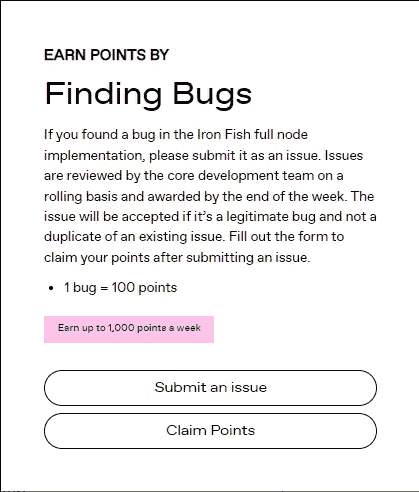
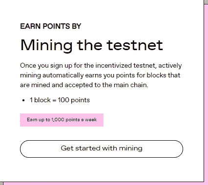
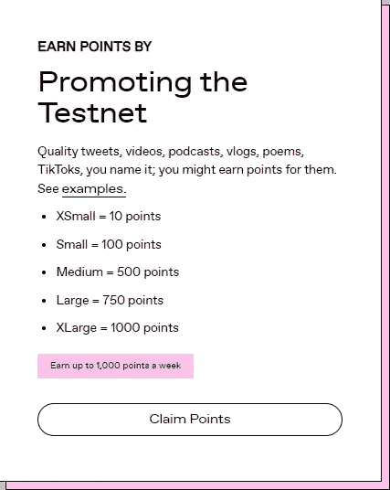
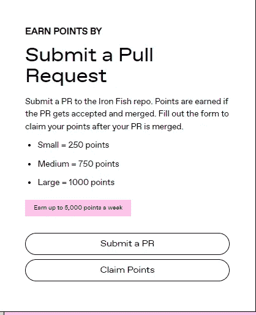

# 测试网铁鱼

> 原文：<https://medium.com/coinmonks/testnet-iron-fish-49c6621d1395?source=collection_archive---------47----------------------->

如果你还不知道，有一个来自铁鱼的小消息。该项目与 ALEO 一起使用零知识技术建立了一个保密连接系统，并在其网站上推出了一个测试网。每个人都可以参加测试。主要是学习这个项目的欲望和渴望。在网站上，你可以找到几个项目，团队铁鱼给测试。因此，您可以找到系统中的错误，并将它们发送给开发人员和管理员(见图 1)。为此，团队铁鱼将用奖金(1 错-100 分)感谢大家。

另外，你可以参加采矿。铁鱼团队为进入网络的每一个街区感谢参与者。1 块= 100 分。

此外，在 testnet 中还有一个获得推广项目积分的机会，即你可以写关于项目的文章，制作各种模因，用项目拍摄 TIC-tac，将各种视频放在你的 youtube 频道上。对于这项工作，团队可以感谢你高达 1000 分。相应地，越是耗时、高质量的工作，你能得到的分数就越多。

该团队并没有就此止步，而是给用户一个机会，让他们有机会因改正错误而获得积分。你所要做的就是提交一个修复请求，团队会给你的工作打 250 分，所以一定要小心，注意每一件事。

最后，铁鱼团队并不局限于这些要点，并接受对 post testnet@ironfish.network 的所有建议。如果您有任何疯狂的想法，如何吸引大量观众，如何修复系统中的各种错误，如何改进项目，您可以放心地申请帖子并分享您的新闻。你绝对可以做任何事情，每个项目都支持你。祝你学习顺利！感谢您的关注！

[铁鱼—$铁—частная，анонимнаяипростаявиспользованиикриптовалюта](https://ironfish.network/)

[铁鱼(@ironfishcrypto) / Twitter](https://twitter.com/ironfishcrypto)

【https://discord.gg/Bvdyw5ff】/不和

https://t.me/ironfishru/俄罗斯电报