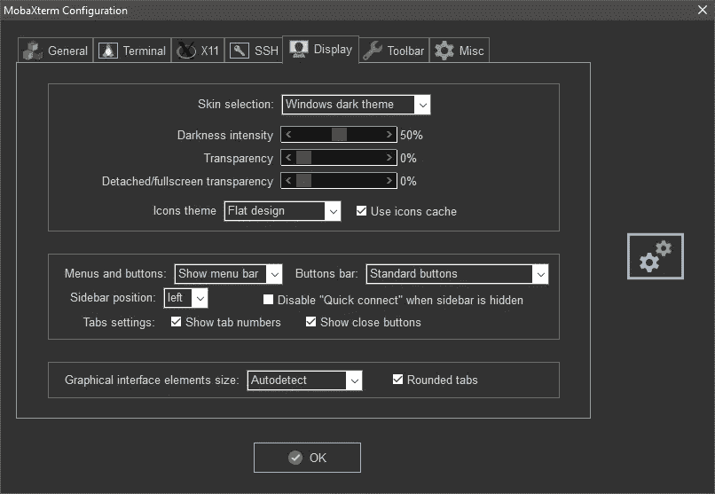
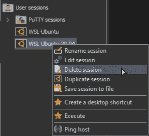

# Testnet:完整指南

> 原文：<https://medium.com/coinmonks/testnet-the-complete-guide-2b89877f7fc5?source=collection_archive---------2----------------------->

## 什么是 testnet 或节点，为什么要做，去哪里找项目参与，去哪里买服务器，如何安装节点，开始参与 testnet，如何连接服务器“养”一个节点。

这项工作的要点是“提高”和维护处于测试阶段的各种加密项目的节点。

> 换句话说:任何项目进入市场之前，都必须经过几个阶段的测试:从开发团队自己执行的一些初始测试，到公共测试，其中网络(产品)由所有(或不是所有)愿意的用户测试，即所谓的测试人员。

这有助于团队了解产品的行为并修复错误，从而避免在产品发布时弄得太脏。

测试大多数项目涉及到“提升”和维护一个节点。

在本文中，术语“测试”意味着在服务器上安装一个节点及其进一步的维护(您将需要跟踪软件更新，及时安装新版本的软件，在出现错误时重新启动节点，查找这些错误并尝试解决它们)。

# **关于节点**

**节点** —简单来说:它是一台服务器，一台远程(或不那么远程)的“电脑”，上面安装了特殊的软件。

一旦我们租用并配置了远程服务器，我们就有了一个节点，它可以与网络的其他成员(节点)进行通信，并存储、发送和接收有关其事务的信息。

分散化对于确保高水平的网络安全是非常必要的。

每一笔交易都是由几个独立的节点确认的，这样就不可能伪造数据。

我们“引发”节点的事件被称为**测试网**，有时也称为**事件**。

测试参与者是**测试人员**。

# 测试网奖励

为了感谢开发团队所做的工作和提供的数据，他们可以用一些硬币来感谢 testnet 参与者。

值得注意的是，测试网有几种类型:**可奖励**和**不可奖励**。

如果在第一种情况下，我们确切地知道有多少硬币，什么时候，在什么条件下我们会得到，第二种类型的事件涉及无偿的帮助。

为了公平起见，我必须说，并不总是奖励考试网支付。就像没有公布任何奖励的项目可以用一定数量的硬币来感谢参与者一样。

最常见的情况是，被测试产品的硬币或代币不在交易所或指数上交易，因此没有价格。

有时，但不经常，项目团队在产品上市后继续测试他们的产品，作为奖励，我们得到已经有一定价格的代币。

## 必须理解的是:

*   项目可能什么都不会付，即使承诺了；
*   项目可以支付，即使不承诺；
*   该项目可以用代币支付，而代币在一段时间内将一文不值；
*   这个项目可以用代币支付，代币已经交易过了，有真实的价格。

乍一看，只参与奖励性的测试似乎是有意义的，因为项目的硬币已经被交易并有了真实的价格。

但是，实践表明，这种活动的回报比测试一个新创造的产品要低得多。

当一枚硬币以名义美元交易时，你被告知:“每个测试参与者将获得 100 枚硬币”，你明白:“好吧，我将获得 100 美元”。

当一枚硬币不值钱(不在交易所交易)时，你被许诺同样的 100 枚硬币，那么在一两个月或一年后，当项目和它的产品一起进入市场时，每枚硬币的价值可能是 0.001 美元，0.2 美元，1 美元，100 美元，等等。

与有一定价值的硬币的项目一起工作是“此时此地”。

与一个新推出的项目和一个年轻的团队合作，首先是一种风险(没有人保证团队会将他们的产品发布)，但也是一个很好的前景。

# 参加测试网的费用

要“养”一个节点(除去欲望和空闲时间)，你需要有一个硬件，在那里养这个节点。

如果你爱你的电脑，你不会把它变成一个节点。

我们需要一台服务器(一台远程“计算机”)，它会在很远的地方发出噪音，没有人会担心。

租用这种“电脑”的价格取决于硬件的特性。每个节点所需的特征取决于项目。

**为一个节点租用一台服务器的平均成本**在每月 5 美元到 50 美元之间。

有些项目需要更贵的设备，比如显卡。然后租用服务器的价格涨到每月 200-300 美元。

许多初学者(不仅仅是)测试人员使用来自亚马逊或谷歌云的免费服务器，这一点也应该记住。

## 如何组织服务器？例子

该方法仅在那些主机上起作用，其中所需容量的服务器可以存活至少一个月，优选地两个月。但请记住，当在大型 10-15 台二手服务器上工作时，您需要不断地维护节点本身，更新它们，定期提升，等等…对于亚马逊 AWS 服务器配置 8 CPU 32 RAM 可以使用一两个月，但这是在您运气好并且可以正确注册帐户的情况下。

对于 Linode 注册稍微复杂一点，你需要考虑很多细微差别来绕过欺诈，成功确认注册账号。但是，如果你可以注册一个帐户，你会得到一个 6 CPU 16 RAM 的服务器，它将持续 25-30 天以上。

也可以在 forums 上购买帐户，这是一个现成的帐户，分别为 AWS 和 Linode 提供试用订阅。

# 如何找到一个测试网来参与

为了参与测试或多或少的强项目，我们建议您在书签中添加类似于[**【dropsearn.com】**](https://dropsearn.com/)[**nodes . guru**](https://nodes.guru/)**的站点。**

**通过参与这些资源上介绍的活动，你将增加“获得美味晚餐和一块馅饼”的机会。**

# **Как итог**

**Мы тестируем криптовалютные проекты, специализируясь на «поднятии» и содержании нод.**

**В награду нас могу похлопать по плечу, подарить кепку или же «ламбу».**

**Стоит или не стоит, думайте сами. Если всё же решились попробовать «нодерство», то представляю вниманию ещё 2 вводных раздела, после прочтения которых вы сможете поднять свою первую ноду.**

**Но просто прочитать мои статьи — мало.**

**Самое важное — это погрузиться в атмосферу и стать частью коммьюнити.невылезатьиз[чатаnodes . guru](https://t.me/nodesguru)，спамитьF5страницу[dropsearn ' a](https://dropsearn.com/)игуглить，гуглить，гуглить.**

**Цель статьи — лишь заинтересовать вас тематикой нод и дать необходимые источники информации. Я сделал всё, что мог. Теперь ваша очередь.**

# **如何以及在哪里为节点租用服务器**

**如果您已经选择了您想要参与测试的第一个项目，那么您首先需要决定的是服务器的技术特性。**

**硬件要求总是可以在节点安装的官方文档中找到。**

**可以将节点的硬件要求分为两种类型:**

*   **弱 VPS(虚拟专用服务器)就行；**
*   **你需要一个强大的 DS(专用服务器)。**

**如果您需要 1 个 CPU、1GB 内存、50GB 硬盘到 8 个 CPU、32GB 内存、512GB 固态硬盘的服务器，您应该选择 VPS。**

**如果你需要 1tb 的空间，或者超过 32GB 的内存，你应该选择 DS。**

**在大多数情况下，我们可以使用相对便宜的 VPS。**

**“2 个内核、4GB RAM 和 50GB SSD”——可视为标准硬件要求。不经常需要 8 个或更多内核和 16 个或更多 RAM。**

## **人质事件**

**如果你需要一个 **VPS** :**

*   **[DigitalOcean.com](https://m.do.co/c/113088de962c)—快捷方便的服务；**

**如果你需要一个 **DS:****

*   **OVH.com——好评如潮的服务；**
*   **[ReliableSite.Net](http://payments.reliablesite.net/aff.php?aff=1374)—有能力为“采矿”支付额外费用且没有禁令问题的服务；**
*   **[HostKey.com](https://hostkey.com/gpu-dedicated-servers/)—可以用显卡租赁的服务。**

## **数字海洋**

**首先要做的是注册一个账户:**

****

**在“计费”选项卡中绑定卡:**

****

**转到“Droplet”选项卡并点击“Create Droplet”:**

****

**然后选择配置:**

****

**选择服务器位置，如有必要，添加 IPv6，设置密码以连接到服务器:**

****

**选择“主机名”(服务器的名称)，键入“标签”(进行快速搜索)，然后选择一个项目。“创建 Droplet”:**

********

**在新创建的服务器的选项卡中，您可以管理它—重新安装操作系统、连接动态 IP、创建备份、编辑硬件配置:**

****

**要连接到服务器，我们需要知道它的 IP 和密码。**

> **在我们连接到图形外壳服务器的情况下，也是端口。**

# **结论**

**现在剩下最难的部分:连接到服务器并“提升”节点。
可以通过不同的方式连接到服务器。你可以使用 **MobaXterm** 来管理你的远程机器。**

**要了解从哪里下载该程序，如何配置并最终连接到服务器，请阅读下面的指南。**

**如果与服务器的连接一切正常，您就可以继续安装节点本身了。在服务器上安装节点的指南(逐步说明)每次都是唯一的。你可以在 [**节点找到很酷的向导。**](https://nodes.guru/)**

**现在剩下的就是执行所选指南中的“逐步”命令，并获得第一个节点。**

# **MobaXterm**

****

**我们将详细研究 MobaXterm 程序:这个东西是什么，在哪里下载，如何安装，以及如何设置“moba”以便与远程服务器舒适地工作。**

## **什么是 MobaXterm**

**这是一个为远程管理计算机和服务器而设计的程序。**

**用户可以使用它在远程系统上执行几乎任何操作。**

**程序中集成的终端允许您通过 **Bash** shell 脚本执行 **Unix** 命令。**

**此外，MobaXterm 还包括一个处理宏的工具，可以在几个系统上同时运行。**

## **从哪里下载 MobaXterm**

**这个程序是有条件免费的。家庭版足以满足我们的需求。目前，该程序仅适用于 Windows 操作系统。**

**从 [**官方网站**](https://mobaxterm.mobatek.net/download.html) 下载最新版本，像正常程序一样安装:**下一个，下一个，下一个，安装**。**

********

## **程序设置**

****设置** > **配置** > **显示。****

********

**在 **SSH** 选项卡中，点击**远程监控**复选框。**

**此功能允许您实时监控服务器负载:**

****

## **程序功能**

**屏幕左侧有两个选项卡— **会话/宏。****

**转到**会话**选项卡，删除默认会话:**

********

## **创建会话**

**例如，现在有一个事件，我们需要安装几个节点来参与这个事件。右键单击空白区域，以我们想要参与的节点或 testnet 的名称创建一个文件夹:**

************

> **当连接到装有 **Windows 操作系统** — **RDP** 的服务器时。
> 用图形外壳——**VNC**连接 **Linux OS 时。
> 连接 **Linux OS 无图形外壳** — **SSH** 时。****

****

**在第一个表单中输入我们服务器的 **IP** ，编辑会话名称(以便将来快速找到正确的名称)，如果需要，编辑图标，并将会话链接添加到桌面:**

****

**按**确定:****

****

**输入您的登录名(通常是 root)和密码。最好从服务器信息中复制密码，然后简单地粘贴到终端上。**

> **要将任何文本插入终端，您必须单击鼠标滚轮。MobaXtermna 中的“Ctrl + V”是用于插入文本的键盘快捷键。默认情况下，鼠标滚轮负责此功能。**
> 
> **当您在终端中键入时，密码不会显示。你用滚轮把它粘贴进去，然后按回车键。就这样，你登录了。**

****

**屏幕左侧将打开一个文件管理器，类似于 Windows 资源管理器。**

**在这个框中，您可以方便地将文件上传到服务器，将整个文件夹从服务器下载到您的本地机器，创建文件和目录——一般来说，您可以在普通机器上做的所有事情，现在都可以在服务器上完成，只需点击几下鼠标。**

****

**如果长时间不与终端窗口交互，会话将被终止。要重新启动，请按“R”键。**

****

## **宏指令**

**宏是一个可以让你在一个会话中记录下你所有的动作(比如输入所有的命令来安装某个节点)并在另一个会话中应用宏中记录的所有命令的东西，这样可以节省很多时间。**

**例如，您想要安装 3 个节点。打开宏录制:**

****

**输入安装、配置和运行节点的所有命令，停止记录宏，为它想一个名称并保存它:**

********

**现在为另一台服务器创建一个新会话。登录到它，打开宏标签，运行你之前写的宏。**

**仅此而已。该宏将重复其中写入的所有命令，节点将自动安装，无需您的干预。**

**方便吗？一个字也没有。尤其是如果你喜欢多账户的话。**

# **SWAP.NET 队
官方网站—[https://swap.net/](https://swap.net/)推特—[https://twitter.com/NFTSwapnet](https://twitter.com/NFTSwapnet)不和—[http://discord.gg/35K7H9RqJd](http://discord.gg/35K7H9RqJd)电报—[https://t.me/NFTswapnet](https://t.me/NFTswapnet)
中—[https://medium.com/@NFTSwapnet](/@NFTSwapnet)
Docs&白皮书—[http://docs.swap.net](https://t.co/5qc7Mxt2p5)**

> **加入 Coinmonks [电报频道](https://t.me/coincodecap)和 [Youtube 频道](https://www.youtube.com/c/coinmonks/videos)了解加密交易和投资**

# **另外，阅读**

*   **[Bitsgap 审查](/coinmonks/bitsgap-review-a-crypto-trading-bot-that-makes-easy-money-a5d88a336df2) | [Quadency 审查](/coinmonks/quadency-review-a-crypto-trading-automation-platform-3068eaa374e1) | [Bitbns 审查](/coinmonks/bitbns-review-38256a07e161)**
*   **[加密复制交易平台](/coinmonks/top-10-crypto-copy-trading-platforms-for-beginners-d0c37c7d698c) | [Coinmama 评论](/coinmonks/coinmama-review-ace5641bde6e)**
*   **[印度加密交易所](/coinmonks/bitcoin-exchange-in-india-7f1fe79715c9) | [比特币储蓄账户](/coinmonks/bitcoin-savings-account-e65b13f92451)**
*   **[OKEx vs KuCoin](https://coincodecap.com/okex-kucoin) | [摄氏替代品](https://coincodecap.com/celsius-alternatives) | [如何购买 VeChain](https://coincodecap.com/buy-vechain)**
*   **[币安期货交易](https://coincodecap.com/binance-futures-trading)|[3 commas vs Mudrex vs eToro](https://coincodecap.com/mudrex-3commas-etoro)**
*   **[如何购买 Monero](https://coincodecap.com/buy-monero) | [IDEX 评论](https://coincodecap.com/idex-review) | [BitKan 交易机器人](https://coincodecap.com/bitkan-trading-bot)**