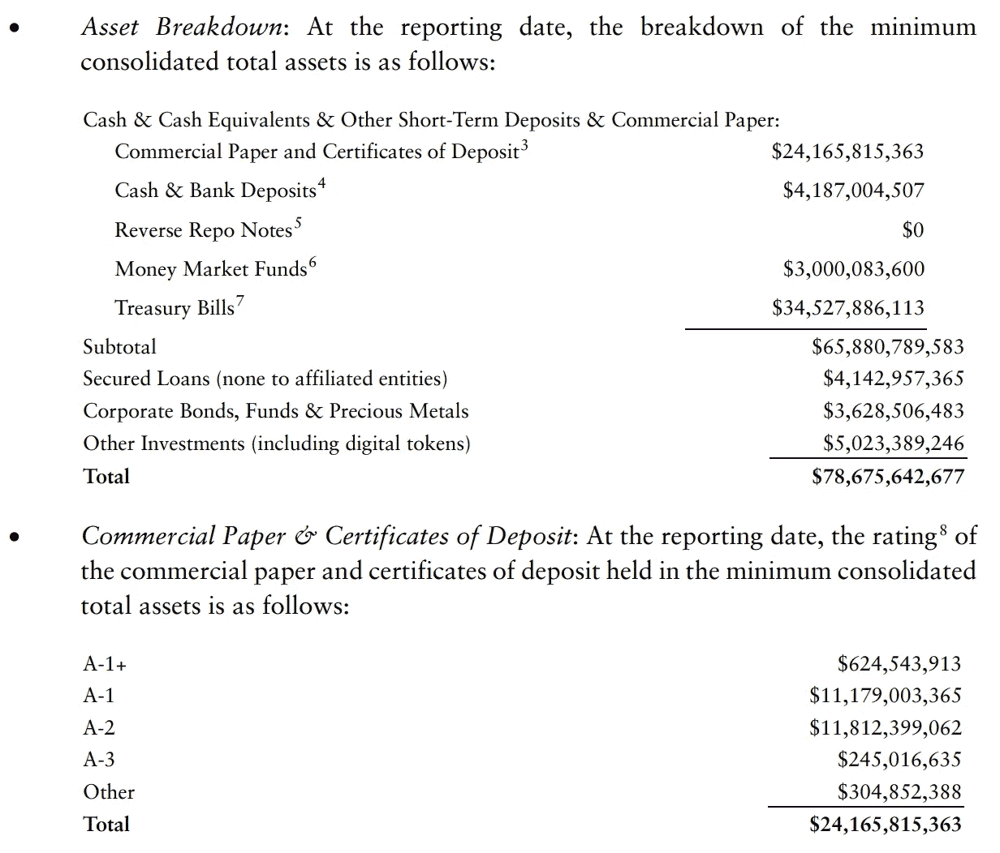

# 系绳——它能在下一次黑天鹅事件中幸存下来吗？

> 原文：<https://medium.com/coinmonks/tether-can-it-survive-the-next-black-swan-event-15ce59e0e257?source=collection_archive---------18----------------------->

我们能从过去的圣诞节幽灵中吸取什么教训吗？

Photo by [Sora Sagano](https://unsplash.com/@sorasagano?utm_source=medium&utm_medium=referral) on [Unsplash](https://unsplash.com?utm_source=medium&utm_medium=referral)

来自传统的金融背景，并且是在上一次金融危机期间开始职业生涯的人，你可以说我愤世嫉俗，但当我看到 Tether 的结构时，我不禁感到有点 p̶a̶n̶i̶c̶式的紧张！

这并不是说我反对创新或者害怕在这个过程中犯一些错误。正如爱迪生所说，“我没有失败，我只是找到了 2000 种不做灯泡的方法”。

我害怕不能从过去吸取教训；犯着我们以前犯过的同样的错误。是啊！我们以前来过这里。

## 过去圣诞节的幽灵

**Reserve Primary Fund (RPF)** 在金融危机爆发时，它是一只领先的货币市场基金(规模超过 600 亿美元)。从传统意义上来说，它的行为很像一种*稳定货币*—*—*投资者投入资金，并获得该基金的发行单位，这些单位以 1 单位= 1 美元的实物货币*挂钩*。任何收益都作为股息分配(在收益稳定的情况下，与*收益*相同。)

问题不在于盯住美元的想法。这很简单——例如，你在银行账户中的存款，从技术上讲不是实物货币，也是 1 美元的存款= 1 美元的实物货币。当你走到自动取款机前取钱时，你经常在这个挂钩上赎回你的存款。(在某种程度上，这种挂钩也得到 FDIC 保险公司的担保。)

从概念上讲，创建一个挂钩很简单。如果我从投资者那里收集了 10，000 美元的纸币，放在金库里，发行了 10，000 张数字代币，*将*固定为 1 张数字代币= 1 美元实物货币；任何时候投资者想要回他们的钱，我都可以兑现挂钩，从金库里取出代币，换成实物货币。

然而，泰瑟的情况并非如此，RPF 的情况也并非如此。风险来自于这样一个事实，即它们并不完全将投资者的资金作为货币存在金库或存款账户中。相反，他们将部分资金投资于市场——包括购买其他公司发行的商业票据。

在 RPF 的例子中，它持有 7.85 亿美元的雷曼兄弟债务，当雷曼兄弟破产时，这些债务变得一文不值，导致 RPF“跌破 1 美元”(从 1 美元到 0.97 美元)，其投资者急于赎回。由于无法满足激增的赎回要求，RPF 首先冻结赎回 7 天，但最终被迫清算。

## 圣诞礼物的幽灵

虽然 Tether 声称“所有 Tether 代币(USD₮)都与相应的法定货币 1 比 1 挂钩，并由 Tether 的储备 100%支持。”这也有类似的哲学基础，当你看到这些储备的构成时，这一点就变得很明显了。

虽然这些储备中约 50%是短期国库券、现金和银行存款(约 390 亿美元)，但其余约 50%是商业票据、CDs、贷款、公司债券等。这些都不是没有风险的。

(补充说明——与数字令牌相关的负债约为 785 亿美元，在这种情况下，还剩下约 2 亿美元作为缓冲或资本)

Tether’s [Assurance Opinion from Dec-31–2021](https://assets.ctfassets.net/vyse88cgwfbl/4hiNJsZ98LlZqCJHKzrLpV/2b6338482ef0093382885f80ba6f1083/Tether_Assurance-12-31-21.pdf)

尽管它们可能保证“有储备支持”，但保证赎回完全是另一回事。以下是他们服务条款的摘录:

> 如果由于 Tether 为支持系留凭证而持有的任何储备的流动性不足、不可用或损失而导致延迟赎回或提取系留凭证，则 Tether 保留延迟赎回或提取系留凭证的权利，并且 Tether 保留通过实物赎回储备中持有的证券和其他资产来赎回系留凭证的权利。— Tether 的[服务条款](https://tether.to/en/legal/)

## 圣诞未来的幽灵

我很难宣称知道 Tether 或其他加密资产的未来会如何。我要说的是，这种冒险并不是泰瑟独有的。

银行在客户存款方面承担了类似的风险，将它们投资于风险更高的资产。然而，通过 FDIC 保险和资本缓冲，银行确实提供了一个更强大的安全网。或许正是因为这种信任，它的客户才不会急于提取存款。

我只能说，在下一次黑天鹅事件暴露这些风险并导致普遍痛苦和失望之前，迫切需要带来透明度、意识和实施适当的监管框架。

与此同时，金融稳定委员会在其最近的报告[“加密资产对金融稳定的风险评估”](https://www.fsb.org/2022/02/assessment-of-risks-to-financial-stability-from-crypto-assets/)中对 Tether 做了如下评论:

> Tether(目前最大的稳定币发行商)报告称，其大部分储备为现金、等价物或短期存款，其余为贷款、公司债券和其他投资。据称，现金等价物部分主要由商业票据组成，但不清楚发行人是谁。重要的是，财务报告只是“证明”,而不是审计…
> 
> 大规模的赎回或对稳定货币储备资产的挤兑可能导致这些资产的贱卖，造成储备投资市场的混乱，如短期融资市场。

我给你留下以下杜兰·杜兰歌曲《来吧》( Come Undone)中的歌词:

> 啊，这需要一点时间
> 也许需要一点罪恶来弥补
> 现在我们将试着对外面的希望和恐惧视而不见
> 嘿，孩子，比风还要狂野，让我哭泣
> 
> 你需要谁？
> 你爱谁？
> 当你自取灭亡

如果您有任何问题或意见，请随时留言。

## 对于好奇的人，请参考:

*   [储备一级基金:跌破 1 美元，货币市场运行(thebalance.com)](https://www.thebalance.com/reserve-primary-fund-3305671)
*   【货币市场混乱:储备基金崩溃(investopedia.com)
*   [合法(系绳)](https://tether.to/en/legal/)
*   [参议院希望从系绳公司首席执行官| PYMNTS.com 那里得到答案](https://www.pymnts.com/cryptocurrency/2021/senate-wants-answers-from-tether-ceo/#:~:text=Tether%20is%20paying%20%2441%20million,backed%20by%20sufficient%20dollar%20reserves.)
*   [系绳争议，解释—边缘](https://www.theverge.com/22620464/tether-backing-cryptocurrency-stablecoin)

> 加入 Coinmonks [电报频道](https://t.me/coincodecap)和 [Youtube 频道](https://www.youtube.com/c/coinmonks/videos)了解加密交易和投资

# 另外，阅读

*   [block fi vs Celsius](/coinmonks/blockfi-vs-celsius-vs-hodlnaut-8a1cc8c26630)|[Hodlnaut 审核](/coinmonks/hodlnaut-review-best-way-to-hodl-is-to-earn-interest-on-your-bitcoin-6658a8c19edf) | [KuCoin 审核](https://coincodecap.com/kucoin-review)
*   [Bitsgap 审查](/coinmonks/bitsgap-review-a-crypto-trading-bot-that-makes-easy-money-a5d88a336df2) | [Quadency 审查](/coinmonks/quadency-review-a-crypto-trading-automation-platform-3068eaa374e1) | [Bitbns 审查](/coinmonks/bitbns-review-38256a07e161)
*   [加密复制交易平台](/coinmonks/top-10-crypto-copy-trading-platforms-for-beginners-d0c37c7d698c) | [Coinmama 评论](/coinmonks/coinmama-review-ace5641bde6e)
*   [印度加密交易所](/coinmonks/bitcoin-exchange-in-india-7f1fe79715c9) | [比特币储蓄账户](/coinmonks/bitcoin-savings-account-e65b13f92451)
*   [OKEx vs KuCoin](https://coincodecap.com/okex-kucoin) | [摄氏替代品](https://coincodecap.com/celsius-alternatives) | [如何购买 VeChain](https://coincodecap.com/buy-vechain)
*   [币安期货交易](https://coincodecap.com/binance-futures-trading)|[3 commas vs Mudrex vs eToro](https://coincodecap.com/mudrex-3commas-etoro)