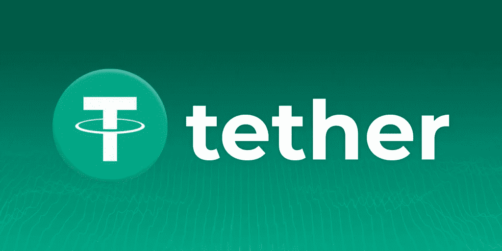

# 系绳寻求减少 USDT 商业票据支持

> 原文：<https://medium.com/coinmonks/tether-seeks-to-decrease-usdt-commercial-paper-backing-34b88117c43b?source=collection_archive---------77----------------------->

主要的稳定硬币公司 Tether 正在寻求最终摆脱其美国骨接地稳定硬币 Tether( USDT)的适销对路的纸支持。

Tether 周三发表了一份受制裁的声明，否认有关 Tether 的有价证券投资组合由中国或亚洲有价证券支持的 85%的报道，并以 30%的降价进行交易。

稳定硬币机构称类似的指控“完全错误”，重申超过 47%的 USDT 储备现在是“美国的金库”在 5 月份发布的最后一份保证意见中，Tether 报告称，截至 3 月 31 日，USDT 支持的有价证券不到 25%，总计约 210 亿美元。

Tether 之前还再次提到了 Celsius 借贷平台最近的极端情况，指出 Celsius 的头寸已经清算，Tether 没有任何损失。该机构表示:“Tether 目前对摄氏零度的敞口为零，这是从 Tether 在该公司的股权中进行的一笔小额投资中零星获得的。”。

泰瑟还认为，暗示泰瑟向加密冒险资本机构三箭资本提供贷款的报道也是“绝对错误的”。

关注我们了解更多故事[点击这里](http://t.me/etellworld)

> 加入 Coinmonks [电报频道](https://t.me/coincodecap)和 [Youtube 频道](https://www.youtube.com/c/coinmonks/videos)了解加密交易和投资

# 另外，阅读

*   [币安 vs FTX](https://coincodecap.com/binance-vs-ftx) | [最佳(SOL)索拉纳钱包](https://coincodecap.com/solana-wallets)
*   [比诺莫评论](https://coincodecap.com/binomo-review) | [斯多葛派 vs 3Commas vs TradeSanta](https://coincodecap.com/stoic-vs-3commas-vs-tradesanta)
*   [Capital.com 评论](https://coincodecap.com/capital-com-review) | [香港的加密借贷平台](https://coincodecap.com/crypto-lending-hong-kong)
*   [如何在 Uniswap 上交换加密？](https://coincodecap.com/swap-crypto-on-uniswap) | [A-Ads 评论](https://coincodecap.com/a-ads-review)
*   [WazirX vs coin dcx vs bit bns](/coinmonks/wazirx-vs-coindcx-vs-bitbns-149f4f19a2f1)|[block fi vs coin loan vs Nexo](/coinmonks/blockfi-vs-coinloan-vs-nexo-cb624635230d)
*   [本地比特币审核](/coinmonks/localbitcoins-review-6cc001c6ed56) | [加密货币储蓄账户](https://coincodecap.com/cryptocurrency-savings-accounts)