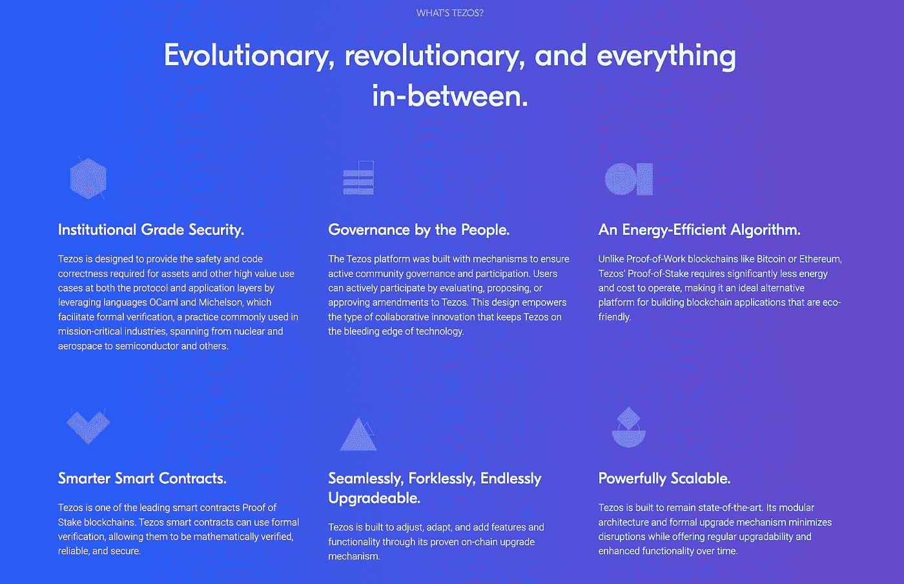
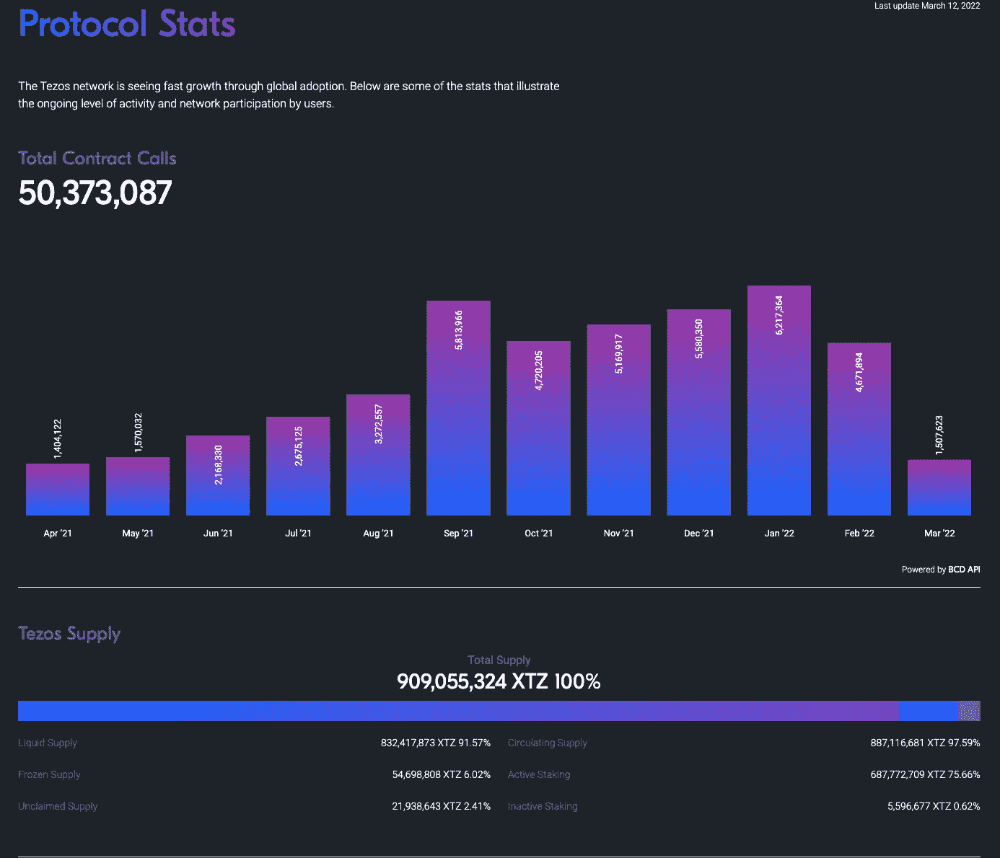

# 泰佐斯(XTZ)

> 原文：<https://medium.com/coinmonks/tezos-xtz-59b21b24df7f?source=collection_archive---------73----------------------->

***一种具有自修改、链上治理的加密分类账。***

随着越来越多的企业探索区块链的应用，区块链技术正迅速获得认可。创新者正在寻找使区块链技术的使用更加现实的方法，从在现有的区块链平台上开发应用程序到构建全新的区块链平台。让我们深入了解 Tezos。

## TEZOS 是什么？

Tezos 是一个基于智能合约的区块链网络，与以太坊没有太大的不同。然而，有一个显著的不同， **Tezos 寻求提供更先进的基础设施，这意味着它可以随着时间的推移而发展和改进，而没有硬分叉的风险。**这是比特币和以太坊从一开始就不得不处理的事情。拥有 XTZ 的人可以对 Tezos 开发者提出的协议改进想法进行投票。

Tezos 是一个开源的**流动股权证明(LPoS)** 区块链网络，它使用智能合约来实现使用其本地 XTZ 硬币(称为 Tezzie)的点对点(P2P)交易。Tezos 每秒能够处理多达 40 个事务(TPS)。这明显高于比特币和以太坊的 TPS，分别为 4.6 TPS 和 15 TPS。

Tezos 区块链还使得创建去中心化的应用程序(DApps)变得更加容易，被认为是以太坊的潜在竞争对手。 **Tezos 有史以来最大的 ICO，筹集了 2.32 亿美元，但在推出后面临严峻的挑战和延误。**

Tezos 是目前 50 大加密货币之一，截至 2022 年 3 月 11 日，其当前 XTZ 价格为 **$2.99 (288 印度卢比)**，市场规模超过 25 亿美元。

Tezos 于 2014 年由 Arthur Breitman 以“L.M. Goodman”的化名创立，目标是为当今大多数区块链平台面临的一个问题提供新的答案:协议开发。

# 让 TEZOS 独一无二

**自我修正协议(SAP)** —一种自我修正的加密分类账，旨在避免硬分叉并允许自动平台更新。

**链上治理** —令牌持有者可以参与区块链上的协议治理。选举周期为利益相关方提供了一种结构化的方法来就提议的协议修订达成一致。

**LIQUID PROOF stage CONSENSUS 机制** —一种基于链的 stage CONSENSUS 机制，俗称 Liquid PoS。面包师负责生产和批准面包块，并拿出一定比例的自有资金来鼓励诚实的行为。

**迈克尔逊** **语言** —一种低级的、基于堆栈的编程语言，旨在协助 Tezos 网络上智能合约的正式验证。

**液态股权凭证(LPOS)**

Tezos 使用利益相关者共识机制来最大化治理去中心化，并鼓励不同规模的 XTZ 持有者参与进来。LPoS 保留了一个动态的验证器集合，它随着网络的发展而增长，并允许利益相关者将权利分配给其他持有者。名称**Liquid Proof stage**是为了将 Tezos 的方法与 EOS 或 NEO 等委托股权证明(DPoS)链区分开来而创造的。**区块链 DPoS 在一组活跃的砌块生产商之间平均分配砌块生产权，而 LPoS 根据每个验证者持有的股份比例分配砌块生产的概率，对系统中的面包师数量没有限制**

# TEZOS 的自我修正模型:它是如何工作的？

XTZ 平台的主干由三个主要协议组成。

它们如下:

## 网络协议

网络协议旨在确定数据块并通过链分发它们。它基本上连接了“八卦”网络和整个协议。网络协议涵盖了节点确保网络完整性所需的一切，例如下载区块链的状态、连接用户以及向网络广播完成的块。

## 交易协议

事务协议控制事务的有效性。它跟踪所有区块链信息，特别是与支持对等交互交易和区块链活动相关的信息。

## 共识协议

由于《共识议定书》,该平台能够就区块链的状况达成共识。这也是 DPoS 模式的切入点。根据本协议，任何区块链更新、添加或升级都必须由平台的利益相关方投票决定。

平台的网络外壳是连接这些协议的纽带。此外，网络外壳指的是“区块链协议”，它结合了事务和共识协议。

区块链协议的形成也是所有网络改进和升级的结果。为了支持平台的“自我修正”能力，利益相关者贡献给链的块(可能包含交易信息或协议改进)被授权影响整个网络。

从技术上来说，用于创建 Tezos 的编码语言是 OCaml(一种专注于表达性和安全性的通用工业级编程语言),它是速度至关重要的企业的首选技术，一个错误可能会造成数百万美元的损失。)能够检测链上的三个主要部分:块、协议和事务。任何用 **OCaml** 编写并在链上实现的模块都能够更新链的整体状态。

尽管事实上**迈克尔逊**是为 Tezos 开发的特定领域智能合约语言，但 SmartPy 和 LIGO 是构建 Tezos 智能合约最受欢迎和广泛支持的语言。

## 监管者 VS TEZOS

Tezos 因其(当时)破纪录的首次公开募股，筹集了高达 2 . 32 亿美元的资金，惹怒了投资者和监管者。

**美国证券交易委员会(SEC)认为 Tezos 的 ICO 是非法证券发行**(Ripple 将在 2021 年面临同样的指控)，并对该项目展开调查，以进行可能的监管起诉。

然而，律师事务所 Block & Leviton 在 2020 年提起的集体诉讼导致与 Tezos 达成 2500 万美元的和解，这可能暂时满足了 SEC 的要求。

## 泰佐斯河畔的 DAPPS

该协议还允许部署执行特定平台功能的分散式应用程序(DApps)。这些应用程序是独立的，这意味着它们**不需要任何第三方授权或干预来执行它们的活动。**本质上，DApps 扩展了 Tezos 网络的用例。

**CricTez** ，一个不可替代的基于令牌的(NFT)板球梦幻体育 dapp。Kalamint，一个社区管理的 NFT 市场；稳定，美元支持的稳定币；Wrap Platform、Ethereum 和 Tezos 桥以及许多其他平台都属于 Tezos 协议的 DApps。

## XTZ 及其象征经济学

Tezos 的本地实用令牌和加密货币是 **XTZ 令牌**。它可以作为一种交易手段，也可以参与平台的链上治理运营。

这里需要注意的是治理概念，它是由令牌持有者运行的。开发人员产生的必须在链上实现的其他每个升级都要经过利益相关者的投票。如果他们的升级或变更想法被接受，开发者会得到 **XTZ** 。

【2017 年 7 月，Tezos 通过首次公开募股在 BTC 和 ETH 筹集了 2.32 亿美元，成为业内最大的 ico 之一。**创世纪区块 2018 年 6 月开始，6.08 亿 XTZ 进入流通**；目前没有供应上限。 **Tezos 有一分钟的封锁期，当前年通货膨胀率为 3.6%**，这适用于 Carthage 2.0 升级。XTZ 此前的通胀率为 5.5%。**典型的交易费用为 0.00232 美元**。目前供应量的近 80%已经押下，目前流通供应量 **887，018，645.48 XTZ** (截至 2022 年 3 月)。

# 想包一些 TEZOS (XTZ)

使用印度最安全的加密交换# COINDCX。

 [## CoinDCX -加密交易所|购买、出售和交易比特币和顶级替代币

### CoinDCX 是印度最大、最安全的加密货币交易所，在这里你可以买卖比特币和其他…

coindcx.com](https://coindcx.com/) 

# 加入我们的社区

## WHATSAPP

 [## ⚡BLOCKENTHU⚡

### WhatsApp 群邀请

chat.whatsapp.com](https://chat.whatsapp.com/FTKme4XzkOU73ZDv99Oatj) 

## 电报

 [## ⚡·布洛克登胡·⚡

### 可以马上查看并加入@blockenthu。

t.me](https://t.me/blockenthu) 

## INSTAGRAM

[https://www.instagram.com/p/CZ2jDo6h_2b/?UTM _ source = ig _ web _ copy _ link](https://www.instagram.com/p/CZ2jDo6h_2b/?utm_source=ig_web_copy_link)

## 商务化人际关系网

 [## Blockenthu | LinkedIn

### blockenthu | LinkedIn 上有 210 名粉丝。“面向大众的 Web 3.0 福利”加密和区块链| BlockEnthu 是社区…

www.linkedin.com](https://www.linkedin.com/company/blockenthu/) 

# BLOCKENTHU #硬币