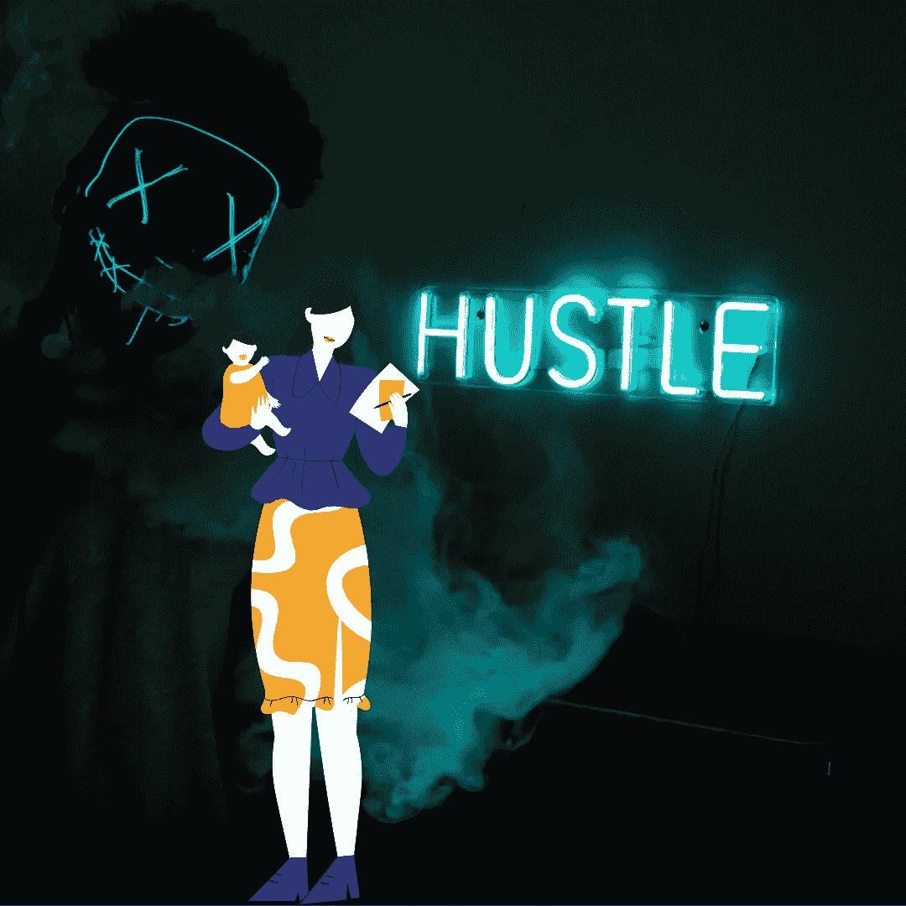

# 感谢你是昨天的被动投资者，你是今天的推动者

> 原文：<https://medium.com/coinmonks/thanks-for-being-yesterdays-passive-investor-you-re-today-s-hustle-11e0915bc492?source=collection_archive---------23----------------------->

## 稳扎稳打。耐心点，坚持住。当你的钱被从口袋里掏出来的时候，你会说这些话。

Source: Self Created Image with [Canva](http://www.canva.com).

**常识讲座**

是真的。真的是。那些拿着东西从来不卖的人最终会第一个到达终点。最后的…