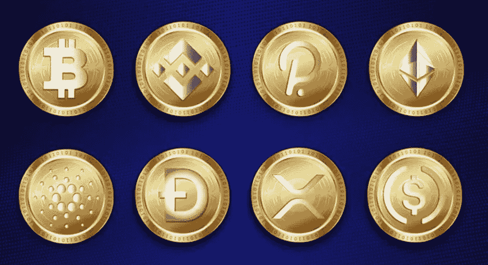

# 当你意识到计划中的伟大重置是基于加密和区块链的那一刻

> 原文：<https://medium.com/coinmonks/that-a-ha-moment-where-you-realize-the-end-game-is-based-on-crypto-and-blockchain-750aa380db82?source=collection_archive---------18----------------------->

我记得在 2015 年买了我的第一个比特币。我花了大约 300 美元买了它，24 小时后以 380 美元卖掉了它。我心想这是多么明智的一步..24 小时内赚了 80 美元。当时比特币似乎只是一个庞氏骗局，一些没有附加值的虚拟货币，人们可以像在赌场玩轮盘游戏一样快速赚钱。

