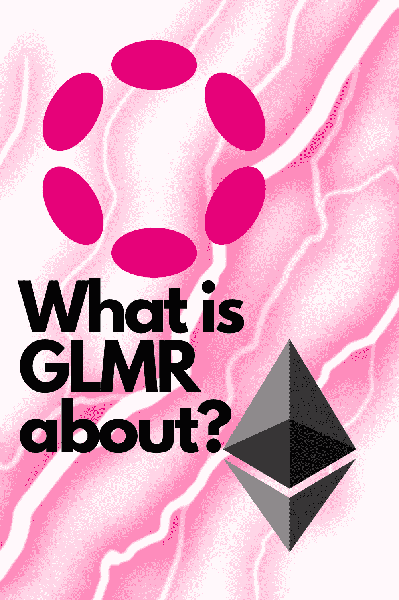
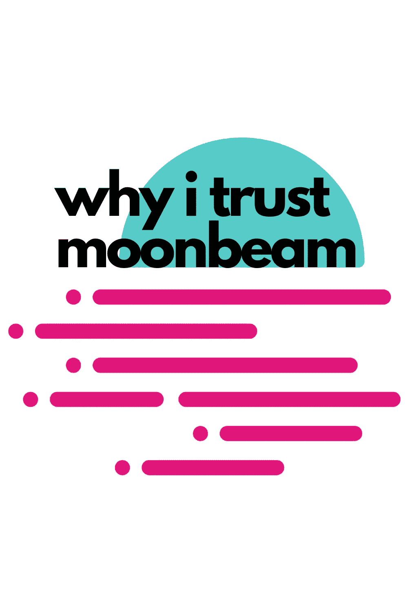

# 这就是我信任 Moonbeam (GLMR)的原因

> 原文：<https://medium.com/coinmonks/thats-why-i-trust-moonbeam-glmr-7eb8115e484e?source=collection_archive---------17----------------------->

# 介绍

Moonbeam 就像以太坊和波尔卡多特之间的桥梁，在波尔卡多特网络上提供智能合约平台的好处。Moonbeam 充分利用了这两种网络的优点，提供了强大的互操作性、可升级性和开发人员友好性。Moonbeam 旨在通过尽可能简化的方式，帮助项目将他们现有的应用程序、工具和社区从以太坊带到波尔卡多特。你可以用高达 360%的 APY 来赌月光！

# 月光就像以太坊和波尔卡多特之间的桥梁

月光是以太坊和波尔卡多特之间的桥梁。

Moonbeam 帮助您创建两个区块链之间的无缝转换，因此您可以在两个环境中无缝地使用您的令牌。

# Moonbeam 是波尔卡多特网络上的智能合约平台

Moonbeam 是一个基于 Polkadot 网络构建的智能合约平台。这意味着它是以太坊和 Polkadot 之间的桥梁，允许用户跨两个网络部署他们的智能合约。

Moonbeam 帮助您创建区块链支持的应用程序，这些应用程序像传统网站或网络应用程序一样工作，但托管在区块链上，而不是服务器上。

# Moonbeam 利用这两种网络的优势来提供

Moonbeam 是 Polkadot 网络上的一个智能合约平台，基于奇偶校验基板。Moonbeam 旨在帮助项目将他们现有的应用程序、工具和社区从以太坊带到波尔卡多特。

由于 Moonbeam 的模块化性质，有几个不同的组件可以独立使用或一起使用:

block explorer 允许用户在任何运行 Solidity contracts 的链上实时查看有关 block、transactions 和 accounts 的信息。它还允许您通过查看您的交易经过的所有链的当前气体限制使用量，来检查您的交易将被挖掘的时间(即，它将被包括在哪个块高度中)。

# Moonbeam 旨在帮助项目将他们现有的应用程序、工具和社区从以太坊带到波尔卡多特。

Moonbeam 旨在帮助项目将他们现有的应用程序、工具和社区从以太坊带到波尔卡多特。Moonbeam 是一个智能合约平台，可以与任何共识算法一起工作，允许您轻松地将您的应用程序与任何区块链集成。

Polkadot 是一个多链框架，允许用户将不同的区块链连接在一起，以提高可伸缩性和安全性。除了链之间的互操作性之外，Polkadot 将允许通过 Polkadot 的中继链连接的链网络内的跨链通信和交易。

# 你可以用高达 360%的 APY 来赌月光

你可以把你的月光押在网络上，赚取利息。该网络支付高达 360%的年利率为赌注月光和贷款(贷款+利息)。这是一个从你的投资中赚取被动收入的绝佳机会。

# 月光艰难前行

Moonbeam 是 Polkadot 网络上的一个智能合约平台。Moonbeam 充分利用了这两种网络的优势，为开发者和用户提供了一个无缝的环境。我们的主要目标之一是帮助项目将他们现有的应用程序、工具和社区从以太坊带到 Polkadot。

我们相信，通过围绕 Moonbeam 开发一个社区，我们可以让人们更容易在它的基础上开发应用程序。越多的人以某种方式使用 Moonbeam 或与之互动(即使他们只是跟着做)，就会形成一个积极的反馈循环，帮助每个人比单独行动更快地增长技能。

# 结论

Moonbeam 是一个完整的项目，它将以太坊智能合约带到了波尔卡多特。Moonbeam 允许以太坊生态系统中的项目构建他们的应用程序并将其部署到 Polkadot 网络中。这意味着所有那些建立在以太坊上的 DApps 也将对 Moonbeam 用户开放！

我能在哪里购买一些？检查:[我为什么使用 OKX](/@diego.schmocker/this-is-why-i-use-okx-b6593d2f725f) 或许多其他网站。

同样值得一读:[凯伯网络水晶 V2](/coinmonks/this-is-why-i-believe-in-kyber-network-crystal-v2-knc-f1160fe1b09f) (KNC)

> 加入 Coinmonks [电报频道](https://t.me/coincodecap)和 [Youtube 频道](https://www.youtube.com/c/coinmonks/videos)了解加密交易和投资

# 另外，阅读

*   [AscendEx Staking](https://coincodecap.com/ascendex-staking)|[Bot Ocean Review](https://coincodecap.com/bot-ocean-review)|[最佳比特币钱包](https://coincodecap.com/bitcoin-wallets-india)
*   [Bitget 回顾](https://coincodecap.com/bitget-review)|[Gemini vs block fi](https://coincodecap.com/gemini-vs-blockfi)|[OKEx 期货交易](https://coincodecap.com/okex-futures-trading)
*   [美国最佳加密交易机器人](https://coincodecap.com/crypto-trading-bots-in-the-us) | [经常性评论](https://coincodecap.com/changelly-review)
*   [在印度利用加密套利赚取被动收入](https://coincodecap.com/crypto-arbitrage-in-india)
*   [霍比评论](https://coincodecap.com/huobi-review) | [OKEx 保证金交易](https://coincodecap.com/okex-margin-trading) | [期货交易](https://coincodecap.com/futures-trading)
*   [麻雀交换评论](https://coincodecap.com/sparrow-exchange-review) | [纳什交换评论](https://coincodecap.com/nash-exchange-review)