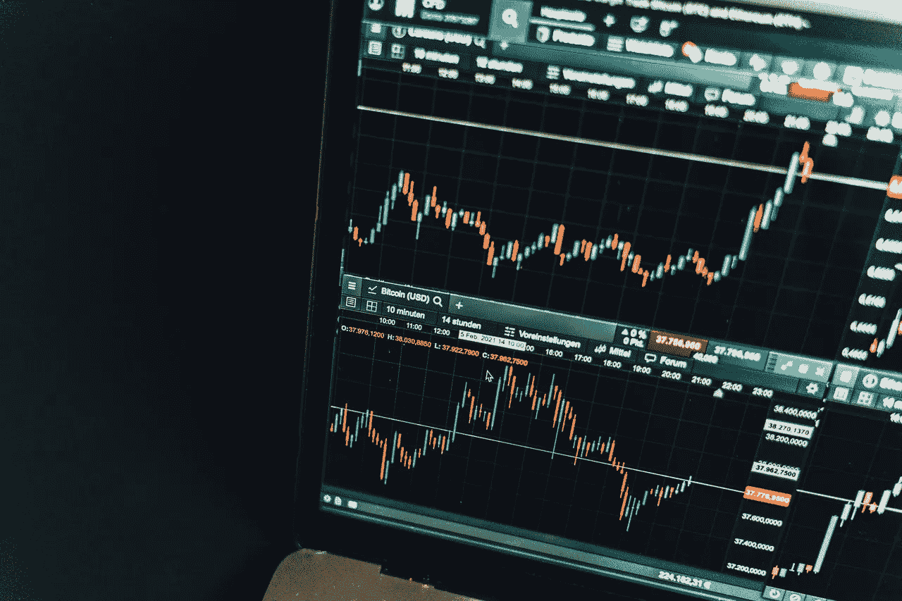
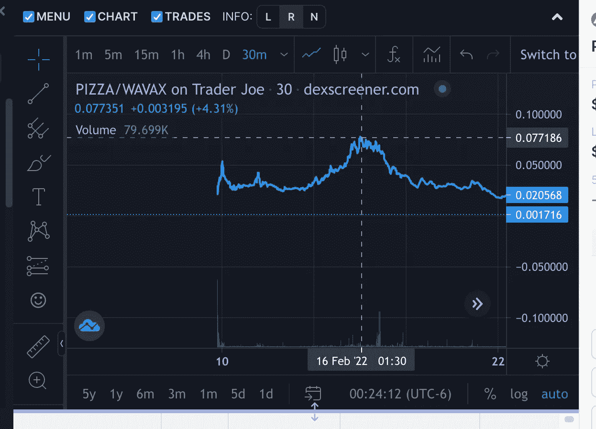
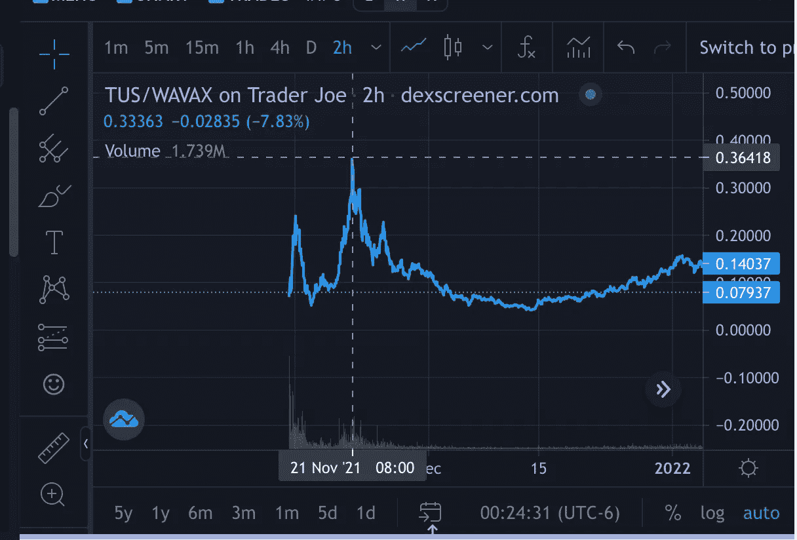
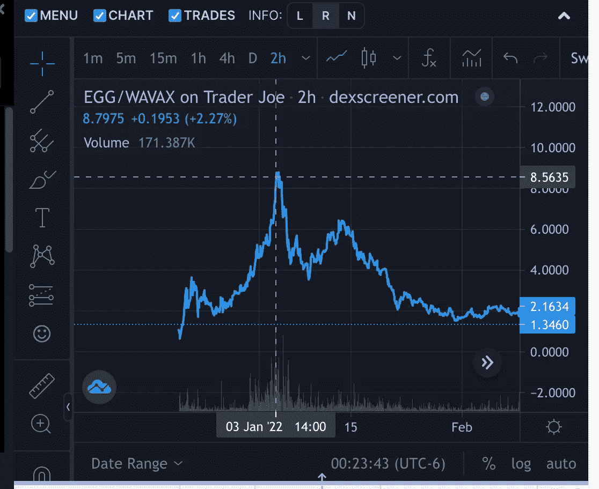
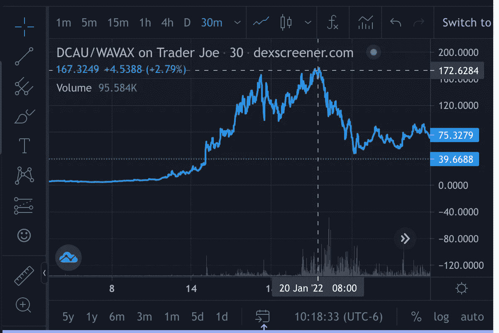

# 一周泵理论以及如何用它来赚钱

> 原文：<https://medium.com/coinmonks/the-1-week-pump-theory-and-how-to-use-it-to-make-money-in-crypto-a743b54b00f4?source=collection_archive---------50----------------------->

我是这样在加密游戏中赚钱的。我遵循这个理论:

> 最受欢迎的先玩后赚项目在代币发行后一周左右表现强劲，然后趋于平稳。

听起来简单吗？确实是。但是这里有一些警告:

*   该项目必须在雪崩区块链。
*   硬币必须有无限或大量的代币供应。
*   这场比赛一定有很多宣传。

# 这里有一些证据…

请看这些图表作为证据。以下是 Avalanche 上一些最受欢迎的游戏:

[$PIZZA](https://twitter.com/search?q=%24PIZZA&src=cashtag_click) 币换[@ PIZZA togame](https://twitter.com/PizzadotGame)。2 月 9 日推出，一周后的 2 月 16 日达到峰值价格约 0.08 美元。

现在是 0.001 美元

👇👇👇👇

[$TUS](https://twitter.com/search?q=%24TUS&src=cashtag_click) 币给 [@PlayCrabada](https://twitter.com/PlayCrabada) 。11 月 13 日推出，8 天后 11 月 21 日达到~ 0.35 美元**的峰值。**

现在大约是 0.08 美元。

👇👇👇👇

[$蛋](https://twitter.com/search?q=%24EGG&src=cashtag_click)币给 [@chikn_nft](https://twitter.com/chikn_nft) 。12 月 19 日上线。**在 1 周后的 12 月 26 日**开始加仓，在 1 月 3 日达到 8.80 美元的峰值。

现在是 1.33 美元。

👇👇👇👇

给 [@minerjoe](https://twitter.com/minerjoe) 的$金币硬币。1 月 21 日上线。9 天后的 1 月 30 日达到 9.5 美元左右的高点。

现在是 0.42 美元。

👇👇👇👇

# 我如何利用这些信息赚钱？

不要误会我的意思:所有这些项目在高峰期过后都有大量利润。但这一周的泵是一个巨大的机会，巩固，等待，然后攻击。

例如:

我正在参加 3 月 11 日雪崩万众期待游戏的造币活动: [@HoppersGame](https://twitter.com/HoppersGame) 。

以下是我基于一周泵理论的游戏计划:

*   我将铸造 5 个 NFT。
*   将所有$FLY 收入(游戏的原生代币)再投资 1 周。
*   我会在一周加油站卖掉所有的飞人和我的非卖品。
*   然后，在不可避免的回调之后，我会寻找一个新的进场点，这一次是从我的利润中获得更多的 NFT。

下周我会告诉你进展如何…

***

想要独家访问我的每周加密观察列表，在那里我告诉你我在未来几周投资的项目？

[注册我的时事通讯](https://sendfox.com/lp/1x9d5n)并在雪崩区块链上从玩到赚游戏中赚取$$。

感谢阅读！

格雷格“密码小子”拉森