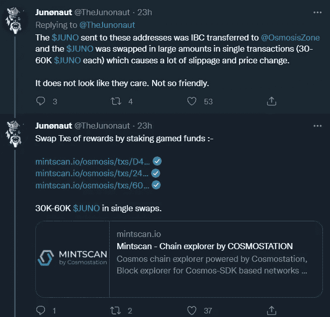

# 价值 1 亿美元的密码盗窃案和试图夺回它的社区

> 原文：<https://medium.com/coinmonks/the-100-million-crypto-heist-and-the-community-trying-to-take-it-back-3a30203f749c?source=collection_archive---------9----------------------->

Juno Symbol

**免责声明:让我以披露我拥有 Juno 加密货币开始这篇文章，这篇文章不是购买或出售 Juno 令牌的金融建议。**

^^^A picture of you after reading this blog. You’ve been warned.

在 crypto 工作一天是不是太过分了？

**朱诺是什么？**

对于我的非加密朋友来说，为了这篇博客，了解 Juno 的物理功能并不重要。它是宇宙生态系统中一个可互操作的智能合约平台。如果这听起来令人困惑，那就把 Juno 想象成一家科技初创公司。自 2021 年 10 月 1 日创立 genesis mint 以来，Juno 在过去几个月中的加密货币排名大幅上升，目前排名第 61 位。加密史上最大的争论之一正在发生，它都围绕着 Juno。Juno 从第一天开始就试图以社区为中心为自己的项目感到自豪，但一次有争议的空投导致了社区分裂。让我们深入探索秘密街道。

**朱诺空投解释**

对于阅读本文的朋友来说，他们可能不知道空投是什么，这是加密货币项目用来帮助启动项目的一种方法。他们背后的想法是，该项目给你他们项目的令牌，希望他们能把你转化为他们产品的用户。为了这篇文章，只知道是免费的钱。为了接收空投，项目将列出某些标准，以便您接收免费令牌。对于 Juno，空投标准是您在 Cosmos Hub 上下注的每 1 个 Atom 令牌，您将获得 1 个 Juno 令牌，比例为 1:1。如果你押 50 个原子，你会得到 50 个朱诺，如果你押 5000 个原子，你会得到 5000 个朱诺。

在 2021 年 7 月 25 日公布的 Juno 空投标准的公开大纲中，Juno 明确表示，允许钱包最多空投 50，000 个 Juno，这意味着如果你下注 60，000 个 Atom，你只能收到 50，000 个 Juno，而不是 60，000 个。此外，快照意味着你的钱包必须满足标准的截止日期是 2021 年 2 月 18 日。如果你想一想，这个时间表应该使某人不可能提前准备空投，因为你直到快照日期后 4 个月才知道空投(我们稍后将进入这一点)。就我个人而言，在 2 月 18 日之前，我有 0 个原子被标桩，所以我没有资格进行空投。空投的问题是，如果你有资金，你可以创造尽可能多的不同钱包，并使它们符合空投条件，正如这条鲸鱼所做的那样。

现在，在这个博客的下一部分，请和我一起拿起你们的锡纸帽。

我是认真的。如果你没有锡纸帽，去你的厨房做一顶。博客可以等等…明白了吗？好，我们继续。

**鲸鱼**

Juno 社区的持续问题源于 1 只 Juno whale。对于我不熟悉密码俚语的朋友来说，鲸鱼是指处于财富链顶端的人，拥有的财富比其他人多得多，比如超级富豪。此人或实体操纵了空投，以实现收益最大化，并拥有过多的 Juno 项目(一些人认为这不是操纵，而是利用了一个漏洞)。让我们看看这条鲸鱼是如何操纵系统并利用 Juno 空投的步骤。

第一步:在 2 月 18 日拍摄快照时，ATOM 令牌的价格约为 20 美元，在拍摄快照前的几周和几个月甚至便宜到 3 美元。这只朱诺鲸在空投之前设置了 50 个原子地址，并在每个钱包中装载了超过 5 万个原子，这意味着朱诺鲸拥有大约 250 万个原子。每个原子的最高价格为 20 美元，让我们假设鲸鱼最多花了 5000 万美元，即使合理的假设是它们花了少得多的钱来积累所有的原子。

第二步:2021 年 10 月 1 日，空投发生了，每个人都很激动，他们收到了一些价值可观的重要代币。此时，每个人都在庆祝一次看似成功的空投。然后，每个人都看到 49 个地址将其所有 50k Juno 令牌发送到 1 个单一地址。可以想象，人们开始想知道发生了什么。此外，Juno 的转让直到 Juno 在 Osmosis 上上市后才开始发生。为了尽可能简化这一过程，渗透是一个独立的区块链，Juno 可以在其中与其他令牌交换。通过混合渗透和 Juno，Juno 网络无法再重启区块链，也无法按照新规则重新空投。这是因为朱诺现在与渗透交织在一起。转账的时间非常可疑。

第三步:2021 年 10 月 12 日，一名 Juno 社区成员提议进行投票，收回鲸鱼约 90%的资金。它获得了 7%的支持，56%的人投票反对收回资金的想法。收回资金是一个滑坡，这并不奇怪的想法被拒绝，缺乏信息。社区基本上说让我们先看看鲸鱼的行动。

第四步:意识到他们正在承受压力，whale 地址据称联系了 Juno 团队。

这是我喜欢称之为“哦，狗屎”的时刻。一条鲸鱼现在可以控制网络，我们应该相信他们的话，一切都很冷？我的屁股！首先，50k 上限是为了创建一个 Juno 社区，它不会将权力授予任何个人，不用说，这不是它的工作方式。此外，如果你像我一样，你一定会好奇这个人/实体是如何在空投前 4 个月知道将其 250 万个原子分成 50 个不同的钱包的？(请系紧你的锡纸帽下巴颏带)我不想做假设，但这给人一种感觉，这个人有一些内幕消息。为什么不用 100k 原子设置钱包 25 钱包？为什么不做 10 个各有 25 万个原子的钱包呢？这条鲸鱼将钱包分割成最大限度空投朱诺的大小。

我需要一支烟，但我不抽烟

现在有人可能会说，这头鲸鱼真的是一个实体，自然会为它所代表的每个客户准备好钱包。但这就是我不相信的原因。如果您要将 Atom 分散到 50 个钱包中，为什么要将所有 Juno 整合到一个钱包中，而不是留在 50 个钱包中？如果您将 50k Juno 放在每个钱包中，这 50 个钱包中的每一个都将有资格获得自己的未来空投。如果您想证明在 1 个钱包中管理 Juno 更容易，那么您何时会将您的 Atom 令牌分散到 50 个钱包中，而不是 1 个？这些行为非常可疑。更不用说，所有这些都是基于这是一只真正的基金的假设。

快速回顾一下:1 Juno Whale 拥有 250 万台 Juno，当时空投的目标是将 Juno 收到的最大数量限制为 5 万台 Juno。社区投票决定观望，让鲸鱼证明自己是友好的。

第五步:“地狱没有像有收据的女人那样的愤怒”——亚里士多德。区块链科技的伟大之处在于每一笔交易都被公开记录。如果你投入工作，就很容易找到线索。首先，这是鲸鱼的朱诺钱包的图片。

这个钱包现在包含 310 万个 Juno，当前 Juno 价格为 40 美元。Juno 的价值现在是 1.25 亿美元。朱诺是怎么从 250 万涨到 310 万的？很棒的问题！嗯，有了 Juno，当您下注您的硬币(锁定它们以保持 Juno 网络安全)时，您将获得 Juno 奖励。就当是领了利息。这个地址每天都有数千枚代币入账。上图右下角“赌注奖励”旁边写着 11248。这表示从大约 1–2 天的利息支付中收集的 Juno 令牌数量。大约每隔一天，该钱包就会取走该数量的 Juno，并将其换成其他令牌。在@TheJunonaut 的一篇[必读](https://typefully.com/TheJunonaut/jCONZeX) Twitter 帖子中，他们强调了鲸鱼的交易。如果你不熟悉区块链交易，你可以直接跳到 TL: DR

以下是交易链接:

[https://www . mints can . io/Juno/account/Juno 1 q 5 nxetqdu 05 qnyphwx 0 z wm8 ea eghgj 92 ta 2 dw](https://www.mintscan.io/juno/account/juno1q5nxetqdu05qnyphwx0zwm8ea2eghgj92ta2dw)[https://www . mints can . io/Juno/account/Juno 16 nwhaecstfuqyczc2 mwv 346 ly 2 VR 0 nktrxkskl](https://www.mintscan.io/juno/account/juno16nwhaecstfuqyczc2mwv346ly2vr0nktrxkskl)[https://www . mints can . io/Juno/account/Juno 17 uryv6 yrtt 6 r 76 Qt 8](https://www.mintscan.io/juno/account/juno17uryv6yrtt6r76qt8fa4zhak3hw8wjyxxl8qqh)

通过下注游戏资金来交换奖励交易:

[https://www . mints can . io/osmosis/txs/d4d 395 b 8 a 11 f 441 f1 a 8535d 27 f 4 e 20 FD 7 f 4b 4844 Bab 5299867 e 20 e 8d 576d 23 a 5](https://www.mintscan.io/osmosis/txs/D4D395B8A11F441F1A8535D27F4E20FD7F7B4844BAB5299867E20E8D576D23A5)https://www . mints can . io/osmosis/txs/247 ea 70 CAD 42 ab 350 c 520 e 4024 f 6b 058 fa 52 CB 4847288

30K-60K [$JUNO](https://twitter.com/search?q=%24JUNO) 单笔掉期。

然后，他们不再进行掉期交易，而是直接出售:

[https://www . mints can . io/Juno/txs/2 ad 6 BC 0 e 955 f 743 e 61 C5 a 06 f 4942 fbf 6 c 240d 61 CCE 03d 49 feb 46d 7648 deb 1 fa 5](https://www.mintscan.io/juno/txs/2AD6BC0E955F743E61C5A06F4942FBF6C240D61CCE03D49FEB46D7648DEB1FA5)[https://www . mints can . io/Juno/txs/5286351 CCF 46d 6 ECE 5 cdd 4747244444468412155 c 17 a 452 beadf 6](https://www.mintscan.io/juno/txs/5286351CCF46D6ECE5CDD4747244468412155C17A452BEADF6BBD5D3E0C5440D)

鲸鱼解锁了 279k 的朱诺代币，看到大家还在看，就卖掉了 20k 的朱诺，然后再次锁定 259k 的朱诺赚取利息。

TL:博士，鲸鱼正在倾倒一堆朱诺。

这条鲸鱼不友好

去吧。如果你愿意，把锡纸帽扔到房间的另一边。很抱歉我现在让你接触到了黑暗的加密世界，也让你变成了一个疯子。我厌倦了孤独，需要带你们去精神病院陪我。对不起

**什么是 16 号道具？**

因此，既然鲸鱼已经明确表示它们不友好，Juno 开发团队就提出了一个新的提议。

社区决定给鲸鱼一个机会，反过来，他们试图偷偷溜过我们，希望没有人会注意到。他们利用这几个月的自由，随时兑现，赚了一大笔钱。所以现在他们让社区别无选择，只能提出捕杀鲸鱼的提议。介绍 16 号提案:

随着鲸鱼锁定资金，16 号提案允许社区在鲸鱼无能为力的情况下采取行动。在 Juno 网络上，资金被锁定 28 天。这个提议有可能解除鲸鱼的所有游戏朱诺(仍然有 50k 朱诺)而鲸鱼对此无能为力。这个支柱无疑是一个滑坡。这次投票让社区有能力收回价值约 1 亿美元的数百万台 Juno。虽然 1 亿美元似乎有些苛刻，但不要忘记，通过出售鲸鱼，他们已经锁定了数千万美元的利润和其他无法收回的令牌。

Twitter 目前正在讨论是投赞成票还是反对票。无论结果如何，投票结果都将改变加密生态系统的发展。一方认为鲸鱼是操纵系统的罪犯，并可能利用内部信息为空投做准备。另一方认为，朱诺负责建立空投的规则，允许这样的事情发生。这些人也不介意朱诺鲸向他们倾倒(有些人喜欢这样，我有什么资格评判呢？).16 号提案还有 4 天就要上线了，这次投票将成为 web3 历史上最大的投票之一。我的头开始疼了，所以我就在这里结束这个故事。放下锡纸帽，喝一杯，我们过几天再聚。请继续关注第 2 部分，在第 16 号提案最终确定后，我会给出我对整个传奇的想法，我们将分解这种情况的后果。

你觉得 16 号提案和朱诺鲸怎么样？留下评论，让我们一起讨论。

对于被我这篇文章玷污的每一个人，我在这里支持你们。

***insta gram*T3:【https://www.instagram.com/warren_feldman/】T4**

***碎碎念:***[https://twitter.com/WarrenFeldman3](https://twitter.com/WarrenFeldman3)