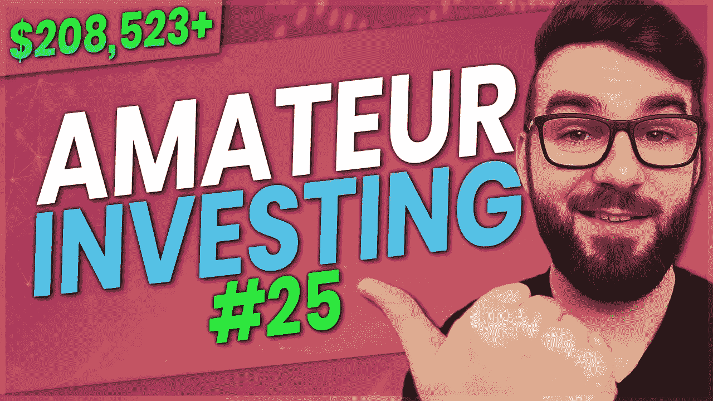

# 第二次崩盘——业余投资#25

> 原文：<https://medium.com/coinmonks/the-2nd-crash-amateur-investing-25-f1bb35129f8?source=collection_archive---------54----------------------->

是时候更新我的投资组合和我的被动收入之旅了。在这一集里，我将分享我每月定期更新的投资内容和原因。这是最好的业余投资！

[https://peakd.com/hive-167922/@scottcbusiness/tpceitgw](https://peakd.com/hive-167922/@scottcbusiness/tpceitgw)

【https://odysee.com/investing-report-25 号

[https://rumble . com/v16x 1 ex-the-2nd-crash-业余-投资-25.html](https://rumble.com/v16x1ex-the-2nd-crash-amateur-investing-25.html)

****免责声明:这不是理财建议，纯属娱乐目的。我所有的股票信息都是 100%准确的，但我的加密数据可能是也可能不是模拟的****

我分享一切，所以你可以 100%透明地跟踪我做的一切。做这一切的目的是向你展示这是可能的，并提供某种可以遵循的框架。这不是财务建议，你不应该完全复制我的投资。你应该做的是找出最适合你的方法，坚持平均成本原则，投资优质资产，避免负债，复利，节俭，低买高卖。

**投资电子表格模板链接:**[https://bit.ly/investingtemplate](https://bit.ly/investingtemplate)

**收入跟踪电子表格模板链接:**[https://bit.ly/incometemplate](https://bit.ly/incometemplate)

**预算电子表格模板链接:**[https://bit.ly/expensestemplate](https://bit.ly/expensestemplate)

**下面我将为月报列出一切:**

我在几只加拿大 ETF(即 VDY、FCCD 和 XEI)的新股票投资平均上涨了约 3.47%，表现不错。我卖完 PDC 放入 VDY。

我平均每月从股票分红、加密收入和一些音乐版税中获得 219.47 美元的被动收入。我的目标是回到我之前的 250 美元左右，作为我的下一个里程碑。今年，我希望获得高达 400 美元的加密被动收入，因为加密回报达到了历史最高水平。

我的投资组合大致分为 73%的密码、6%的股票、3%的贵金属和 18%的流动现金。我每年被动收入预计为 2633.61 美元。其中 426.05 美元的年利润来自股票股息，约 2204.73 美元来自加密货币赌注。我的注意力和最近一样。

在我最近一次更新中，我的投资组合总价值是 320，579 加元。我目前的投资组合价值是 208，523 美元。这比上个月 4 月 1 日的总价值上涨了约 112，056 美元。我有史以来最高的投资组合价值约为 395，000 美元，比我现在的价值高出约 47%。虽然我遭受了巨大的打击，几乎跌了一半，但我仍然对事情的发展充满信心，我以前也经历过这些周期。我主要是感激我能够在不到 3 年的时间里积累超过 20 万美元的财富，这本身就是一个壮举。

我从股票分红中赚了 18.24 加元，从 crypto real estate 赚了 0 加元，从 ATOM 和 HBD 的两个月赌注中赚了 157.31 加元。总的来说，我从 crypto 赚了 911.80 加元，从股票分红中赚了 1，968.37 加元。

我的投资组合在股票领域的细分只是 100%进入这 3 个 ETF，因为我卖掉了我的 PDC 和 INI Tangerine 投资基金。我仍在制定新的退休目标，因为我可能不会在 30 岁退休，但我仍然相信我能在 35 岁前退休。

对于加密，我在瑞士联邦理工学院和 BTC 之间的主要细分是 55%瑞士联邦理工学院，45% BTC。据称，在撰写本文时，其价值为 129，399.13 加元。对于隐私加密，我有价值 3026.86 美元的 XMR。对于为我赚取被动收入的赌注加密，我有价值约 12，474 美元的 HBD、Hive 和 ATOM。我有价值 4387 美元的投机投资，其中 93%是符文，7%是币安硬币。最后，我有价值 4685 美元的 Dash 加密现金、比特币现金和 BUSD。我用我所有的长期贷款换了 BCH。

在崩溃期间，一切都受到了打击，这并不奇怪，但我希望我们再次开始回升。

我继续收回菲亚特，购买贵金属，并得到应急准备装备。展望未来，当市场好转时，我会集中精力为房地产存钱。

这对你有帮助吗？你投资什么股票？你喜欢增长投资还是建立被动收入？你投资定期支付的加密货币吗？请在下面的评论中告诉我你对此的看法，别忘了订阅哦！

👥支持我&跟随我去别的地方👥

👉[http://www.scottcbusiness.com](http://www.scottcbusiness.com)

在我的电报中提问:【https://t.me/cryptoandthings】T2

你可以在 https://cointr.ee/scottcbusiness 的[上找到我所有的加密货币地址](https://cointr.ee/scottcbusiness)

你可以在这里找到我所有的推荐链接:[https://linktr.ee/scottcbusiness](https://linktr.ee/scottcbusiness)

> 加入 Coinmonks [电报频道](https://t.me/coincodecap)和 [Youtube 频道](https://www.youtube.com/c/coinmonks/videos)了解加密交易和投资

# 另外，阅读

*   [最佳加密交换平台](https://coincodecap.com/best-crypto-swap-platforms) | [最佳加密交易所](https://coincodecap.com/crypto-exchange)
*   [购买比特币印度](/coinmonks/buy-bitcoin-in-india-feb50ddfef94) | [Pionex 评论](/coinmonks/pionex-review-exchange-with-crypto-trading-bot-1e459d0191ea) | [加密交易机器人](/coinmonks/crypto-trading-bot-c2ffce8acb2a)
*   [n ave 零点回顾](/coinmonks/ngrave-zero-review-c465cf8307fc) | [Phemex 回顾](/coinmonks/phemex-review-4cfba0b49e28) | [PrimeXBT 回顾](/coinmonks/primexbt-review-88e0815be858)
*   最佳[区块链分析](https://bitquery.io/blog/best-blockchain-analysis-tools-and-software)工具| [赚比特币](/coinmonks/earn-bitcoin-6e8bd3c592d9)
*   [Cloudbet 赌场评论](https://coincodecap.com/cloudbet-casino-review) | [点火赌场评论](https://coincodecap.com/ignition-casino-review)
*   [加密套利](/coinmonks/crypto-arbitrage-guide-how-to-make-money-as-a-beginner-62bfe5c868f6)指南| [如何做空比特币](/coinmonks/how-to-short-bitcoin-568a2d0b4ae5)